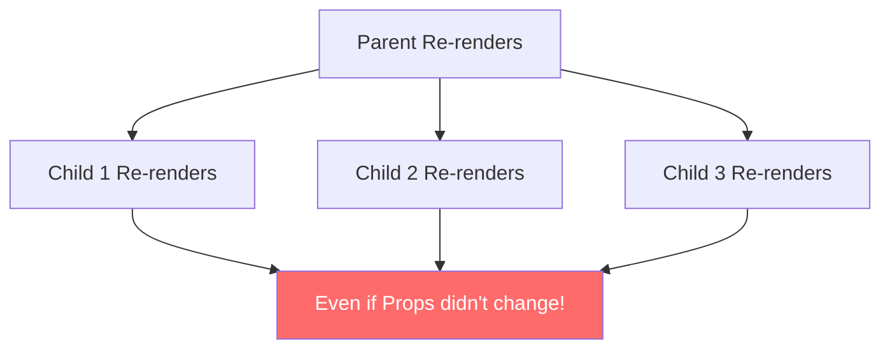
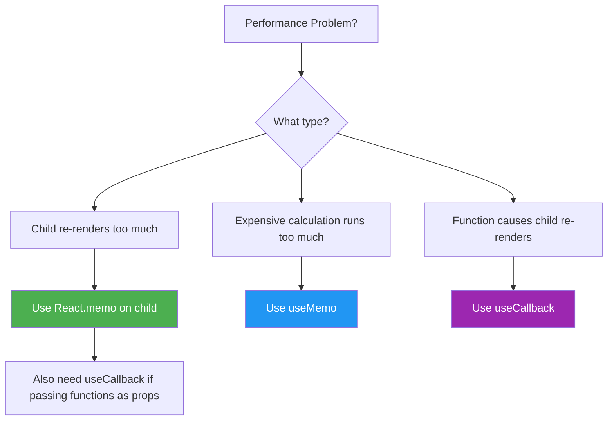

# ⚡ React Performance Optimization

## 📚 Topics Covered
- Why unnecessary re-renders slow down React apps
- `React.memo` — prevent child component re-renders
- Custom comparison function with `React.memo`
- `useMemo` — cache expensive calculation results
- `useCallback` — cache function references
- When to use each — decision flowchart
- Referential equality — why objects/functions break memo
- Common mistakes and when NOT to memoize
- Project: Optimized Todo App with memoization

---

## `React.memo`, `useMemo`, `useCallback` — Stop Unnecessary Re-renders

---

## 🔹 Why Performance Matters?

By default, **every time a parent component re-renders, all its child components also re-render** — even if their props haven't changed.

This is usually fine for small apps, but in large apps it causes **sluggish UI**.



**Solution:** `React.memo`, `useMemo`, `useCallback`

---

## 🔹 1. `React.memo` — Prevent Child Re-render

### 🧠 What is it?

`React.memo` is a **Higher Order Component (HOC)** that wraps a functional component and **memoizes** it — meaning it only re-renders if its **props actually changed**.

### 🧩 Syntax

```jsx
const MyComponent = React.memo(function MyComponent(props) {
  return <div>{props.name}</div>;
});
```

---

### 📍 Problem Without React.memo

```jsx
import { useState } from "react";

// This re-renders every time parent renders
function Greeting({ name }) {
  console.log("Greeting rendered!");
  return <h2>Hello, {name}!</h2>;
}

function App() {
  const [count, setCount] = useState(0);

  return (
    <div>
      <Greeting name="Ali" />
      <button onClick={() => setCount(count + 1)}>
        Count: {count}
      </button>
    </div>
  );
}
```

Every button click → `Greeting` re-renders even though `name` prop never changed!

---

### ✅ Solution With React.memo

```jsx
import { useState, memo } from "react";

// Now only re-renders if 'name' prop changes
const Greeting = memo(function Greeting({ name }) {
  console.log("Greeting rendered!");
  return <h2>Hello, {name}!</h2>;
});

function App() {
  const [count, setCount] = useState(0);

  return (
    <div>
      <Greeting name="Ali" />
      <button onClick={() => setCount(count + 1)}>
        Count: {count}
      </button>
    </div>
  );
}
```

Now `Greeting` only re-renders when `name` prop changes. ✅

---

### 📍 Custom Comparison Function

By default `React.memo` does **shallow comparison**. For objects/arrays, you can provide custom comparison:

```jsx
const UserCard = memo(
  function UserCard({ user }) {
    return <div>{user.name} - {user.age}</div>;
  },
  (prevProps, nextProps) => {
    // Return true = skip re-render (props are "equal")
    // Return false = re-render
    return prevProps.user.id === nextProps.user.id;
  }
);
```

---

## 🔹 2. `useMemo` — Memoize Expensive Calculations

### 🧠 What is it?

`useMemo` **caches the result of a calculation** between re-renders. It only recalculates when its **dependencies change**.

### 🧩 Syntax

```jsx
const result = useMemo(() => {
  return expensiveCalculation(a, b);
}, [a, b]); // only recalculate when a or b changes
```

---

### 📍 Problem Without useMemo

```jsx
import { useState } from "react";

function App() {
  const [count, setCount] = useState(0);
  const [items] = useState([1, 2, 3, 4, 5, 6, 7, 8, 9, 10]);

  // This runs on EVERY render — even when count changes!
  const total = items.reduce((sum, item) => sum + item, 0);

  return (
    <div>
      <p>Total: {total}</p>
      <button onClick={() => setCount(count + 1)}>
        Count: {count}
      </button>
    </div>
  );
}
```

---

### ✅ Solution With useMemo

```jsx
import { useState, useMemo } from "react";

function App() {
  const [count, setCount] = useState(0);
  const [items] = useState([1, 2, 3, 4, 5, 6, 7, 8, 9, 10]);

  // Only recalculates when 'items' changes
  const total = useMemo(() => {
    console.log("Calculating total...");
    return items.reduce((sum, item) => sum + item, 0);
  }, [items]);

  return (
    <div>
      <p>Total: {total}</p>
      <button onClick={() => setCount(count + 1)}>
        Count: {count}
      </button>
    </div>
  );
}
```

---

### 📍 Real World Example — Filtered List

```jsx
import { useState, useMemo } from "react";

const products = [
  { id: 1, name: "Laptop", price: 1200, category: "Electronics" },
  { id: 2, name: "Phone", price: 800, category: "Electronics" },
  { id: 3, name: "Shirt", price: 50, category: "Clothing" },
  { id: 4, name: "Shoes", price: 120, category: "Clothing" },
  { id: 5, name: "Headphones", price: 200, category: "Electronics" },
];

function ProductList() {
  const [search, setSearch] = useState("");
  const [darkMode, setDarkMode] = useState(false);

  // Only recalculates when 'search' changes — not when darkMode changes!
  const filteredProducts = useMemo(() => {
    console.log("Filtering products...");
    return products.filter((p) =>
      p.name.toLowerCase().includes(search.toLowerCase())
    );
  }, [search]);

  return (
    <div style={{ background: darkMode ? "#333" : "#fff", padding: 20 }}>
      <input
        value={search}
        onChange={(e) => setSearch(e.target.value)}
        placeholder="Search products..."
      />
      <button onClick={() => setDarkMode(!darkMode)}>Toggle Theme</button>

      {filteredProducts.map((p) => (
        <div key={p.id}>
          {p.name} — ${p.price}
        </div>
      ))}
    </div>
  );
}
```

---

## 🔹 3. `useCallback` — Memoize Functions

### 🧠 What is it?

`useCallback` **caches a function** between re-renders. Without it, every render creates a **new function reference** — which breaks `React.memo` on child components.

### 🧩 Syntax

```jsx
const memoizedFn = useCallback(() => {
  doSomething(a, b);
}, [a, b]); // only recreate when a or b changes
```

---

### 📍 Problem Without useCallback

```jsx
import { useState, memo } from "react";

const Button = memo(function Button({ onClick, label }) {
  console.log(`Button "${label}" rendered`);
  return <button onClick={onClick}>{label}</button>;
});

function App() {
  const [count, setCount] = useState(0);
  const [name, setName] = useState("Ali");

  // New function created on EVERY render!
  // React.memo can't help because the function reference always changes
  const handleClick = () => {
    console.log("clicked!");
  };

  return (
    <div>
      <Button onClick={handleClick} label="Click Me" />
      <button onClick={() => setCount(count + 1)}>Count: {count}</button>
    </div>
  );
}
```

`Button` still re-renders even with `memo` because `handleClick` is a new function every render!

---

### ✅ Solution With useCallback

```jsx
import { useState, memo, useCallback } from "react";

const Button = memo(function Button({ onClick, label }) {
  console.log(`Button "${label}" rendered`);
  return <button onClick={onClick}>{label}</button>;
});

function App() {
  const [count, setCount] = useState(0);

  // Same function reference across renders
  const handleClick = useCallback(() => {
    console.log("clicked!");
  }, []); // empty deps = never recreate

  return (
    <div>
      <Button onClick={handleClick} label="Click Me" />
      <button onClick={() => setCount(count + 1)}>Count: {count}</button>
    </div>
  );
}
```

Now `Button` only renders once! ✅

---

### 📍 useCallback with Dependencies

```jsx
import { useState, useCallback } from "react";

function Counter() {
  const [count, setCount] = useState(0);

  // Recreate when 'count' changes (because it uses count)
  const handleIncrement = useCallback(() => {
    setCount(count + 1);
  }, [count]);

  // Better pattern — use functional update (no dependency needed!)
  const handleIncrementBetter = useCallback(() => {
    setCount((prev) => prev + 1);
  }, []); // no dependencies needed!

  return (
    <div>
      <p>{count}</p>
      <button onClick={handleIncrementBetter}>+</button>
    </div>
  );
}
```

---

## 🔹 When to Use What?



---

## 🔹 Complete Real World Example

```jsx
import { useState, useMemo, useCallback, memo } from "react";

// Child component — wrapped with memo
const TodoItem = memo(function TodoItem({ todo, onDelete }) {
  console.log("TodoItem rendered:", todo.text);
  return (
    <div style={{ display: "flex", gap: 10, padding: 8, border: "1px solid #ddd", marginBottom: 8 }}>
      <span style={{ textDecoration: todo.done ? "line-through" : "none" }}>
        {todo.text}
      </span>
      <button onClick={() => onDelete(todo.id)}>❌</button>
    </div>
  );
});

let nextId = 1;

function TodoApp() {
  const [todos, setTodos] = useState([
    { id: nextId++, text: "Learn React", done: false },
    { id: nextId++, text: "Build Projects", done: true },
    { id: nextId++, text: "Get a Job", done: false },
  ]);
  const [filter, setFilter] = useState("all"); // all | active | done
  const [newTodo, setNewTodo] = useState("");

  // useMemo: only recalculates when todos or filter changes
  const filteredTodos = useMemo(() => {
    if (filter === "active") return todos.filter((t) => !t.done);
    if (filter === "done") return todos.filter((t) => t.done);
    return todos;
  }, [todos, filter]);

  // useMemo: counts
  const stats = useMemo(() => ({
    total: todos.length,
    done: todos.filter((t) => t.done).length,
    active: todos.filter((t) => !t.done).length,
  }), [todos]);

  // useCallback: stable function reference for child component
  const handleDelete = useCallback((id) => {
    setTodos((prev) => prev.filter((t) => t.id !== id));
  }, []);

  const handleAdd = useCallback(() => {
    if (!newTodo.trim()) return;
    setTodos((prev) => [...prev, { id: nextId++, text: newTodo, done: false }]);
    setNewTodo("");
  }, [newTodo]);

  return (
    <div style={{ maxWidth: 500, margin: "0 auto", padding: 20 }}>
      <h2>📝 Todo App</h2>

      {/* Stats */}
      <div style={{ background: "#f0f0f0", padding: 10, borderRadius: 8, marginBottom: 16 }}>
        Total: {stats.total} | Active: {stats.active} | Done: {stats.done}
      </div>

      {/* Add */}
      <div style={{ display: "flex", gap: 8, marginBottom: 16 }}>
        <input
          value={newTodo}
          onChange={(e) => setNewTodo(e.target.value)}
          onKeyDown={(e) => e.key === "Enter" && handleAdd()}
          placeholder="Add todo..."
          style={{ flex: 1, padding: 8 }}
        />
        <button onClick={handleAdd}>Add</button>
      </div>

      {/* Filter */}
      <div style={{ display: "flex", gap: 8, marginBottom: 16 }}>
        {["all", "active", "done"].map((f) => (
          <button
            key={f}
            onClick={() => setFilter(f)}
            style={{ fontWeight: filter === f ? "bold" : "normal" }}
          >
            {f}
          </button>
        ))}
      </div>

      {/* List */}
      {filteredTodos.map((todo) => (
        <TodoItem key={todo.id} todo={todo} onDelete={handleDelete} />
      ))}
    </div>
  );
}

export default TodoApp;
```

---

## 🔹 Common Mistakes ❌

### 1. Overusing useMemo/useCallback

```jsx
// ❌ DON'T — simple values don't need memoization
const name = useMemo(() => "Ali", []); // unnecessary!

// ✅ DO — only for expensive calculations
const sorted = useMemo(() => bigArray.sort(compareFn), [bigArray]);
```

### 2. Wrong Dependencies

```jsx
// ❌ Missing dependency
const getTotal = useCallback(() => {
  return price * quantity; // uses quantity but not in deps!
}, [price]); // BUG: stale quantity

// ✅ Correct
const getTotal = useCallback(() => {
  return price * quantity;
}, [price, quantity]);
```

### 3. Forgetting React.memo for useCallback to work

```jsx
// ❌ useCallback alone won't help if child isn't memo'd
function Child({ onClick }) { ... } // not memo'd

// ✅ Must use BOTH
const Child = memo(function Child({ onClick }) { ... });
const handleClick = useCallback(() => {...}, []);
```

---

## 🔹 Summary Table

| Tool | Purpose | When to Use |
|------|---------|-------------|
| `React.memo` | Skip child re-render if props same | Child re-renders unnecessarily |
| `useMemo` | Cache calculation result | Expensive calculation runs too often |
| `useCallback` | Cache function reference | Passing functions as props to memo'd children |

---

## 🎯 Interview Questions

**Q1: What is the difference between `useMemo` and `useCallback`?**

> `useMemo` caches a **value** (result of a function). `useCallback` caches the **function itself**. `useMemo(() => fn, deps)` ≈ `useCallback(fn, deps)`.

**Q2: When should you NOT use React.memo?**

> When the component is cheap to render, or when props change on almost every render — memoization overhead would outweigh the benefit.

**Q3: Can you use useMemo inside a condition or loop?**

> No! This violates the Rules of Hooks. Hooks must always be called at the top level.

**Q4: What is "referential equality" and why does it matter?**

> In JavaScript, `{} === {}` is `false` — two objects with same values are not equal. React.memo uses `===` to compare props, so object/function props always look "different" unless you use `useMemo`/`useCallback`.

---

## 🏠 Home Task

Build a **Product Search App** with:
1. A list of 20+ products (name, price, category)
2. Search input that filters by name
3. Sort by price (ascending/descending)
4. Use `useMemo` for filtering and sorting
5. Product card component wrapped with `React.memo`
6. Delete button — use `useCallback` for the handler
7. Check browser console to verify unnecessary renders are eliminated
