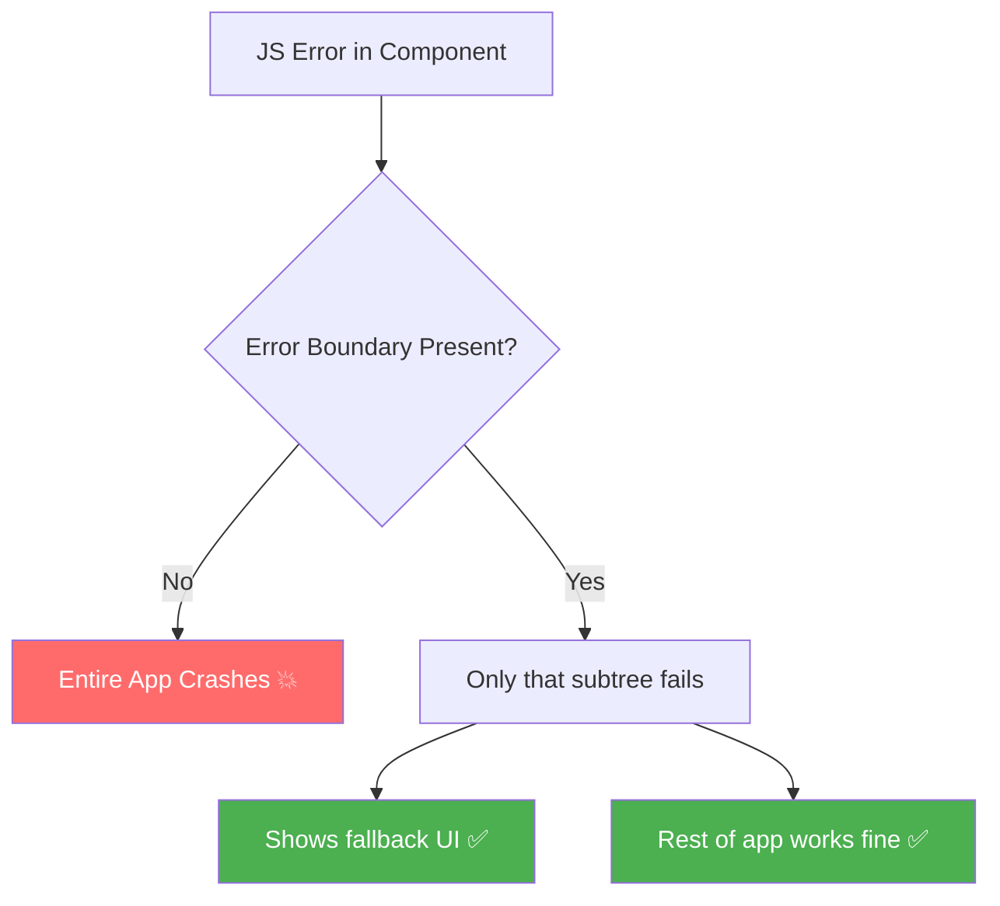
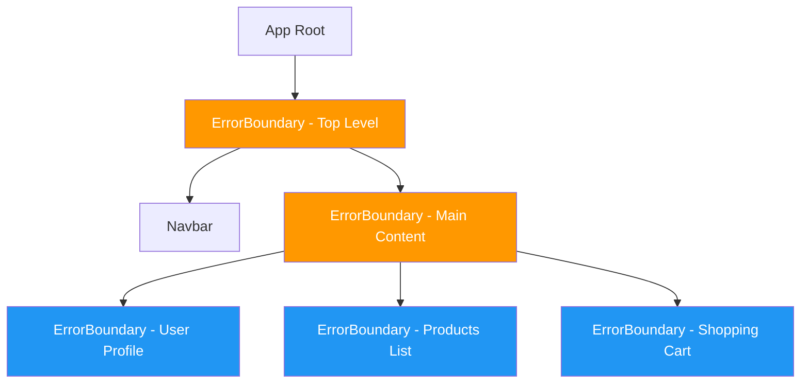

# 🛡️ Error Boundaries & Suspense for Data Fetching

## 📚 Topics Covered
- Why error handling matters — blank screen problem
- Error Boundary class component — `getDerivedStateFromError` and `componentDidCatch`
- Custom fallback UI with reset functionality
- What errors are NOT caught by boundaries (async, event handlers)
- Error boundary placement strategy
- `react-error-boundary` package
- `Suspense` for async data fetching (React 18+)
- Combining `ErrorBoundary` + `Suspense` + `React.lazy()`
- Project: Dashboard with per-widget error boundaries

---

## Graceful Error Handling in React

---

## 🔹 Why Error Handling Matters?

When a JavaScript error occurs inside a component, it can crash the **entire React app** and show a blank white screen. Users see nothing helpful.



---

## 🔹 1. Error Boundaries — Catch Render Errors

### 🧠 What is it?

An **Error Boundary** is a React **class component** that implements `componentDidCatch` and/or `getDerivedStateFromError`. It catches JavaScript errors in its child component tree and shows a fallback UI instead of crashing.

> ⚠️ Error Boundaries **only work as class components** — there is no hook equivalent yet (as of React 18). But you write them once and use everywhere.

---

### 🧩 Basic Error Boundary Class

```jsx
import { Component } from "react";

class ErrorBoundary extends Component {
  constructor(props) {
    super(props);
    this.state = { hasError: false, error: null };
  }

  // Called when child throws — update state to show fallback
  static getDerivedStateFromError(error) {
    return { hasError: true, error };
  }

  // Called after error is caught — good for logging
  componentDidCatch(error, errorInfo) {
    console.error("Caught error:", error);
    console.error("Component stack:", errorInfo.componentStack);
    // Could send to error reporting service (Sentry, etc.)
  }

  render() {
    if (this.state.hasError) {
      return (
        <div style={{
          padding: 24,
          background: "#fff3f3",
          border: "1px solid #ff6b6b",
          borderRadius: 8,
          textAlign: "center",
        }}>
          <h3>❌ Something went wrong</h3>
          <p style={{ color: "#666" }}>{this.state.error?.message}</p>
          <button
            onClick={() => this.setState({ hasError: false, error: null })}
            style={{ marginTop: 8, padding: "8px 16px" }}
          >
            🔄 Try Again
          </button>
        </div>
      );
    }

    return this.props.children;
  }
}

export default ErrorBoundary;
```

---

### 📍 Usage — Wrap Any Component

```jsx
import ErrorBoundary from "./ErrorBoundary";

function App() {
  return (
    <div>
      <h1>My App</h1>

      {/* If UserProfile crashes, only this section shows error */}
      <ErrorBoundary>
        <UserProfile />
      </ErrorBoundary>

      {/* These still work even if UserProfile crashes */}
      <Footer />
    </div>
  );
}
```

---

### 📍 Component That Can Crash

```jsx
function BuggyComponent({ user }) {
  // This will throw if user is undefined
  return <div>{user.name.toUpperCase()}</div>;
}

function App() {
  const [user, setUser] = useState(null); // null initially!

  return (
    <div>
      <h1>App</h1>

      {/* Without boundary — whole app crashes */}
      {/* <BuggyComponent user={user} /> */}

      {/* With boundary — only this section shows error */}
      <ErrorBoundary>
        <BuggyComponent user={user} />
      </ErrorBoundary>

      <button onClick={() => setUser({ name: "Ali" })}>
        Load User
      </button>
    </div>
  );
}
```

---

### 📍 Reusable Error Boundary with Custom Fallback

```jsx
import { Component } from "react";

class ErrorBoundary extends Component {
  state = { hasError: false, error: null };

  static getDerivedStateFromError(error) {
    return { hasError: true, error };
  }

  componentDidCatch(error, info) {
    if (this.props.onError) {
      this.props.onError(error, info);
    }
  }

  reset = () => {
    this.setState({ hasError: false, error: null });
    if (this.props.onReset) this.props.onReset();
  };

  render() {
    if (this.state.hasError) {
      // Use custom fallback if provided, otherwise default
      if (this.props.fallback) {
        return this.props.fallback(this.state.error, this.reset);
      }

      return (
        <div style={{ padding: 20, textAlign: "center" }}>
          <p>Something went wrong.</p>
          <button onClick={this.reset}>Try Again</button>
        </div>
      );
    }

    return this.props.children;
  }
}

// Usage with custom fallback
function App() {
  return (
    <ErrorBoundary
      fallback={(error, reset) => (
        <div style={{ padding: 24, background: "#fff3f3", borderRadius: 8 }}>
          <h3>🔴 Page Error</h3>
          <code>{error.message}</code>
          <br />
          <button onClick={reset} style={{ marginTop: 12 }}>
            Reload Component
          </button>
        </div>
      )}
      onError={(err) => console.log("Logged:", err)}
    >
      <SomeHeavyPage />
    </ErrorBoundary>
  );
}
```

---

## 🔹 2. What Errors Do NOT Get Caught?

Error boundaries do **not** catch:

| Scenario | Caught? | Solution |
|----------|---------|----------|
| Errors in render | ✅ Yes | Error Boundary |
| Errors in `componentDidMount` | ✅ Yes | Error Boundary |
| Errors in event handlers | ❌ No | try/catch in handler |
| Async errors (setTimeout, fetch) | ❌ No | try/catch + state |
| Errors in the Error Boundary itself | ❌ No | Another Error Boundary |

```jsx
// ❌ Error in event handler — NOT caught by ErrorBoundary
function Button() {
  const handleClick = () => {
    throw new Error("Click error!"); // NOT caught!
  };
  return <button onClick={handleClick}>Click</button>;
}

// ✅ Must handle manually
function Button() {
  const handleClick = () => {
    try {
      throw new Error("Click error!");
    } catch (err) {
      console.error(err);
      // Show error in state
    }
  };
  return <button onClick={handleClick}>Click</button>;
}
```

---

## 🔹 3. Placement Strategy



**Strategy:** Put Error Boundaries at the right granularity:
- **Too few:** One error crashes large sections
- **Too many:** Complex and hard to maintain
- **Sweet spot:** Wrap independent sections (sidebar, main content, widgets)

---

## 🔹 4. react-error-boundary Package

The `react-error-boundary` package provides a ready-made Error Boundary with helpful features:

```bash
npm install react-error-boundary
```

```jsx
import { ErrorBoundary } from "react-error-boundary";

function ErrorFallback({ error, resetErrorBoundary }) {
  return (
    <div style={{ padding: 20, background: "#fff3f3", borderRadius: 8 }}>
      <h3>❌ Error occurred!</h3>
      <pre style={{ color: "red", fontSize: 14 }}>{error.message}</pre>
      <button onClick={resetErrorBoundary}>🔄 Try Again</button>
    </div>
  );
}

function App() {
  return (
    <ErrorBoundary
      FallbackComponent={ErrorFallback}
      onError={(error) => console.log("Error logged:", error)}
      onReset={() => console.log("Component reset!")}
    >
      <UserDashboard />
    </ErrorBoundary>
  );
}
```

---

## 🔹 5. Suspense for Async Data (React 18+)

`Suspense` can now work with **data fetching** — not just lazy loading. A component can "suspend" (pause rendering) while data loads, and Suspense shows the fallback.

> This pattern works natively with **React Query / TanStack Query** and custom Suspense-enabled data sources.

---

### 📍 Suspense + React Query (Preview)

```jsx
import { Suspense } from "react";
import { useQuery } from "@tanstack/react-query";

function UserProfile({ userId }) {
  // suspense: true makes this component suspend while loading
  const { data: user } = useQuery({
    queryKey: ["user", userId],
    queryFn: () => fetch(`/api/users/${userId}`).then(r => r.json()),
    suspense: true, // enables Suspense integration
  });

  return (
    <div>
      <h2>{user.name}</h2>
      <p>{user.email}</p>
    </div>
  );
}

function App() {
  return (
    // Error Boundary catches data errors
    // Suspense shows loading while data fetches
    <ErrorBoundary fallback={<ErrorFallback />}>
      <Suspense fallback={<div>Loading user...</div>}>
        <UserProfile userId={1} />
      </Suspense>
    </ErrorBoundary>
  );
}
```

---

## 🔹 6. Complete Error Handling Setup

```jsx
import { Component, Suspense, lazy, useState } from "react";
import { ErrorBoundary } from "react-error-boundary";

// Lazy loaded pages
const Dashboard = lazy(() => import("./pages/Dashboard"));
const UserProfile = lazy(() => import("./pages/UserProfile"));

// Error fallback
function PageError({ error, resetErrorBoundary }) {
  return (
    <div style={{
      minHeight: "50vh",
      display: "flex",
      flexDirection: "column",
      alignItems: "center",
      justifyContent: "center",
      gap: 16,
    }}>
      <div style={{ fontSize: 48 }}>💔</div>
      <h2>Something went wrong</h2>
      <p style={{ color: "#666", maxWidth: 400, textAlign: "center" }}>
        {error.message || "An unexpected error occurred. Please try again."}
      </p>
      <button
        onClick={resetErrorBoundary}
        style={{
          padding: "10px 24px",
          background: "#2196f3",
          color: "#fff",
          border: "none",
          borderRadius: 4,
          cursor: "pointer",
        }}
      >
        🔄 Try Again
      </button>
    </div>
  );
}

// Loading spinner
function Spinner() {
  return (
    <div style={{
      display: "flex",
      justifyContent: "center",
      alignItems: "center",
      height: "50vh",
    }}>
      <div style={{
        width: 48,
        height: 48,
        borderRadius: "50%",
        border: "4px solid #e0e0e0",
        borderTop: "4px solid #2196f3",
        animation: "spin 0.8s linear infinite",
      }} />
      <style>{`@keyframes spin { to { transform: rotate(360deg); } }`}</style>
    </div>
  );
}

function App() {
  const [page, setPage] = useState("dashboard");

  return (
    <div>
      <nav style={{ padding: 16, background: "#1a237e", display: "flex", gap: 12 }}>
        {["dashboard", "profile"].map((p) => (
          <button
            key={p}
            onClick={() => setPage(p)}
            style={{
              padding: "6px 16px",
              background: page === p ? "#fff" : "transparent",
              color: page === p ? "#1a237e" : "#fff",
              border: "1px solid #fff",
              borderRadius: 4,
              cursor: "pointer",
              textTransform: "capitalize",
            }}
          >
            {p}
          </button>
        ))}
      </nav>

      <ErrorBoundary
        FallbackComponent={PageError}
        resetKeys={[page]}
        onError={(err) => console.error("App error:", err)}
      >
        <Suspense fallback={<Spinner />}>
          {page === "dashboard" ? <Dashboard /> : <UserProfile />}
        </Suspense>
      </ErrorBoundary>
    </div>
  );
}

export default App;
```

---

## 🎯 Interview Questions

**Q1: Why are Error Boundaries class components?**

> Error boundaries use lifecycle methods (`getDerivedStateFromError`, `componentDidCatch`) which don't have hook equivalents. The React team hasn't added hook-based alternatives yet, but libraries like `react-error-boundary` wrap the class for you.

**Q2: What's the difference between `getDerivedStateFromError` and `componentDidCatch`?**

> `getDerivedStateFromError` is a static method used to **update state** to show the fallback UI (called during rendering). `componentDidCatch` is called **after** the error for **side effects** like logging.

**Q3: Can an error boundary catch errors in async functions?**

> No. Error boundaries only catch errors that occur during **rendering, lifecycle methods, and constructors**. Async errors (in `setTimeout`, Promises, event handlers) must be caught with `try/catch`.

**Q4: What happens when multiple components throw errors simultaneously?**

> Each component's error is caught by its **nearest ancestor** Error Boundary. If they share the same boundary, the first error caught will trigger the fallback.

---

## 🏠 Home Task

Build a **Dashboard with Error Handling**:
1. 4 widgets: User Info, Recent Orders, Stats, Notifications
2. Each widget wrapped in its own `ErrorBoundary`
3. A "Crash Widget" button on each card to simulate errors
4. Reset button in error fallback to recover
5. Wrap all lazy-loaded pages with both `Suspense` and `ErrorBoundary`
6. Log errors to console in `componentDidCatch`
