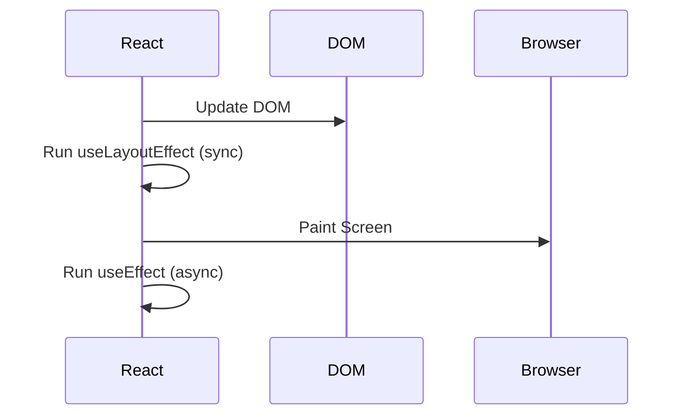
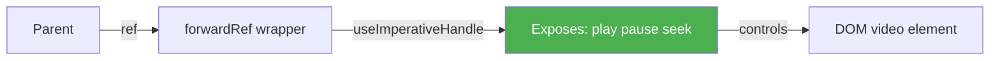
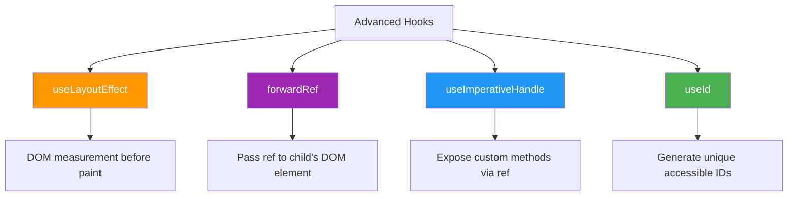

# ⚛️ Advanced React Hooks

## 📚 Topics Covered
- `useLayoutEffect` — synchronous DOM measurement before paint
- `useLayoutEffect` vs `useEffect` — when to use each
- `forwardRef` — passing refs through to child DOM elements
- `useImperativeHandle` — expose custom methods to parent via ref
- `useId` — generating unique stable IDs for accessibility
- Project: Custom Modal with ref-based `open()` / `close()` API

---

## `useLayoutEffect`, `useImperativeHandle`, `forwardRef`, `useId`

---

## 🔹 1. `useLayoutEffect` — Synchronous DOM Measurement

### 🧠 What is it?

`useLayoutEffect` works exactly like `useEffect` but fires **synchronously after DOM mutations** and **before the browser paints** the screen.



---

### 🔍 useEffect vs useLayoutEffect

| Feature | `useEffect` | `useLayoutEffect` |
|---------|------------|-------------------|
| Timing | After paint | Before paint (sync) |
| Blocks paint? | No | Yes |
| Use for | API calls, subscriptions | DOM measurements, animations |
| Performance | Better (async) | Can be slower if overused |

---

### 📍 Example 1: Measuring DOM Element Size

```jsx
import { useLayoutEffect, useRef, useState } from "react";

function MeasureBox() {
  const boxRef = useRef(null);
  const [size, setSize] = useState({ width: 0, height: 0 });

  // Must use useLayoutEffect — we need size BEFORE paint
  useLayoutEffect(() => {
    const { width, height } = boxRef.current.getBoundingClientRect();
    setSize({ width, height });
  }, []);

  return (
    <div>
      <div
        ref={boxRef}
        style={{
          width: "50%",
          padding: 20,
          background: "#e3f2fd",
          borderRadius: 8,
        }}
      >
        This box is being measured!
      </div>
      <p>
        Width: {Math.round(size.width)}px | Height: {Math.round(size.height)}px
      </p>
    </div>
  );
}
```

---

### 📍 Example 2: Tooltip Positioning (No Flicker)

```jsx
import { useLayoutEffect, useRef, useState } from "react";

function Tooltip({ targetRef, text }) {
  const tooltipRef = useRef(null);
  const [position, setPosition] = useState({ top: 0, left: 0 });

  useLayoutEffect(() => {
    const targetRect = targetRef.current.getBoundingClientRect();
    const tooltipRect = tooltipRef.current.getBoundingClientRect();

    setPosition({
      top: targetRect.top - tooltipRect.height - 8,
      left: targetRect.left + targetRect.width / 2 - tooltipRect.width / 2,
    });
  }, []);

  return (
    <div
      ref={tooltipRef}
      style={{
        position: "fixed",
        top: position.top,
        left: position.left,
        background: "#333",
        color: "#fff",
        padding: "4px 8px",
        borderRadius: 4,
        fontSize: 14,
      }}
    >
      {text}
    </div>
  );
}
```

> **Why not `useEffect`?** With `useEffect`, the tooltip would flash in wrong position first, then jump — visible to user. `useLayoutEffect` positions it correctly before paint.

---

### 📍 Example 3: Scroll Position Restore

```jsx
import { useLayoutEffect } from "react";
import { useLocation } from "react-router-dom";

function ScrollToTop() {
  const { pathname } = useLocation();

  useLayoutEffect(() => {
    window.scrollTo(0, 0);
  }, [pathname]);

  return null;
}
```

---

## 🔹 2. `forwardRef` — Pass Ref to Child Component

### 🧠 What is it?

Normally, you can't pass `ref` as a prop to a child component — React handles refs specially. `forwardRef` lets you **forward** a ref from parent to a DOM element inside the child.

### 📍 Problem Without forwardRef

```jsx
// ❌ This doesn't work — ref doesn't reach the input!
function MyInput({ ref, ...props }) {
  return <input ref={ref} {...props} />;
}

function App() {
  const inputRef = useRef(null);
  return <MyInput ref={inputRef} placeholder="Type..." />;
  // inputRef.current is null!
}
```

---

### ✅ Solution With forwardRef

```jsx
import { forwardRef, useRef } from "react";

// forwardRef wraps the component
const MyInput = forwardRef(function MyInput(props, ref) {
  return (
    <input
      ref={ref}  // forward the ref to the actual DOM input
      style={{ padding: 8, border: "2px solid #2196f3", borderRadius: 4 }}
      {...props}
    />
  );
});

function App() {
  const inputRef = useRef(null);

  const handleFocus = () => {
    inputRef.current.focus(); // works! ✅
  };

  return (
    <div>
      <MyInput ref={inputRef} placeholder="Type here..." />
      <button onClick={handleFocus}>Focus Input</button>
    </div>
  );
}
```

---

### 📍 Real World: Custom Button Component

```jsx
import { forwardRef } from "react";

const Button = forwardRef(function Button(
  { children, variant = "primary", ...props },
  ref
) {
  const styles = {
    primary: { background: "#2196f3", color: "#fff" },
    danger: { background: "#f44336", color: "#fff" },
    outline: { background: "transparent", border: "2px solid #2196f3" },
  };

  return (
    <button
      ref={ref}
      style={{
        padding: "8px 16px",
        borderRadius: 4,
        border: "none",
        cursor: "pointer",
        ...styles[variant],
      }}
      {...props}
    >
      {children}
    </button>
  );
});

export default Button;
```

---

## 🔹 3. `useImperativeHandle` — Expose Custom Methods to Parent

### 🧠 What is it?

`useImperativeHandle` lets a child component **expose specific methods** to the parent through a ref — instead of exposing the raw DOM element.

Used **together with `forwardRef`**.

### 🧩 Syntax

```jsx
useImperativeHandle(ref, () => ({
  methodName() { ... },
  anotherMethod() { ... }
}), [deps]);
```

---

### 📍 Example 1: Custom Input with Focus & Clear

```jsx
import { forwardRef, useImperativeHandle, useRef } from "react";

const SmartInput = forwardRef(function SmartInput(props, ref) {
  const inputRef = useRef(null);

  // Expose only specific methods — not the whole DOM element
  useImperativeHandle(ref, () => ({
    focus() {
      inputRef.current.focus();
    },
    clear() {
      inputRef.current.value = "";
    },
    getValue() {
      return inputRef.current.value;
    },
  }));

  return (
    <input
      ref={inputRef}
      style={{ padding: 8, border: "1px solid #ddd", borderRadius: 4 }}
      {...props}
    />
  );
});

function App() {
  const inputRef = useRef(null);

  return (
    <div style={{ display: "flex", flexDirection: "column", gap: 8, maxWidth: 300 }}>
      <SmartInput ref={inputRef} placeholder="Type something..." />
      <button onClick={() => inputRef.current.focus()}>Focus</button>
      <button onClick={() => inputRef.current.clear()}>Clear</button>
      <button onClick={() => alert(inputRef.current.getValue())}>
        Get Value
      </button>
    </div>
  );
}
```

---

### 📍 Example 2: Video Player with Exposed Controls

```jsx
import { forwardRef, useImperativeHandle, useRef } from "react";

const VideoPlayer = forwardRef(function VideoPlayer({ src }, ref) {
  const videoRef = useRef(null);

  useImperativeHandle(ref, () => ({
    play() { videoRef.current.play(); },
    pause() { videoRef.current.pause(); },
    seek(time) { videoRef.current.currentTime = time; },
    getTime() { return videoRef.current.currentTime; },
  }));

  return (
    <video
      ref={videoRef}
      src={src}
      width="400"
      style={{ borderRadius: 8 }}
    />
  );
});

function App() {
  const playerRef = useRef(null);

  return (
    <div>
      <VideoPlayer ref={playerRef} src="/movie.mp4" />
      <div style={{ display: "flex", gap: 8, marginTop: 8 }}>
        <button onClick={() => playerRef.current.play()}>▶ Play</button>
        <button onClick={() => playerRef.current.pause()}>⏸ Pause</button>
        <button onClick={() => playerRef.current.seek(0)}>⏮ Restart</button>
      </div>
    </div>
  );
}
```

---



---

## 🔹 4. `useId` — Generate Unique IDs

### 🧠 What is it?

`useId` generates a **unique stable ID** for a component instance. Useful for accessibility attributes (`htmlFor`, `aria-labelledby`, etc.) that require matching IDs.

### 🧩 Syntax

```jsx
const id = useId();
// id will be something like ":r0:", ":r1:", etc.
```

---

### 📍 Problem Without useId

```jsx
// ❌ Hardcoded IDs break when component is used multiple times!
function EmailField() {
  return (
    <div>
      <label htmlFor="email">Email</label>
      <input id="email" type="email" />
    </div>
  );
}

// If you use <EmailField /> twice, there are two elements with id="email"
// This is invalid HTML and breaks accessibility!
```

---

### ✅ Solution With useId

```jsx
import { useId } from "react";

function EmailField() {
  const id = useId();
  // id is unique per component instance

  return (
    <div>
      <label htmlFor={id}>Email</label>
      <input id={id} type="email" />
    </div>
  );
}

function App() {
  return (
    <form>
      {/* Each instance gets a unique id */}
      <EmailField />  {/* id = ":r0:" */}
      <EmailField />  {/* id = ":r1:" */}
    </form>
  );
}
```

---

### 📍 Real World: Form with Multiple Fields

```jsx
import { useId } from "react";

function FormField({ label, type = "text", ...inputProps }) {
  const id = useId();

  return (
    <div style={{ marginBottom: 16 }}>
      <label
        htmlFor={id}
        style={{ display: "block", marginBottom: 4, fontWeight: "bold" }}
      >
        {label}
      </label>
      <input
        id={id}
        type={type}
        style={{ width: "100%", padding: 8, borderRadius: 4, border: "1px solid #ddd" }}
        {...inputProps}
      />
    </div>
  );
}

function RegistrationForm() {
  return (
    <form style={{ maxWidth: 400, margin: "0 auto", padding: 20 }}>
      <h2>Register</h2>
      <FormField label="Full Name" placeholder="Ali Hassan" />
      <FormField label="Email" type="email" placeholder="ali@example.com" />
      <FormField label="Password" type="password" />
      <FormField label="Phone" type="tel" placeholder="+92 300 1234567" />
      <button type="submit" style={{ width: "100%", padding: 10 }}>
        Register
      </button>
    </form>
  );
}
```

---

### 📍 useId with Related Elements

```jsx
import { useId } from "react";

function Accordion({ title, children }) {
  const contentId = useId();
  const buttonId = useId();

  return (
    <div>
      <button
        id={buttonId}
        aria-controls={contentId}
        aria-expanded="true"
      >
        {title}
      </button>
      <div
        id={contentId}
        role="region"
        aria-labelledby={buttonId}
      >
        {children}
      </div>
    </div>
  );
}
```

---

## 🔹 All Hooks at a Glance



---

## 🎯 Interview Questions

**Q1: What's the difference between `useEffect` and `useLayoutEffect`?**

> `useLayoutEffect` runs synchronously after DOM updates but **before the browser paints**. `useEffect` runs asynchronously after the paint. Use `useLayoutEffect` when you need to measure DOM or prevent visual flicker.

**Q2: What problem does `forwardRef` solve?**

> React doesn't pass `ref` through props automatically. `forwardRef` allows a parent to attach a ref to a DOM element inside a child component.

**Q3: Why would you use `useImperativeHandle`?**

> When you want to expose a **limited, controlled API** (custom methods) to the parent via ref, instead of exposing the entire raw DOM element. Good for components like modals, inputs, or video players.

**Q4: Why use `useId` instead of just a counter or random number?**

> `useId` is **stable across server and client renders** (important for SSR/Next.js) and unique per component instance. Random numbers or counters can cause hydration mismatches.

---

## 🏠 Home Task

Build a **Custom Modal Component** that:
1. Uses `forwardRef` so the parent can control it via ref
2. Uses `useImperativeHandle` to expose `open()` and `close()` methods
3. Uses `useId` for the modal title and aria attributes
4. Uses `useLayoutEffect` to lock page scroll when modal is open
5. Parent should be able to do: `modalRef.current.open()` and `modalRef.current.close()`
