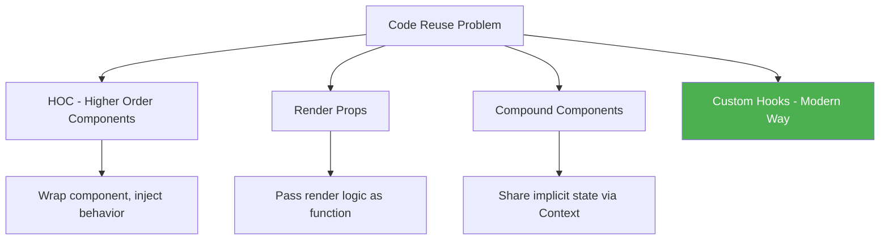
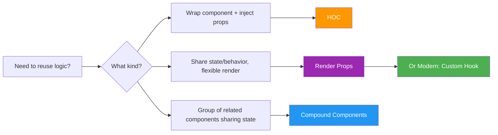

# 🧩 React Component Patterns

## 📚 Topics Covered
- Higher Order Components (HOC) — wrap and enhance components
- `withLoading`, `withAuth`, `withLogger` HOC examples
- HOC caveats — displayName, props forwarding
- Render Props pattern — flexible rendering with shared logic
- Children as function pattern
- Compound Components — grouped UI sharing implicit state via Context
- Custom Select component with compound pattern
- Accordion compound component example
- When to use HOC vs Render Props vs Compound Components vs Custom Hooks

---

## HOC, Render Props, Compound Components, forwardRef

---

## 🔹 Why Patterns?

As apps grow, you need ways to **share logic and behavior** between components without repeating code. These patterns are the classic solutions — still used in many real-world codebases and libraries.



---

## 🔹 1. Higher Order Components (HOC)

### 🧠 What is it?

A **Higher Order Component** is a function that takes a component and returns a **new, enhanced component**. Think of it like a decorator.

```
HOC = (Component) => EnhancedComponent
```

---

### 📍 Example 1: withLoading HOC

```jsx
// HOC that adds loading state to any component
function withLoading(WrappedComponent) {
  return function WithLoadingComponent({ isLoading, ...props }) {
    if (isLoading) {
      return (
        <div style={{
          display: "flex",
          justifyContent: "center",
          padding: 40,
          fontSize: 18,
          color: "#666",
        }}>
          ⏳ Loading...
        </div>
      );
    }

    return <WrappedComponent {...props} />;
  };
}

// Original component — knows nothing about loading
function UserList({ users }) {
  return (
    <ul>
      {users.map((user) => (
        <li key={user.id}>{user.name}</li>
      ))}
    </ul>
  );
}

// Enhanced component with loading built in
const UserListWithLoading = withLoading(UserList);

// Usage
function App() {
  const [isLoading, setIsLoading] = useState(true);
  const [users, setUsers] = useState([]);

  useEffect(() => {
    setTimeout(() => {
      setUsers([{ id: 1, name: "Ali" }, { id: 2, name: "Sara" }]);
      setIsLoading(false);
    }, 2000);
  }, []);

  return <UserListWithLoading isLoading={isLoading} users={users} />;
}
```

---

### 📍 Example 2: withAuth HOC (Route Protection)

```jsx
import { Navigate } from "react-router-dom";

function withAuth(WrappedComponent) {
  return function AuthenticatedComponent(props) {
    const isAuthenticated = localStorage.getItem("token");

    if (!isAuthenticated) {
      return <Navigate to="/login" replace />;
    }

    return <WrappedComponent {...props} />;
  };
}

// Protect any page with one line
const ProtectedDashboard = withAuth(Dashboard);
const ProtectedProfile = withAuth(Profile);
const ProtectedSettings = withAuth(Settings);

// In routes
<Route path="/dashboard" element={<ProtectedDashboard />} />
<Route path="/profile" element={<ProtectedProfile />} />
```

---

### 📍 Example 3: withLogger HOC

```jsx
function withLogger(WrappedComponent) {
  return function LoggedComponent(props) {
    useEffect(() => {
      console.log(`[${WrappedComponent.name}] mounted with props:`, props);
      return () => {
        console.log(`[${WrappedComponent.name}] unmounted`);
      };
    }, []);

    useEffect(() => {
      console.log(`[${WrappedComponent.name}] props updated:`, props);
    });

    return <WrappedComponent {...props} />;
  };
}

const LoggedButton = withLogger(Button);
const LoggedUserCard = withLogger(UserCard);
```

---

### ⚠️ HOC Caveats

```jsx
// Problem 1: DisplayName lost in DevTools
// Fix: set displayName
function withLoading(WrappedComponent) {
  function WithLoading(props) { ... }
  WithLoading.displayName = `withLoading(${WrappedComponent.displayName || WrappedComponent.name})`;
  return WithLoading;
}

// Problem 2: Props are forwarded automatically — make sure to spread
function withAuth(WrappedComponent) {
  return function Auth(props) {
    if (!isAuth) return <Navigate to="/login" />;
    return <WrappedComponent {...props} />; // ← must spread ALL props
  };
}
```

---

## 🔹 2. Render Props

### 🧠 What is it?

A component receives a **function as a prop** and calls that function to render its output. The component provides **data/behavior**, you decide **what to render**.

```
<Component render={(data) => <YourUI data={data} />} />
```

---

### 📍 Example 1: Mouse Tracker

```jsx
// Provides mouse position logic
function MouseTracker({ render }) {
  const [position, setPosition] = useState({ x: 0, y: 0 });

  const handleMouseMove = (e) => {
    setPosition({ x: e.clientX, y: e.clientY });
  };

  return (
    <div style={{ height: "100vh" }} onMouseMove={handleMouseMove}>
      {render(position)} {/* Call render prop with data */}
    </div>
  );
}

// Different UIs using the same mouse tracking logic
function App() {
  return (
    <>
      {/* Use 1: Show coordinates */}
      <MouseTracker
        render={({ x, y }) => (
          <p>Mouse: {x}, {y}</p>
        )}
      />

      {/* Use 2: Follow cursor */}
      <MouseTracker
        render={({ x, y }) => (
          <div
            style={{
              position: "fixed",
              left: x,
              top: y,
              width: 20,
              height: 20,
              background: "red",
              borderRadius: "50%",
              transform: "translate(-50%, -50%)",
              pointerEvents: "none",
            }}
          />
        )}
      />
    </>
  );
}
```

---

### 📍 Example 2: Data Fetcher with Render Props

```jsx
function DataFetcher({ url, render }) {
  const [state, setState] = useState({
    data: null,
    loading: true,
    error: null,
  });

  useEffect(() => {
    setState({ data: null, loading: true, error: null });
    fetch(url)
      .then((r) => r.json())
      .then((data) => setState({ data, loading: false, error: null }))
      .catch((err) => setState({ data: null, loading: false, error: err.message }));
  }, [url]);

  return render(state);
}

// Usage — completely flexible rendering
function App() {
  return (
    <DataFetcher
      url="https://jsonplaceholder.typicode.com/users"
      render={({ data, loading, error }) => {
        if (loading) return <div>⏳ Loading...</div>;
        if (error) return <div>❌ Error: {error}</div>;
        return (
          <ul>
            {data.map((user) => (
              <li key={user.id}>{user.name} — {user.email}</li>
            ))}
          </ul>
        );
      }}
    />
  );
}
```

---

### 📍 Children as Function (Common Pattern)

```jsx
// Same as render prop, but uses children
function Toggle({ children }) {
  const [on, setOn] = useState(false);
  return children({ on, toggle: () => setOn(!on) });
}

function App() {
  return (
    <Toggle>
      {({ on, toggle }) => (
        <div>
          <p>The toggle is {on ? "ON" : "OFF"}</p>
          <button onClick={toggle}>Toggle</button>
        </div>
      )}
    </Toggle>
  );
}
```

---

## 🔹 3. Compound Components

### 🧠 What is it?

Compound components work together as a group — like `<select>` and `<option>` in HTML. They **share implicit state** through React Context, so the parent manages state while children can access it.

---

### 📍 Example: Custom Select Component

```jsx
import { createContext, useContext, useState } from "react";

// Context for sharing state between compound components
const SelectContext = createContext(null);

// Parent — owns the state
function Select({ children, value, onChange }) {
  const [isOpen, setIsOpen] = useState(false);

  return (
    <SelectContext.Provider value={{ value, onChange, isOpen, setIsOpen }}>
      <div style={{ position: "relative", display: "inline-block" }}>
        {children}
      </div>
    </SelectContext.Provider>
  );
}

// Trigger — shows current value, opens/closes
Select.Trigger = function Trigger({ placeholder = "Select..." }) {
  const { value, isOpen, setIsOpen } = useContext(SelectContext);
  return (
    <button
      onClick={() => setIsOpen(!isOpen)}
      style={{
        padding: "8px 16px",
        border: "1px solid #ddd",
        borderRadius: 4,
        background: "#fff",
        cursor: "pointer",
        minWidth: 150,
        display: "flex",
        justifyContent: "space-between",
      }}
    >
      {value || placeholder}
      <span>{isOpen ? "▲" : "▼"}</span>
    </button>
  );
};

// Options container
Select.Options = function Options({ children }) {
  const { isOpen } = useContext(SelectContext);
  if (!isOpen) return null;
  return (
    <div style={{
      position: "absolute",
      top: "100%",
      left: 0,
      right: 0,
      background: "#fff",
      border: "1px solid #ddd",
      borderRadius: 4,
      boxShadow: "0 4px 12px rgba(0,0,0,0.1)",
      zIndex: 100,
    }}>
      {children}
    </div>
  );
};

// Individual option
Select.Option = function Option({ value, children }) {
  const { value: selectedValue, onChange, setIsOpen } = useContext(SelectContext);
  const isSelected = selectedValue === value;

  return (
    <div
      onClick={() => {
        onChange(value);
        setIsOpen(false);
      }}
      style={{
        padding: "8px 16px",
        cursor: "pointer",
        background: isSelected ? "#e3f2fd" : "#fff",
        fontWeight: isSelected ? "bold" : "normal",
      }}
    >
      {children}
    </div>
  );
};

// Usage — clean and intuitive!
function App() {
  const [country, setCountry] = useState("");

  return (
    <div style={{ padding: 20 }}>
      <Select value={country} onChange={setCountry}>
        <Select.Trigger placeholder="Select country..." />
        <Select.Options>
          <Select.Option value="pk">🇵🇰 Pakistan</Select.Option>
          <Select.Option value="us">🇺🇸 United States</Select.Option>
          <Select.Option value="uk">🇬🇧 United Kingdom</Select.Option>
          <Select.Option value="ae">🇦🇪 UAE</Select.Option>
        </Select.Options>
      </Select>

      {country && <p>Selected: {country}</p>}
    </div>
  );
}
```

---

### 📍 Example 2: Accordion Compound Component

```jsx
import { createContext, useContext, useState } from "react";

const AccordionContext = createContext(null);

function Accordion({ children, defaultOpen = null }) {
  const [openItem, setOpenItem] = useState(defaultOpen);

  const toggle = (id) => setOpenItem(openItem === id ? null : id);

  return (
    <AccordionContext.Provider value={{ openItem, toggle }}>
      <div style={{ border: "1px solid #ddd", borderRadius: 8, overflow: "hidden" }}>
        {children}
      </div>
    </AccordionContext.Provider>
  );
}

Accordion.Item = function Item({ id, children }) {
  return <div style={{ borderBottom: "1px solid #ddd" }}>{children}</div>;
};

Accordion.Header = function Header({ id, children }) {
  const { openItem, toggle } = useContext(AccordionContext);
  const isOpen = openItem === id;

  return (
    <button
      onClick={() => toggle(id)}
      style={{
        width: "100%",
        padding: "12px 16px",
        background: isOpen ? "#e3f2fd" : "#fff",
        border: "none",
        textAlign: "left",
        cursor: "pointer",
        display: "flex",
        justifyContent: "space-between",
        fontWeight: isOpen ? "bold" : "normal",
      }}
    >
      {children}
      <span>{isOpen ? "▲" : "▼"}</span>
    </button>
  );
};

Accordion.Content = function Content({ id, children }) {
  const { openItem } = useContext(AccordionContext);
  if (openItem !== id) return null;

  return (
    <div style={{ padding: "12px 16px", background: "#fafafa" }}>
      {children}
    </div>
  );
};

// Usage
function FAQ() {
  return (
    <div style={{ maxWidth: 600, margin: "0 auto", padding: 20 }}>
      <h2>Frequently Asked Questions</h2>
      <Accordion defaultOpen="q1">
        <Accordion.Item id="q1">
          <Accordion.Header id="q1">What is React?</Accordion.Header>
          <Accordion.Content id="q1">
            React is a JavaScript library for building user interfaces.
          </Accordion.Content>
        </Accordion.Item>

        <Accordion.Item id="q2">
          <Accordion.Header id="q2">What are hooks?</Accordion.Header>
          <Accordion.Content id="q2">
            Hooks are functions that let you use state and lifecycle features in functional components.
          </Accordion.Content>
        </Accordion.Item>

        <Accordion.Item id="q3">
          <Accordion.Header id="q3">What is Context API?</Accordion.Header>
          <Accordion.Content id="q3">
            Context API allows you to share state across components without prop drilling.
          </Accordion.Content>
        </Accordion.Item>
      </Accordion>
    </div>
  );
}
```

---

## 🔹 Patterns Comparison



| Pattern | Best For | Example Libraries |
|---------|----------|------------------|
| HOC | Cross-cutting concerns (auth, logging, loading) | Redux connect(), React Router withRouter |
| Render Props | Flexible rendering with shared logic | Downshift, React Motion |
| Compound Components | Grouped UI with shared state | Radix UI, Headless UI |
| Custom Hooks | Logic reuse (modern React) | SWR, React Query |

---

## 🎯 Interview Questions

**Q1: What is a Higher Order Component?**

> A function that takes a component and returns a new enhanced component. It's used to add cross-cutting behavior (auth, loading, logging) without modifying the original component.

**Q2: What problem do Render Props solve?**

> They allow sharing stateful logic or behavior between components without HOCs. The component owning the logic calls a function prop to render UI — the consumer decides what to render.

**Q3: How do Compound Components work internally?**

> They use React Context to share implicit state between the parent and its child sub-components. The parent manages state and provides it through Context; children read from Context without needing explicit prop passing.

**Q4: Are HOCs and Render Props replaced by hooks?**

> Custom hooks can replace most HOC and render props use cases with cleaner code. But HOCs are still common for wrapping entire components (like auth protection), and compound components are still the best pattern for complex UI groups.

---

## 🏠 Home Task

Build a **Tabs Component** using Compound Components:

```jsx
// Target API:
<Tabs defaultTab="about">
  <Tabs.List>
    <Tabs.Tab id="about">About</Tabs.Tab>
    <Tabs.Tab id="projects">Projects</Tabs.Tab>
    <Tabs.Tab id="contact">Contact</Tabs.Tab>
  </Tabs.List>
  <Tabs.Panel id="about"><AboutContent /></Tabs.Panel>
  <Tabs.Panel id="projects"><ProjectsContent /></Tabs.Panel>
  <Tabs.Panel id="contact"><ContactContent /></Tabs.Panel>
</Tabs>
```

Also add a `withErrorBoundary` HOC and wrap each Panel with it.
