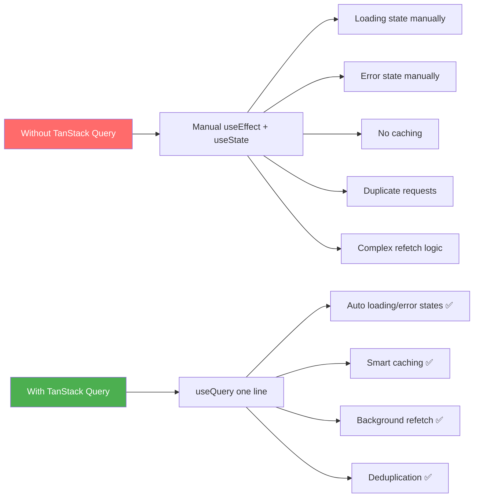
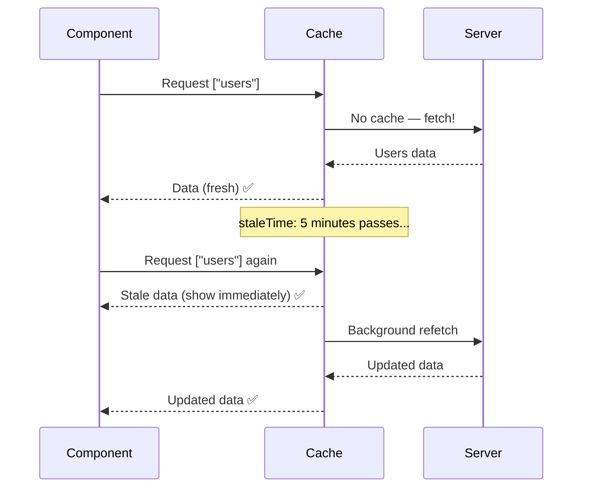

# 🔄 TanStack Query (React Query) — Part 1

## 📚 Topics Covered
- Server state vs client state — the key difference
- Why TanStack Query vs manual `useEffect` + `useState`
- Installation and setup — `QueryClient` and `QueryClientProvider`
- `useQuery` hook — fetching and caching data
- `queryKey` — how caching and deduplication works
- `isLoading` vs `isFetching` difference
- `staleTime` and `gcTime` — cache configuration
- Dynamic queries with `enabled` option
- Manual `refetch` and refresh buttons
- React Query DevTools
- Project: Posts App with list and detail view

---

## Server State Management, `useQuery`, `QueryClient`, DevTools

---

## 🔹 What is TanStack Query?

TanStack Query (formerly **React Query**) is a powerful library for **managing server state** in React. It handles:

- **Fetching** data from APIs
- **Caching** responses
- **Re-fetching** when data gets stale
- **Synchronizing** data across components
- **Loading and error states** automatically



---

## 🔹 Installation

```bash
npm install @tanstack/react-query
# Optional but highly recommended DevTools
npm install @tanstack/react-query-devtools
```

---

## 🔹 Setup — QueryClient & Provider

Wrap your app with `QueryClientProvider` — this provides the cache to all components:

```jsx
// src/main.jsx
import { StrictMode } from "react";
import { createRoot } from "react-dom/client";
import { QueryClient, QueryClientProvider } from "@tanstack/react-query";
import { ReactQueryDevtools } from "@tanstack/react-query-devtools";
import App from "./App";

// Create the client — configure defaults here
const queryClient = new QueryClient({
  defaultOptions: {
    queries: {
      staleTime: 1000 * 60 * 5,  // 5 minutes — data is fresh for 5 mins
      retry: 2,                    // retry failed requests 2 times
      refetchOnWindowFocus: true,  // refetch when user switches back to tab
    },
  },
});

createRoot(document.getElementById("root")).render(
  <StrictMode>
    <QueryClientProvider client={queryClient}>
      <App />
      {/* DevTools panel — only shows in development */}
      <ReactQueryDevtools initialIsOpen={false} />
    </QueryClientProvider>
  </StrictMode>
);
```

---

## 🔹 `useQuery` — Fetch Data

### 🧩 Basic Syntax

```jsx
const { data, isLoading, isError, error } = useQuery({
  queryKey: ["uniqueKey"],
  queryFn: () => fetch("/api/data").then(r => r.json()),
});
```

- `queryKey` — unique identifier for this query (used for caching)
- `queryFn` — async function that returns the data

---

### 📍 Before TanStack Query (Verbose)

```jsx
function UserList() {
  const [users, setUsers] = useState([]);
  const [loading, setLoading] = useState(true);
  const [error, setError] = useState(null);

  useEffect(() => {
    fetch("https://jsonplaceholder.typicode.com/users")
      .then((r) => {
        if (!r.ok) throw new Error("Failed to fetch");
        return r.json();
      })
      .then((data) => {
        setUsers(data);
        setLoading(false);
      })
      .catch((err) => {
        setError(err.message);
        setLoading(false);
      });
  }, []);

  if (loading) return <div>Loading...</div>;
  if (error) return <div>Error: {error}</div>;

  return (
    <ul>{users.map((u) => <li key={u.id}>{u.name}</li>)}</ul>
  );
}
```

---

### ✅ With TanStack Query (Clean!)

```jsx
import { useQuery } from "@tanstack/react-query";

async function fetchUsers() {
  const res = await fetch("https://jsonplaceholder.typicode.com/users");
  if (!res.ok) throw new Error("Failed to fetch users");
  return res.json();
}

function UserList() {
  const { data: users, isLoading, isError, error } = useQuery({
    queryKey: ["users"],
    queryFn: fetchUsers,
  });

  if (isLoading) return <div>⏳ Loading...</div>;
  if (isError) return <div>❌ Error: {error.message}</div>;

  return (
    <ul>
      {users.map((user) => (
        <li key={user.id}>{user.name} — {user.email}</li>
      ))}
    </ul>
  );
}
```

Same functionality — 50% less code! ✅

---

## 🔹 Query Key — The Cache Key

The `queryKey` is how TanStack Query identifies and caches data:

```jsx
// Static key — same cache entry
useQuery({ queryKey: ["users"], queryFn: fetchUsers });

// Dynamic key — different cache entry per user
useQuery({ queryKey: ["user", userId], queryFn: () => fetchUser(userId) });

// With filters — different cache per filter
useQuery({
  queryKey: ["users", { status: "active", page: 2 }],
  queryFn: () => fetchUsers({ status: "active", page: 2 }),
});
```

> **Rule:** Include everything the query function depends on in the key!

---

## 🔹 All useQuery Return Values

```jsx
const {
  data,           // The fetched data (undefined while loading)
  isLoading,      // true on first fetch (no cached data yet)
  isFetching,     // true whenever a request is in-flight (including refetches)
  isError,        // true if the query failed
  error,          // the Error object if failed
  isSuccess,      // true if data fetched successfully
  status,         // "loading" | "error" | "success"
  refetch,        // function to manually trigger a refetch
  dataUpdatedAt,  // timestamp of last successful fetch
} = useQuery({ queryKey: ["users"], queryFn: fetchUsers });
```

---

### 📍 isFetching vs isLoading

```jsx
function Users() {
  const { data, isLoading, isFetching } = useQuery({
    queryKey: ["users"],
    queryFn: fetchUsers,
  });

  return (
    <div>
      {/* Shows only on FIRST load (no cached data) */}
      {isLoading && <div>Loading users...</div>}

      {/* Shows on any request — including background refetch */}
      {isFetching && <div style={{ position: "fixed", top: 8, right: 8 }}>
        🔄 Refreshing...
      </div>}

      {data?.map((user) => <div key={user.id}>{user.name}</div>)}
    </div>
  );
}
```

---

## 🔹 Caching & Stale Time



```jsx
const queryClient = new QueryClient({
  defaultOptions: {
    queries: {
      staleTime: 1000 * 60 * 5,     // Fresh for 5 minutes
      gcTime: 1000 * 60 * 10,        // Keep in cache for 10 minutes
    },
  },
});

// Or per-query
useQuery({
  queryKey: ["config"],
  queryFn: fetchConfig,
  staleTime: Infinity,  // Never considered stale (use for static data)
});
```

---

## 🔹 Dynamic Queries — Fetch by ID

```jsx
import { useQuery } from "@tanstack/react-query";
import { useParams } from "react-router-dom";

async function fetchPost(id) {
  const res = await fetch(`https://jsonplaceholder.typicode.com/posts/${id}`);
  if (!res.ok) throw new Error("Post not found");
  return res.json();
}

function PostDetail() {
  const { id } = useParams();

  const { data: post, isLoading, isError } = useQuery({
    queryKey: ["post", id],    // key includes id — separate cache per post
    queryFn: () => fetchPost(id),
    enabled: !!id,             // only run when id exists
  });

  if (isLoading) return <div>⏳ Loading post...</div>;
  if (isError) return <div>❌ Post not found</div>;

  return (
    <article>
      <h1>{post.title}</h1>
      <p>{post.body}</p>
    </article>
  );
}
```

---

## 🔹 `enabled` Option — Conditional Queries

```jsx
function UserPosts({ userId }) {
  // Only fetch posts AFTER we have a userId
  const { data: posts } = useQuery({
    queryKey: ["posts", userId],
    queryFn: () => fetchPostsByUser(userId),
    enabled: !!userId,  // won't run if userId is null/undefined
  });

  return <div>{posts?.map(p => <div key={p.id}>{p.title}</div>)}</div>;
}
```

---

## 🔹 Manual Refetch & Refresh Button

```jsx
function WeatherWidget() {
  const { data, isLoading, isFetching, refetch } = useQuery({
    queryKey: ["weather"],
    queryFn: fetchWeather,
    staleTime: 1000 * 60, // 1 minute
  });

  return (
    <div style={{ padding: 20, border: "1px solid #ddd", borderRadius: 8 }}>
      <div style={{ display: "flex", justifyContent: "space-between" }}>
        <h3>🌤️ Weather</h3>
        <button
          onClick={() => refetch()}
          disabled={isFetching}
          style={{ padding: "4px 12px" }}
        >
          {isFetching ? "Refreshing..." : "🔄 Refresh"}
        </button>
      </div>

      {isLoading ? (
        <div>Loading weather...</div>
      ) : (
        <div>
          <p>Temperature: {data?.temp}°C</p>
          <p>Condition: {data?.condition}</p>
        </div>
      )}
    </div>
  );
}
```

---

## 🔹 Complete Example — Posts App

```jsx
// api/posts.js
export const fetchPosts = async () => {
  const res = await fetch("https://jsonplaceholder.typicode.com/posts?_limit=10");
  if (!res.ok) throw new Error("Failed to fetch posts");
  return res.json();
};

export const fetchPost = async (id) => {
  const res = await fetch(`https://jsonplaceholder.typicode.com/posts/${id}`);
  if (!res.ok) throw new Error("Post not found");
  return res.json();
};
```

```jsx
// components/PostList.jsx
import { useQuery } from "@tanstack/react-query";
import { fetchPosts } from "../api/posts";

function PostList({ onSelect }) {
  const { data: posts, isLoading, isError, error, isFetching } = useQuery({
    queryKey: ["posts"],
    queryFn: fetchPosts,
    staleTime: 1000 * 30,
  });

  if (isLoading) return <div style={{ padding: 20 }}>⏳ Loading posts...</div>;
  if (isError) return <div style={{ color: "red" }}>Error: {error.message}</div>;

  return (
    <div>
      {isFetching && (
        <div style={{ fontSize: 12, color: "#999", padding: "4px 12px" }}>
          🔄 Updating...
        </div>
      )}
      {posts.map((post) => (
        <div
          key={post.id}
          onClick={() => onSelect(post.id)}
          style={{
            padding: 12,
            borderBottom: "1px solid #eee",
            cursor: "pointer",
          }}
          onMouseEnter={(e) => e.target.style.background = "#f5f5f5"}
          onMouseLeave={(e) => e.target.style.background = "transparent"}
        >
          <strong>#{post.id}</strong> {post.title}
        </div>
      ))}
    </div>
  );
}
```

```jsx
// components/PostDetail.jsx
import { useQuery } from "@tanstack/react-query";
import { fetchPost } from "../api/posts";

function PostDetail({ postId }) {
  const { data: post, isLoading } = useQuery({
    queryKey: ["post", postId],
    queryFn: () => fetchPost(postId),
    enabled: !!postId,
  });

  if (!postId) return <div style={{ padding: 20, color: "#999" }}>← Select a post</div>;
  if (isLoading) return <div style={{ padding: 20 }}>⏳ Loading...</div>;

  return (
    <div style={{ padding: 20 }}>
      <h2>{post.title}</h2>
      <p style={{ lineHeight: 1.6 }}>{post.body}</p>
      <p style={{ color: "#999", fontSize: 12 }}>Post ID: {post.id}</p>
    </div>
  );
}
```

```jsx
// App.jsx
import { useState } from "react";
import PostList from "./components/PostList";
import PostDetail from "./components/PostDetail";

function App() {
  const [selectedId, setSelectedId] = useState(null);

  return (
    <div style={{ display: "grid", gridTemplateColumns: "300px 1fr", height: "100vh" }}>
      <div style={{ borderRight: "1px solid #ddd", overflowY: "auto" }}>
        <h3 style={{ padding: "12px 16px", borderBottom: "1px solid #eee" }}>
          📝 Posts
        </h3>
        <PostList onSelect={setSelectedId} />
      </div>
      <PostDetail postId={selectedId} />
    </div>
  );
}

export default App;
```

---

## 🎯 Interview Questions

**Q1: What is the difference between server state and client state?**

> Client state is local UI state (modal open/closed, form values). Server state is data from an API that needs to be fetched, cached, and kept in sync. TanStack Query manages server state.

**Q2: What is `staleTime`?**

> The time data is considered "fresh". During this period, re-renders won't trigger new requests. After staleTime, data is "stale" and a background refetch happens next time the query is used.

**Q3: What is `gcTime` (formerly `cacheTime`)?**

> How long data stays in cache after all components using it unmount. Defaults to 5 minutes. After this, cached data is garbage collected.

**Q4: Why use TanStack Query instead of just `useEffect`?**

> TanStack Query provides caching, deduplication (two components using same key = one request), background refetching, stale data management, loading/error states, retry logic, and DevTools — all out of the box.

---

## 🏠 Home Task

Build a **GitHub User Search App**:
1. Search input for GitHub username
2. Use `useQuery` with `enabled: !!username` to fetch user profile
3. Show user's avatar, name, bio, followers, following, repos
4. On repo click — fetch and show repo details (another `useQuery` with repo id)
5. Add a "Refresh" button using `refetch`
6. Show `isFetching` spinner in top-right corner
7. Open DevTools and watch the cache update!
