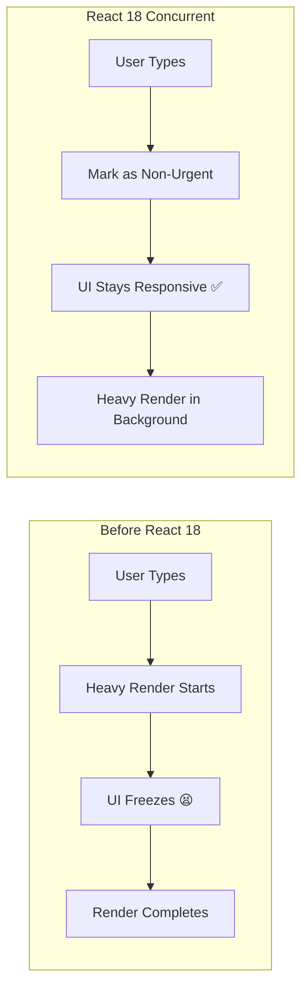
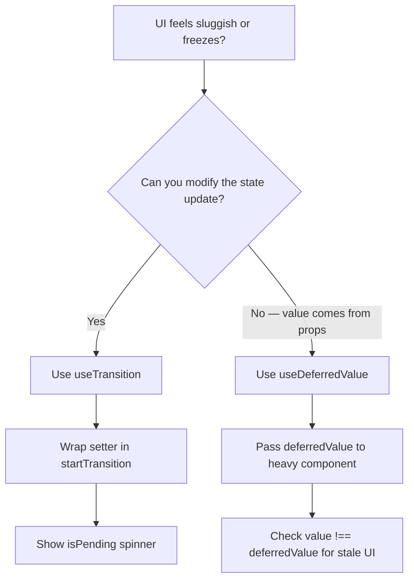

# 🚀 React 18 Concurrent Features

## 📚 Topics Covered
- What is Concurrent Mode and why React 18 introduced it
- `useTransition` — mark state updates as non-urgent
- `isPending` — showing loading state during transitions
- `useDeferredValue` — defer a slow value update
- `useTransition` vs `useDeferredValue` — comparison
- React 18 Automatic Batching
- `startTransition` as standalone function
- Project: User Dashboard with large dataset filtering

---

## `useTransition`, `useDeferredValue` — Keep Your UI Responsive

---

## 🔹 Why Concurrent Features?

Before React 18, all state updates were **urgent** — React would stop everything and re-render immediately. This caused UI to **freeze** during heavy updates (like filtering a huge list).

React 18 introduced **Concurrent Mode** — React can now **pause, resume, and prioritize** renders.



---

## 🔹 1. `useTransition` — Mark Updates as Non-Urgent

### 🧠 What is it?

`useTransition` lets you mark a state update as a **transition** (non-urgent). React will keep the current UI responsive while processing the heavy update in the background.

### 🧩 Syntax

```jsx
const [isPending, startTransition] = useTransition();
```

- `isPending` — `true` while the transition is running
- `startTransition` — wrap your non-urgent state update inside

---

### 📍 Problem Without useTransition

```jsx
import { useState } from "react";

// Generate large list
const allItems = Array.from({ length: 10000 }, (_, i) => `Item ${i + 1}`);

function SlowSearch() {
  const [query, setQuery] = useState("");
  const [results, setResults] = useState(allItems);

  const handleChange = (e) => {
    setQuery(e.target.value);
    // This heavy filter blocks the input from updating!
    setResults(allItems.filter((item) =>
      item.toLowerCase().includes(e.target.value.toLowerCase())
    ));
  };

  return (
    <div>
      <input value={query} onChange={handleChange} placeholder="Search..." />
      {/* UI freezes while filtering 10,000 items */}
      {results.map((item) => <div key={item}>{item}</div>)}
    </div>
  );
}
```

---

### ✅ Solution With useTransition

```jsx
import { useState, useTransition } from "react";

const allItems = Array.from({ length: 10000 }, (_, i) => `Item ${i + 1}`);

function FastSearch() {
  const [query, setQuery] = useState("");
  const [results, setResults] = useState(allItems);
  const [isPending, startTransition] = useTransition();

  const handleChange = (e) => {
    const value = e.target.value;

    // Urgent: update input immediately
    setQuery(value);

    // Non-urgent: filtering can wait
    startTransition(() => {
      setResults(
        allItems.filter((item) =>
          item.toLowerCase().includes(value.toLowerCase())
        )
      );
    });
  };

  return (
    <div style={{ padding: 20 }}>
      <input
        value={query}
        onChange={handleChange}
        placeholder="Search 10,000 items..."
        style={{ padding: 8, width: 300, fontSize: 16 }}
      />

      {isPending && (
        <p style={{ color: "#999" }}>⏳ Updating results...</p>
      )}

      <p>{results.length} results</p>

      <div style={{ height: 400, overflowY: "auto" }}>
        {results.map((item) => (
          <div key={item} style={{ padding: 4, borderBottom: "1px solid #eee" }}>
            {item}
          </div>
        ))}
      </div>
    </div>
  );
}
```

---

### 📍 Real World: Tab Switching

```jsx
import { useState, useTransition, memo } from "react";

// Simulate heavy component
const HeavyTab = memo(function HeavyTab({ tab }) {
  // Simulate slow render
  const start = Date.now();
  while (Date.now() - start < 100) {} // artificial delay

  return (
    <div style={{ padding: 20 }}>
      <h3>Content for: {tab}</h3>
      <p>This tab has a lot of content that takes time to render.</p>
    </div>
  );
});

const tabs = ["Home", "About", "Products", "Contact"];

function TabContainer() {
  const [activeTab, setActiveTab] = useState("Home");
  const [isPending, startTransition] = useTransition();

  const handleTabChange = (tab) => {
    startTransition(() => {
      setActiveTab(tab);
    });
  };

  return (
    <div>
      <div style={{ display: "flex", gap: 8, marginBottom: 16 }}>
        {tabs.map((tab) => (
          <button
            key={tab}
            onClick={() => handleTabChange(tab)}
            style={{
              padding: "8px 16px",
              background: activeTab === tab ? "#2196f3" : "#eee",
              color: activeTab === tab ? "#fff" : "#333",
              border: "none",
              borderRadius: 4,
              cursor: "pointer",
              opacity: isPending ? 0.7 : 1,
            }}
          >
            {tab}
          </button>
        ))}
      </div>

      {isPending ? (
        <div style={{ opacity: 0.5 }}>Loading...</div>
      ) : (
        <HeavyTab tab={activeTab} />
      )}
    </div>
  );
}
```

---

## 🔹 2. `useDeferredValue` — Defer a Value Update

### 🧠 What is it?

`useDeferredValue` takes a value and returns a **deferred version** of it. The deferred value "lags behind" the real value during heavy renders — React renders the urgent update first, then catches up.

### 🧩 Syntax

```jsx
const deferredValue = useDeferredValue(value);
```

---

### 📍 useTransition vs useDeferredValue

| | `useTransition` | `useDeferredValue` |
|--|-----------------|-------------------|
| Controls | The **state update** | The **value** |
| Use when | You own the state update code | You receive value as a prop or can't modify state setter |
| Has `isPending`? | Yes ✅ | No (use `value !== deferredValue`) |

---

### 📍 Example: Deferred Search Results

```jsx
import { useState, useDeferredValue, memo } from "react";

const allItems = Array.from({ length: 10000 }, (_, i) => `Product ${i + 1}`);

// Heavy list component
const SearchResults = memo(function SearchResults({ query }) {
  const filtered = allItems.filter((item) =>
    item.toLowerCase().includes(query.toLowerCase())
  );

  return (
    <div>
      <p>{filtered.length} results</p>
      {filtered.slice(0, 50).map((item) => (
        <div key={item} style={{ padding: 4 }}>
          {item}
        </div>
      ))}
    </div>
  );
});

function DeferredSearch() {
  const [query, setQuery] = useState("");

  // Deferred version lags behind during heavy renders
  const deferredQuery = useDeferredValue(query);

  // true = stale results being shown
  const isStale = query !== deferredQuery;

  return (
    <div style={{ padding: 20 }}>
      <input
        value={query}
        onChange={(e) => setQuery(e.target.value)}
        placeholder="Search products..."
        style={{ padding: 8, width: 300 }}
      />

      <div style={{ opacity: isStale ? 0.5 : 1 }}>
        {isStale && <span style={{ color: "#999" }}>Updating...</span>}
        <SearchResults query={deferredQuery} />
      </div>
    </div>
  );
}
```

---

### 📍 Real World: Live Preview with Deferred Rendering

```jsx
import { useState, useDeferredValue } from "react";

// Simulate expensive markdown renderer
function MarkdownPreview({ markdown }) {
  // Simulate slow operation
  const start = Date.now();
  while (Date.now() - start < 50) {}

  return (
    <div
      style={{
        padding: 16,
        background: "#f8f9fa",
        borderRadius: 8,
        minHeight: 200,
        border: "1px solid #dee2e6",
      }}
    >
      <h4>Preview:</h4>
      <pre style={{ whiteSpace: "pre-wrap" }}>{markdown}</pre>
    </div>
  );
}

function Editor() {
  const [text, setText] = useState("");
  const deferredText = useDeferredValue(text);

  return (
    <div style={{ display: "grid", gridTemplateColumns: "1fr 1fr", gap: 16, padding: 20 }}>
      <div>
        <h4>Editor:</h4>
        <textarea
          value={text}
          onChange={(e) => setText(e.target.value)}
          style={{ width: "100%", height: 200, padding: 8 }}
          placeholder="Type your markdown here..."
        />
      </div>

      {/* Preview uses deferred value — won't block typing */}
      <MarkdownPreview markdown={deferredText} />
    </div>
  );
}
```

---

## 🔹 React 18 Other Features

### Automatic Batching

Before React 18, multiple state updates inside `setTimeout` or Promises caused multiple re-renders:

```jsx
// Before React 18: 2 re-renders
setTimeout(() => {
  setCount(c => c + 1);  // re-render 1
  setName("Ali");         // re-render 2
}, 1000);

// React 18: Automatically batched = 1 re-render!
setTimeout(() => {
  setCount(c => c + 1);  // batched
  setName("Ali");         // batched → 1 re-render only
}, 1000);
```

### `startTransition` as standalone function

```jsx
import { startTransition } from "react";

// Can use without the hook if you don't need isPending
startTransition(() => {
  setHeavyState(newValue);
});
```

---

## 🔹 When to Use Each



---

## 🔹 Complete App Example

```jsx
import { useState, useTransition, useDeferredValue, memo } from "react";

// Generate fake user data
const users = Array.from({ length: 5000 }, (_, i) => ({
  id: i,
  name: `User ${i + 1}`,
  email: `user${i + 1}@example.com`,
  role: i % 3 === 0 ? "Admin" : i % 3 === 1 ? "Editor" : "Viewer",
}));

const UserTable = memo(function UserTable({ query, role }) {
  const filtered = users.filter(
    (u) =>
      u.name.toLowerCase().includes(query.toLowerCase()) &&
      (role === "All" || u.role === role)
  );

  return (
    <table style={{ width: "100%", borderCollapse: "collapse" }}>
      <thead>
        <tr style={{ background: "#f0f0f0" }}>
          <th style={{ padding: 8, textAlign: "left" }}>Name</th>
          <th style={{ padding: 8, textAlign: "left" }}>Email</th>
          <th style={{ padding: 8, textAlign: "left" }}>Role</th>
        </tr>
      </thead>
      <tbody>
        {filtered.slice(0, 20).map((user) => (
          <tr key={user.id} style={{ borderBottom: "1px solid #eee" }}>
            <td style={{ padding: 8 }}>{user.name}</td>
            <td style={{ padding: 8 }}>{user.email}</td>
            <td style={{ padding: 8 }}>{user.role}</td>
          </tr>
        ))}
      </tbody>
    </table>
  );
});

function UserDashboard() {
  const [searchQuery, setSearchQuery] = useState("");
  const [roleFilter, setRoleFilter] = useState("All");
  const [isPending, startTransition] = useTransition();

  const deferredQuery = useDeferredValue(searchQuery);

  const handleSearch = (e) => {
    setSearchQuery(e.target.value); // urgent
    startTransition(() => {
      // role filter is non-urgent
    });
  };

  const handleRole = (role) => {
    startTransition(() => {
      setRoleFilter(role);
    });
  };

  return (
    <div style={{ padding: 20, maxWidth: 800, margin: "0 auto" }}>
      <h2>👥 User Dashboard</h2>

      <div style={{ display: "flex", gap: 12, marginBottom: 16 }}>
        <input
          value={searchQuery}
          onChange={handleSearch}
          placeholder="Search users..."
          style={{ flex: 1, padding: 8 }}
        />
        {["All", "Admin", "Editor", "Viewer"].map((role) => (
          <button
            key={role}
            onClick={() => handleRole(role)}
            style={{
              padding: "8px 12px",
              background: roleFilter === role ? "#2196f3" : "#eee",
              color: roleFilter === role ? "#fff" : "#333",
              border: "none",
              borderRadius: 4,
              cursor: "pointer",
            }}
          >
            {role}
          </button>
        ))}
      </div>

      <div style={{ opacity: isPending ? 0.6 : 1, transition: "opacity 0.2s" }}>
        {isPending && <p style={{ color: "#666" }}>⏳ Filtering...</p>}
        <UserTable query={deferredQuery} role={roleFilter} />
      </div>
    </div>
  );
}

export default UserDashboard;
```

---

## 🎯 Interview Questions

**Q1: What is Concurrent Mode in React 18?**

> Concurrent Mode allows React to prepare multiple versions of the UI at the same time. It can pause, resume, or abandon renders to keep the UI responsive. `useTransition` and `useDeferredValue` expose this capability.

**Q2: What's the difference between `useTransition` and `useDeferredValue`?**

> `useTransition` wraps the **state setter** — you control what's non-urgent. `useDeferredValue` wraps the **value** — useful when you receive the value as a prop or can't control the setter. Both defer heavy renders but from different angles.

**Q3: Does `startTransition` make renders faster?**

> No — it just changes the **priority**. The heavy render still happens, but it doesn't block urgent updates (like user input). The UI stays interactive.

**Q4: When would you use `isPending` from `useTransition`?**

> To show a loading/spinner state while the deferred render is in progress — so users know something is updating.

---

## 🏠 Home Task

Build a **Country Search App**:
1. List of 200+ countries (name, population, capital, region)
2. Search input using `useTransition` — input stays responsive
3. Filter by region using `useDeferredValue`
4. Show "Searching..." when `isPending` is true
5. Show faded/opaque list while deferred value catches up
6. Stats bar: total results found
