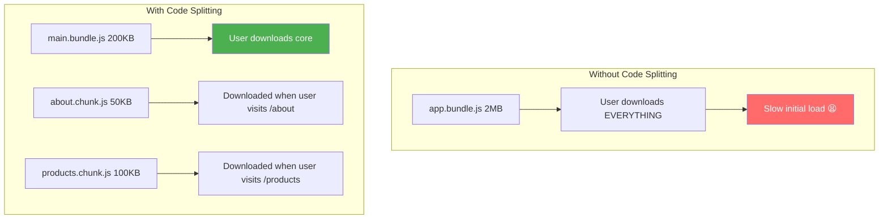
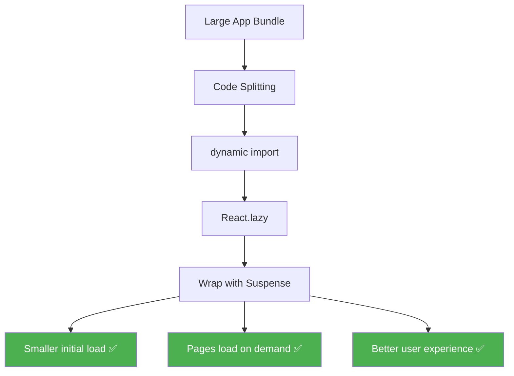

# 🔀 Code Splitting, Lazy Loading & Suspense

## 📚 Topics Covered
- Why code splitting matters — bundle size and load time
- Dynamic `import()` — the foundation of lazy loading
- `React.lazy()` — lazy load components on demand
- `Suspense` — show fallback UI while component loads
- Route-based code splitting with React Router
- Multiple `Suspense` boundaries — granular loading states
- Lazy loading on user action (modals, heavy widgets)
- Prefetching on hover
- Vite bundle analysis with `rollup-plugin-visualizer`
- Common mistakes with `React.lazy()`

---

## `React.lazy()`, `Suspense`, Dynamic Imports

---

## 🔹 Why Code Splitting?

By default, React bundles **all your JavaScript** into one large file. When a user visits your app, their browser downloads **everything** — even pages they might never visit.



**Code Splitting** = split your app into smaller chunks, load them **on demand**.

---

## 🔹 1. Dynamic `import()` — The Foundation

JavaScript's `import()` function loads a module **asynchronously** at runtime.

```jsx
// Static import (loaded at startup — always)
import HeavyComponent from "./HeavyComponent";

// Dynamic import (loaded on demand — lazy!)
const HeavyComponent = await import("./HeavyComponent");
```

---

## 🔹 2. `React.lazy()` — Lazy Load Components

### 🧠 What is it?

`React.lazy()` takes a function that calls `import()` and returns a **lazy component** that only loads its code when it's first rendered.

### 🧩 Syntax

```jsx
const LazyComponent = React.lazy(() => import("./MyComponent"));
```

---

### 🔹 3. `Suspense` — Show Fallback While Loading

`Suspense` wraps lazy components and shows a **fallback UI** while the component is loading.

```jsx
import { Suspense } from "react";

<Suspense fallback={<div>Loading...</div>}>
  <LazyComponent />
</Suspense>
```

---

### 📍 Basic Example

```jsx
import { lazy, Suspense } from "react";

// ❌ Old way — always loaded
// import HeavyChart from "./HeavyChart";

// ✅ New way — loaded only when needed
const HeavyChart = lazy(() => import("./HeavyChart"));

function Dashboard() {
  return (
    <div>
      <h1>Dashboard</h1>
      <Suspense fallback={<div>📊 Loading chart...</div>}>
        <HeavyChart />
      </Suspense>
    </div>
  );
}
```

---

## 🔹 4. Lazy Loading with React Router

The most common use case — lazy load entire pages/routes:

```jsx
import { lazy, Suspense } from "react";
import { BrowserRouter, Routes, Route } from "react-router-dom";

// Each page is a separate chunk — loaded when user navigates there
const Home = lazy(() => import("./pages/Home"));
const About = lazy(() => import("./pages/About"));
const Products = lazy(() => import("./pages/Products"));
const ProductDetail = lazy(() => import("./pages/ProductDetail"));
const Contact = lazy(() => import("./pages/Contact"));

function App() {
  return (
    <BrowserRouter>
      <Suspense
        fallback={
          <div style={{
            display: "flex",
            justifyContent: "center",
            alignItems: "center",
            height: "100vh",
            fontSize: 18,
          }}>
            ⏳ Loading page...
          </div>
        }
      >
        <Routes>
          <Route path="/" element={<Home />} />
          <Route path="/about" element={<About />} />
          <Route path="/products" element={<Products />} />
          <Route path="/products/:id" element={<ProductDetail />} />
          <Route path="/contact" element={<Contact />} />
        </Routes>
      </Suspense>
    </BrowserRouter>
  );
}

export default App;
```

---

## 🔹 5. Custom Loading Spinner

```jsx
function PageLoader() {
  return (
    <div
      style={{
        display: "flex",
        flexDirection: "column",
        alignItems: "center",
        justifyContent: "center",
        height: "50vh",
        gap: 16,
      }}
    >
      <div
        style={{
          width: 48,
          height: 48,
          border: "4px solid #e0e0e0",
          borderTop: "4px solid #2196f3",
          borderRadius: "50%",
          animation: "spin 0.8s linear infinite",
        }}
      />
      <p style={{ color: "#666" }}>Loading...</p>
      <style>{`
        @keyframes spin {
          to { transform: rotate(360deg); }
        }
      `}</style>
    </div>
  );
}

// Usage
<Suspense fallback={<PageLoader />}>
  <LazyComponent />
</Suspense>
```

---

## 🔹 6. Multiple Suspense Boundaries

You can have **nested Suspense** boundaries — each showing its own fallback:

```jsx
function App() {
  return (
    <div>
      {/* Page-level suspense */}
      <Suspense fallback={<PageLoader />}>
        <Routes>...</Routes>
      </Suspense>
    </div>
  );
}

function ProductPage() {
  const Reviews = lazy(() => import("./Reviews"));
  const RecommendedProducts = lazy(() => import("./RecommendedProducts"));

  return (
    <div>
      <h1>Product Details</h1>

      {/* Component-level suspense */}
      <Suspense fallback={<div>Loading reviews...</div>}>
        <Reviews />
      </Suspense>

      <Suspense fallback={<div>Loading recommendations...</div>}>
        <RecommendedProducts />
      </Suspense>
    </div>
  );
}
```

---

## 🔹 7. Lazy Loading on User Action

Load heavy components only when user clicks a button:

```jsx
import { lazy, Suspense, useState } from "react";

const HeavyModal = lazy(() => import("./HeavyModal"));

function App() {
  const [showModal, setShowModal] = useState(false);

  return (
    <div>
      <button onClick={() => setShowModal(true)}>
        Open Heavy Modal
      </button>

      {/* Component only loads when showModal becomes true */}
      {showModal && (
        <Suspense fallback={<div>Loading modal...</div>}>
          <HeavyModal onClose={() => setShowModal(false)} />
        </Suspense>
      )}
    </div>
  );
}
```

---

## 🔹 8. Prefetching — Load Before User Clicks

```jsx
// Prefetch on hover — user hasn't clicked yet but we start loading
function NavLink({ to, children }) {
  const handleMouseEnter = () => {
    // Trigger the import early
    import(`./pages/${to}`);
  };

  return (
    <Link to={`/${to}`} onMouseEnter={handleMouseEnter}>
      {children}
    </Link>
  );
}

// Usage
<NavLink to="about">About</NavLink>
// When user hovers → About page starts loading
// When user clicks → Already loaded!
```

---

## 🔹 9. Complete App with Lazy Loading

```jsx
// src/App.jsx
import { lazy, Suspense } from "react";
import { BrowserRouter, Routes, Route, Link } from "react-router-dom";

const Home = lazy(() => import("./pages/Home"));
const Shop = lazy(() => import("./pages/Shop"));
const Cart = lazy(() => import("./pages/Cart"));
const Profile = lazy(() => import("./pages/Profile"));

function Navbar() {
  return (
    <nav style={{
      background: "#1a1a2e",
      padding: "12px 24px",
      display: "flex",
      gap: 24,
    }}>
      {[
        { to: "/", label: "🏠 Home" },
        { to: "/shop", label: "🛍️ Shop" },
        { to: "/cart", label: "🛒 Cart" },
        { to: "/profile", label: "👤 Profile" },
      ].map(({ to, label }) => (
        <Link
          key={to}
          to={to}
          style={{ color: "#fff", textDecoration: "none" }}
        >
          {label}
        </Link>
      ))}
    </nav>
  );
}

function LoadingPage() {
  return (
    <div style={{
      display: "flex",
      alignItems: "center",
      justifyContent: "center",
      height: "calc(100vh - 50px)",
      fontSize: 24,
      color: "#666",
    }}>
      ⏳ Loading...
    </div>
  );
}

function App() {
  return (
    <BrowserRouter>
      <Navbar />
      <Suspense fallback={<LoadingPage />}>
        <Routes>
          <Route path="/" element={<Home />} />
          <Route path="/shop" element={<Shop />} />
          <Route path="/cart" element={<Cart />} />
          <Route path="/profile" element={<Profile />} />
        </Routes>
      </Suspense>
    </BrowserRouter>
  );
}

export default App;
```

---

## 🔹 10. Vite Bundle Analysis — See Your Chunks

```bash
# Install visualizer plugin
npm install --save-dev rollup-plugin-visualizer

# vite.config.js
import { defineConfig } from 'vite'
import react from '@vitejs/plugin-react'
import { visualizer } from 'rollup-plugin-visualizer'

export default defineConfig({
  plugins: [
    react(),
    visualizer({ open: true })  // Opens bundle analysis after build
  ],
})

# Build and see analysis
npm run build
```

This opens a visual treemap showing which chunks are large.

---

## 🔹 Common Mistakes ❌

### 1. Defining lazy components inside a component

```jsx
// ❌ Wrong — creates new lazy component on every render!
function App() {
  const LazyComp = lazy(() => import("./LazyComp")); // BAD!
  return <LazyComp />;
}

// ✅ Correct — define outside the component
const LazyComp = lazy(() => import("./LazyComp"));
function App() {
  return <LazyComp />;
}
```

### 2. No Suspense boundary

```jsx
// ❌ Wrong — lazy component with no Suspense
const LazyComp = lazy(() => import("./LazyComp"));
function App() {
  return <LazyComp />; // Throws error!
}

// ✅ Must wrap with Suspense
function App() {
  return (
    <Suspense fallback={<div>Loading...</div>}>
      <LazyComp />
    </Suspense>
  );
}
```

---

## 🔹 Summary



---

## 🎯 Interview Questions

**Q1: What is code splitting?**

> Breaking the app bundle into smaller chunks that are loaded **on demand** instead of all at once. This reduces initial load time.

**Q2: What does `React.lazy()` require?**

> It requires the component to be the **default export** of the module. Named exports won't work directly.

**Q3: What happens if no Suspense boundary is found?**

> React throws an error. Every `lazy` component must be inside a `Suspense` boundary somewhere in its ancestor tree.

**Q4: Can you use lazy loading for non-component modules?**

> The dynamic `import()` function can load any module, but `React.lazy()` specifically is for React components. For data/utility lazy loading, use `import()` directly in `useEffect` or event handlers.

---

## 🏠 Home Task

Build a **Multi-page App** with code splitting:
1. 4+ pages: Home, Products, Cart, Dashboard
2. All pages lazily loaded with `React.lazy()`
3. Global Suspense with a nice spinner
4. Prefetch next page on nav link hover
5. Conditional component: heavy modal/chart only loads when user opens it
6. Check Network tab in DevTools to confirm separate chunks are loading
