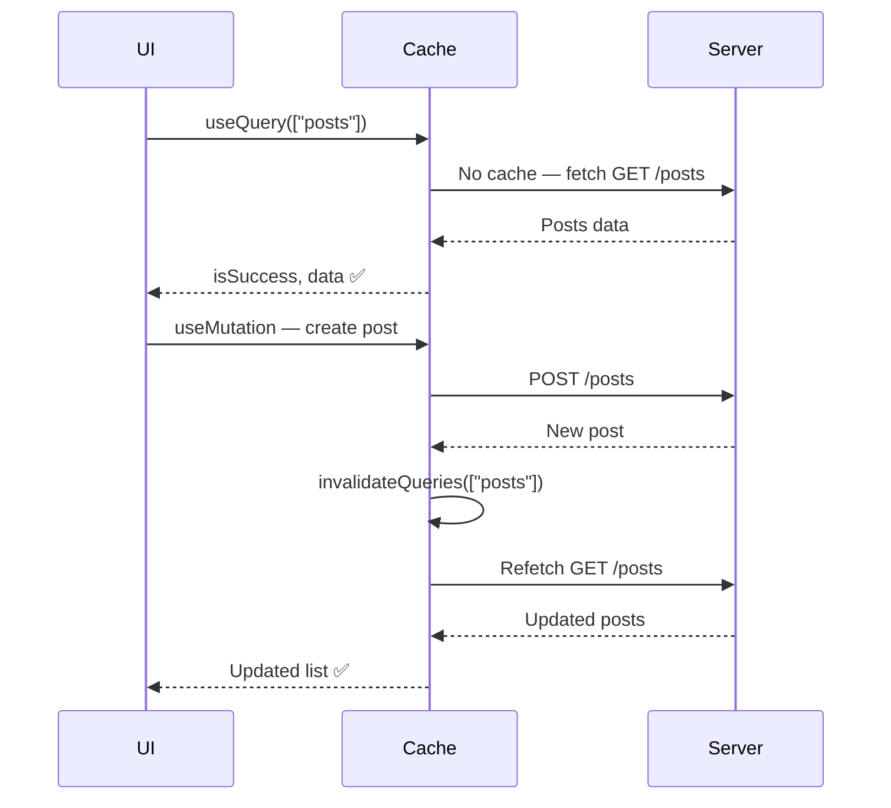

# 🔄 TanStack Query — Part 2

## 📚 Topics Covered
- `useMutation` — POST, PUT, DELETE operations
- `onSuccess`, `onError`, `onSettled` callbacks
- Cache invalidation with `invalidateQueries`
- Manual cache update with `setQueryData`
- Optimistic updates — instant UI with rollback on error
- `keepPreviousData` for smooth pagination transitions
- `useInfiniteQuery` — infinite scroll pattern
- `getNextPageParam` and `hasNextPage`
- Complete CRUD architecture with custom hooks
- Project: Product Manager with full CRUD

---

## `useMutation`, Pagination, Infinite Scroll, Cache Management, Optimistic Updates

---

## 🔹 Quick Recap — Part 1

| Concept | What it does |
|---------|-------------|
| `QueryClient` | Holds the cache for the whole app |
| `QueryClientProvider` | Provides cache to all components |
| `useQuery` | Fetches + caches data |
| `queryKey` | Unique cache identifier |
| `staleTime` | How long data stays fresh |

---

## 🔹 1. `useMutation` — Create, Update, Delete

`useQuery` is for **reading** data (GET). `useMutation` is for **writing** data (POST, PUT, PATCH, DELETE).

### 🧩 Syntax

```jsx
const mutation = useMutation({
  mutationFn: (newData) => postData(newData),
  onSuccess: (data) => { /* runs after success */ },
  onError: (error) => { /* runs after failure */ },
  onSettled: () => { /* runs after success OR failure */ },
});

// Trigger the mutation
mutation.mutate(payload);
```

---

### 📍 Example 1: Create a Post

```jsx
import { useMutation, useQueryClient } from "@tanstack/react-query";
import { useState } from "react";

async function createPost(newPost) {
  const res = await fetch("https://jsonplaceholder.typicode.com/posts", {
    method: "POST",
    headers: { "Content-Type": "application/json" },
    body: JSON.stringify(newPost),
  });
  if (!res.ok) throw new Error("Failed to create post");
  return res.json();
}

function CreatePostForm() {
  const [title, setTitle] = useState("");
  const [body, setBody] = useState("");
  const queryClient = useQueryClient();

  const createMutation = useMutation({
    mutationFn: createPost,

    // After success — refresh the posts list
    onSuccess: (newPost) => {
      console.log("Created:", newPost);

      // Invalidate cache — force a fresh fetch of posts list
      queryClient.invalidateQueries({ queryKey: ["posts"] });

      setTitle("");
      setBody("");
    },

    onError: (error) => {
      console.error("Error:", error.message);
    },
  });

  const handleSubmit = (e) => {
    e.preventDefault();
    createMutation.mutate({ title, body, userId: 1 });
  };

  return (
    <form onSubmit={handleSubmit} style={{ padding: 20 }}>
      <h3>Create Post</h3>

      <input
        value={title}
        onChange={(e) => setTitle(e.target.value)}
        placeholder="Title"
        style={{ display: "block", width: "100%", padding: 8, marginBottom: 8 }}
        required
      />

      <textarea
        value={body}
        onChange={(e) => setBody(e.target.value)}
        placeholder="Content"
        style={{ display: "block", width: "100%", padding: 8, marginBottom: 8, height: 80 }}
        required
      />

      <button
        type="submit"
        disabled={createMutation.isPending}
        style={{
          padding: "8px 20px",
          background: createMutation.isPending ? "#ccc" : "#2196f3",
          color: "#fff",
          border: "none",
          borderRadius: 4,
          cursor: createMutation.isPending ? "not-allowed" : "pointer",
        }}
      >
        {createMutation.isPending ? "Creating..." : "Create Post"}
      </button>

      {createMutation.isError && (
        <p style={{ color: "red" }}>❌ {createMutation.error.message}</p>
      )}
      {createMutation.isSuccess && (
        <p style={{ color: "green" }}>✅ Post created!</p>
      )}
    </form>
  );
}
```

---

### 📍 Example 2: Delete with Confirmation

```jsx
function DeleteButton({ postId }) {
  const queryClient = useQueryClient();

  const deleteMutation = useMutation({
    mutationFn: async (id) => {
      const res = await fetch(`https://jsonplaceholder.typicode.com/posts/${id}`, {
        method: "DELETE",
      });
      if (!res.ok) throw new Error("Delete failed");
    },
    onSuccess: () => {
      queryClient.invalidateQueries({ queryKey: ["posts"] });
    },
  });

  return (
    <button
      onClick={() => {
        if (window.confirm("Delete this post?")) {
          deleteMutation.mutate(postId);
        }
      }}
      disabled={deleteMutation.isPending}
      style={{ color: "red", background: "none", border: "1px solid red", borderRadius: 4, padding: "4px 8px", cursor: "pointer" }}
    >
      {deleteMutation.isPending ? "Deleting..." : "🗑️ Delete"}
    </button>
  );
}
```

---

## 🔹 2. Cache Invalidation vs Manual Update

### invalidateQueries — Refetch After Mutation

```jsx
// After creating/updating/deleting — tell React Query to refetch
queryClient.invalidateQueries({ queryKey: ["posts"] });

// Invalidate everything starting with "posts"
queryClient.invalidateQueries({ queryKey: ["posts"], exact: false });
```

### setQueryData — Update Cache Manually (No Refetch)

```jsx
const queryClient = useQueryClient();

// Directly update the cache with new data
queryClient.setQueryData(["posts"], (oldPosts) => {
  return [...oldPosts, newPost];
});
```

---

## 🔹 3. Optimistic Updates — Instant UI Feedback

Update the UI **before** the server responds, then roll back if it fails.

```jsx
function ToggleLike({ post }) {
  const queryClient = useQueryClient();

  const likeMutation = useMutation({
    mutationFn: (post) =>
      fetch(`/api/posts/${post.id}/like`, { method: "POST" }).then(r => r.json()),

    // Before request — optimistically update
    onMutate: async (targetPost) => {
      // Cancel any in-progress refetches to avoid overwriting
      await queryClient.cancelQueries({ queryKey: ["posts"] });

      // Snapshot the previous value (for rollback)
      const previousPosts = queryClient.getQueryData(["posts"]);

      // Optimistically update cache
      queryClient.setQueryData(["posts"], (old) =>
        old.map((p) =>
          p.id === targetPost.id
            ? { ...p, liked: !p.liked, likes: p.liked ? p.likes - 1 : p.likes + 1 }
            : p
        )
      );

      // Return context with snapshot
      return { previousPosts };
    },

    // If mutation fails — rollback to snapshot
    onError: (err, variables, context) => {
      queryClient.setQueryData(["posts"], context.previousPosts);
      alert("Failed to update like. Rolled back.");
    },

    // Always refetch after settle
    onSettled: () => {
      queryClient.invalidateQueries({ queryKey: ["posts"] });
    },
  });

  return (
    <button
      onClick={() => likeMutation.mutate(post)}
      style={{ color: post.liked ? "red" : "#666" }}
    >
      {post.liked ? "❤️" : "🤍"} {post.likes}
    </button>
  );
}
```

---

## 🔹 4. Pagination

```jsx
import { useState } from "react";
import { useQuery, keepPreviousData } from "@tanstack/react-query";

async function fetchPosts(page) {
  const res = await fetch(
    `https://jsonplaceholder.typicode.com/posts?_page=${page}&_limit=5`
  );
  const data = await res.json();
  const totalCount = res.headers.get("X-Total-Count"); // from JSONPlaceholder
  return { posts: data, total: Number(totalCount) };
}

function PaginatedPosts() {
  const [page, setPage] = useState(1);
  const limit = 5;

  const { data, isLoading, isError, isFetching } = useQuery({
    queryKey: ["posts", page],
    queryFn: () => fetchPosts(page),
    placeholderData: keepPreviousData, // Keep old data while fetching new page
  });

  const totalPages = data ? Math.ceil(data.total / limit) : 0;

  if (isLoading) return <div>⏳ Loading...</div>;
  if (isError) return <div>❌ Error loading posts</div>;

  return (
    <div style={{ maxWidth: 600, margin: "0 auto", padding: 20 }}>
      <h2>Posts {isFetching && "🔄"}</h2>

      {data.posts.map((post) => (
        <div key={post.id} style={{ padding: 12, borderBottom: "1px solid #eee" }}>
          <strong>{post.title}</strong>
          <p style={{ color: "#666", fontSize: 14 }}>{post.body.slice(0, 80)}...</p>
        </div>
      ))}

      {/* Pagination Controls */}
      <div style={{ display: "flex", justifyContent: "center", gap: 8, marginTop: 20 }}>
        <button
          onClick={() => setPage((p) => Math.max(1, p - 1))}
          disabled={page === 1}
          style={{ padding: "6px 12px" }}
        >
          ← Prev
        </button>

        {Array.from({ length: totalPages }, (_, i) => i + 1).map((p) => (
          <button
            key={p}
            onClick={() => setPage(p)}
            style={{
              padding: "6px 12px",
              background: page === p ? "#2196f3" : "#eee",
              color: page === p ? "#fff" : "#333",
              border: "none",
              borderRadius: 4,
              cursor: "pointer",
            }}
          >
            {p}
          </button>
        ))}

        <button
          onClick={() => setPage((p) => Math.min(totalPages, p + 1))}
          disabled={page === totalPages}
          style={{ padding: "6px 12px" }}
        >
          Next →
        </button>
      </div>
      <p style={{ textAlign: "center", color: "#999", marginTop: 8 }}>
        Page {page} of {totalPages}
      </p>
    </div>
  );
}
```

---

## 🔹 5. Infinite Scroll — `useInfiniteQuery`

```jsx
import { useInfiniteQuery } from "@tanstack/react-query";
import { useCallback, useRef } from "react";

async function fetchPosts({ pageParam = 1 }) {
  const res = await fetch(
    `https://jsonplaceholder.typicode.com/posts?_page=${pageParam}&_limit=10`
  );
  const posts = await res.json();
  return {
    posts,
    nextPage: posts.length === 10 ? pageParam + 1 : undefined,
  };
}

function InfinitePostList() {
  const {
    data,
    fetchNextPage,
    hasNextPage,
    isFetchingNextPage,
    isLoading,
  } = useInfiniteQuery({
    queryKey: ["posts-infinite"],
    queryFn: fetchPosts,
    getNextPageParam: (lastPage) => lastPage.nextPage,
    initialPageParam: 1,
  });

  // Intersection Observer for auto-load
  const observer = useRef(null);
  const lastPostRef = useCallback((node) => {
    if (isFetchingNextPage) return;
    if (observer.current) observer.current.disconnect();
    observer.current = new IntersectionObserver((entries) => {
      if (entries[0].isIntersecting && hasNextPage) {
        fetchNextPage();
      }
    });
    if (node) observer.current.observe(node);
  }, [isFetchingNextPage, hasNextPage, fetchNextPage]);

  if (isLoading) return <div style={{ padding: 20 }}>⏳ Loading...</div>;

  const allPosts = data?.pages.flatMap((page) => page.posts) ?? [];

  return (
    <div style={{ maxWidth: 600, margin: "0 auto", padding: 20 }}>
      <h2>📝 Posts (Infinite Scroll)</h2>

      {allPosts.map((post, index) => {
        const isLast = index === allPosts.length - 1;
        return (
          <div
            key={post.id}
            ref={isLast ? lastPostRef : null}
            style={{ padding: 12, borderBottom: "1px solid #eee" }}
          >
            <strong>#{post.id} {post.title}</strong>
            <p style={{ color: "#666", fontSize: 14 }}>
              {post.body.slice(0, 100)}...
            </p>
          </div>
        );
      })}

      {isFetchingNextPage && (
        <div style={{ textAlign: "center", padding: 20, color: "#999" }}>
          ⏳ Loading more...
        </div>
      )}

      {!hasNextPage && (
        <div style={{ textAlign: "center", padding: 20, color: "#999" }}>
          ✅ All posts loaded!
        </div>
      )}
    </div>
  );
}
```

---

## 🔹 6. Complete CRUD App

```jsx
// hooks/usePosts.js
import { useQuery, useMutation, useQueryClient } from "@tanstack/react-query";

const API = "https://jsonplaceholder.typicode.com/posts";

// Queries
export const usePosts = () =>
  useQuery({
    queryKey: ["posts"],
    queryFn: () => fetch(`${API}?_limit=10`).then(r => r.json()),
  });

export const usePost = (id) =>
  useQuery({
    queryKey: ["post", id],
    queryFn: () => fetch(`${API}/${id}`).then(r => r.json()),
    enabled: !!id,
  });

// Mutations
export const useCreatePost = () => {
  const queryClient = useQueryClient();
  return useMutation({
    mutationFn: (post) =>
      fetch(API, {
        method: "POST",
        headers: { "Content-Type": "application/json" },
        body: JSON.stringify(post),
      }).then(r => r.json()),
    onSuccess: () => queryClient.invalidateQueries({ queryKey: ["posts"] }),
  });
};

export const useUpdatePost = () => {
  const queryClient = useQueryClient();
  return useMutation({
    mutationFn: ({ id, ...post }) =>
      fetch(`${API}/${id}`, {
        method: "PUT",
        headers: { "Content-Type": "application/json" },
        body: JSON.stringify(post),
      }).then(r => r.json()),
    onSuccess: (data) => {
      queryClient.invalidateQueries({ queryKey: ["posts"] });
      queryClient.setQueryData(["post", data.id], data);
    },
  });
};

export const useDeletePost = () => {
  const queryClient = useQueryClient();
  return useMutation({
    mutationFn: (id) =>
      fetch(`${API}/${id}`, { method: "DELETE" }).then(r => r.json()),
    onSuccess: () => queryClient.invalidateQueries({ queryKey: ["posts"] }),
  });
};
```

---

## 🔹 TanStack Query Flow Diagram



---

## 🎯 Interview Questions

**Q1: When would you use `useMutation` instead of `useQuery`?**

> `useMutation` is for side effects that change server data (POST, PUT, DELETE). It doesn't run automatically — you call `mutation.mutate(data)` explicitly.

**Q2: What is the difference between `invalidateQueries` and `setQueryData`?**

> `invalidateQueries` marks data as stale and triggers a background refetch. `setQueryData` directly updates the cache with provided data — no server request. Use `setQueryData` for optimistic updates; use `invalidateQueries` when you trust the server to have the correct data.

**Q3: What are optimistic updates and why use them?**

> Optimistic updates immediately update the UI assuming the server will succeed, then roll back if it fails. This makes the app feel instant and responsive instead of waiting for round-trip latency.

**Q4: How does `useInfiniteQuery` differ from `useQuery`?**

> `useInfiniteQuery` stores data in **pages** (an array of results). You call `fetchNextPage()` to load more, and `hasNextPage` tells you if more exists. Perfect for "Load More" or infinite scroll patterns.

---

## 🏠 Home Task

Build a complete **Product Manager** app:
1. List products with pagination (10 per page)
2. Create new product form (useMutation POST)
3. Edit product inline (useMutation PUT)
4. Delete product with confirmation (useMutation DELETE)
5. Optimistic delete — remove from UI immediately, rollback on error
6. Search products — use `enabled: !!searchQuery`
7. Open DevTools and observe cache entries for each query key
