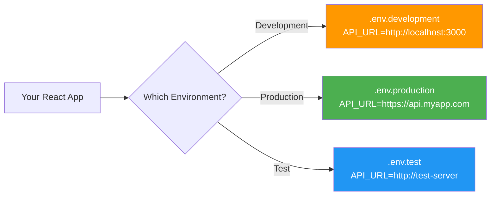
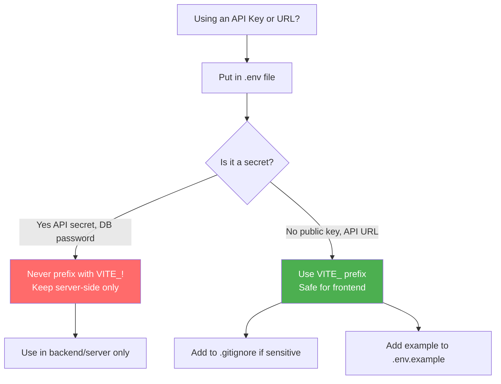

# 🔐 Environment Variables in React

## 📚 Topics Covered
- What are environment variables and why use them
- `.env`, `.env.local`, `.env.development`, `.env.production` files
- Vite prefix rule — only `VITE_` variables reach the browser
- `import.meta.env` — accessing variables in React
- CRA: `REACT_APP_` prefix and `process.env`
- Centralizing env config in `src/config/env.js`
- `.gitignore` — never commit secrets
- `.env.example` — template for teammates
- Feature flags with environment variables
- What is safe vs unsafe to expose in frontend

---

## `.env` Files, Secrets Management, Vite & CRA

---

## 🔹 What Are Environment Variables?

Environment variables store **configuration values** that change between environments (development, staging, production) — like API URLs, API keys, feature flags.



---

## 🔹 Why Use Environment Variables?

```jsx
// ❌ BAD — hardcoded values in code
const API_URL = "https://api.example.com"; // Different in dev vs prod!
const API_KEY = "sk-abc123supersecret";     // Secret in code! Dangerous!

// ✅ GOOD — from environment variables
const API_URL = import.meta.env.VITE_API_URL;
const API_KEY = import.meta.env.VITE_API_KEY;
```

**Benefits:**
- Different values per environment (dev/prod/test)
- Secrets not committed to git
- Easy to change without touching code
- Team members can have their own values

---

## 🔹 Vite — Environment Variables (Recommended)

### File Names

| File | When Used |
|------|-----------|
| `.env` | All environments (default) |
| `.env.local` | Local overrides (not committed to git) |
| `.env.development` | Only in `npm run dev` |
| `.env.production` | Only in `npm run build` |
| `.env.test` | Only in test environment |

### ⚠️ Important: Prefix Rule

In Vite, **only variables prefixed with `VITE_`** are exposed to your React code.

```bash
# .env
VITE_API_URL=https://api.example.com      # ✅ Accessible in React
VITE_APP_NAME=My Store                     # ✅ Accessible
SECRET_KEY=super-secret-123               # ❌ NOT accessible (no VITE_ prefix)
DATABASE_URL=postgres://...               # ❌ NOT accessible (backend only)
```

---

### 📍 Creating .env Files

```bash
# .env (project root, same level as package.json)
VITE_API_URL=https://jsonplaceholder.typicode.com
VITE_APP_NAME=My React App
VITE_ENABLE_ANALYTICS=false
VITE_MAX_UPLOAD_SIZE=5242880
```

```bash
# .env.local (your personal overrides — never commit this)
VITE_API_URL=http://localhost:4000
VITE_DEBUG=true
```

```bash
# .env.production (for production builds)
VITE_API_URL=https://api.myapp.com
VITE_ENABLE_ANALYTICS=true
```

---

### 📍 Accessing in React

```jsx
// In any component or JS file
const apiUrl = import.meta.env.VITE_API_URL;
const appName = import.meta.env.VITE_APP_NAME;
const isDebug = import.meta.env.VITE_DEBUG === "true";
const maxSize = Number(import.meta.env.VITE_MAX_UPLOAD_SIZE);

// Built-in Vite variables (no VITE_ prefix needed)
const isDev = import.meta.env.DEV;        // true in development
const isProd = import.meta.env.PROD;       // true in production
const mode = import.meta.env.MODE;         // "development" | "production"
```

---

### 📍 Centralize in a config file

```jsx
// src/config/env.js
export const config = {
  apiUrl: import.meta.env.VITE_API_URL || "http://localhost:3000",
  appName: import.meta.env.VITE_APP_NAME || "My App",
  enableAnalytics: import.meta.env.VITE_ENABLE_ANALYTICS === "true",
  maxUploadSize: Number(import.meta.env.VITE_MAX_UPLOAD_SIZE) || 5_000_000,
  isDev: import.meta.env.DEV,
  isProd: import.meta.env.PROD,
};

// Usage in any file
import { config } from "../config/env";

const response = await fetch(`${config.apiUrl}/posts`);
```

---

## 🔹 Create React App (CRA) — Environment Variables

If using CRA (not Vite), the prefix is `REACT_APP_`:

```bash
# .env (CRA)
REACT_APP_API_URL=https://api.example.com
REACT_APP_NAME=My Store
```

```jsx
// Access with process.env (NOT import.meta.env)
const apiUrl = process.env.REACT_APP_API_URL;
const appName = process.env.REACT_APP_NAME;
```

---

## 🔹 `.gitignore` — Never Commit Secrets!

```bash
# .gitignore — add these lines
.env.local
.env.*.local
.env.production    # if it contains real secrets
```

**Always commit:**
- `.env.example` — template with fake/empty values showing team what vars are needed

```bash
# .env.example (commit this to git as a template)
VITE_API_URL=https://your-api-url.com
VITE_APP_NAME=Your App Name
VITE_STRIPE_PUBLIC_KEY=pk_test_your_key_here
VITE_GOOGLE_MAPS_KEY=your_key_here
```

---

## 🔹 Complete Example — API Configuration

```bash
# .env
VITE_API_BASE_URL=https://jsonplaceholder.typicode.com
VITE_APP_TITLE=My Blog App
VITE_POSTS_PER_PAGE=10
VITE_ENABLE_DARK_MODE=true
```

```jsx
// src/config/env.js
export const ENV = {
  apiBaseUrl: import.meta.env.VITE_API_BASE_URL,
  appTitle: import.meta.env.VITE_APP_TITLE,
  postsPerPage: Number(import.meta.env.VITE_POSTS_PER_PAGE),
  enableDarkMode: import.meta.env.VITE_ENABLE_DARK_MODE === "true",
};

// Validate required variables at startup
const required = ["VITE_API_BASE_URL"];
required.forEach((key) => {
  if (!import.meta.env[key]) {
    throw new Error(`Missing required environment variable: ${key}`);
  }
});
```

```jsx
// src/api/client.js
import { ENV } from "../config/env";

export async function apiGet(path) {
  const res = await fetch(`${ENV.apiBaseUrl}${path}`);
  if (!res.ok) throw new Error(`API error: ${res.status}`);
  return res.json();
}

export async function apiPost(path, body) {
  const res = await fetch(`${ENV.apiBaseUrl}${path}`, {
    method: "POST",
    headers: { "Content-Type": "application/json" },
    body: JSON.stringify(body),
  });
  if (!res.ok) throw new Error(`API error: ${res.status}`);
  return res.json();
}
```

```jsx
// src/App.jsx
import { useEffect } from "react";
import { ENV } from "./config/env";

function App() {
  useEffect(() => {
    document.title = ENV.appTitle;
  }, []);

  return (
    <div>
      <h1>Welcome to {ENV.appTitle}</h1>
      {ENV.enableDarkMode && <p>🌙 Dark mode is enabled</p>}
    </div>
  );
}
```

---

## 🔹 Feature Flags with Env Variables

```bash
# .env.development
VITE_FEATURE_NEW_DASHBOARD=true
VITE_FEATURE_AI_SEARCH=false

# .env.production
VITE_FEATURE_NEW_DASHBOARD=false
VITE_FEATURE_AI_SEARCH=false
```

```jsx
// src/config/features.js
export const features = {
  newDashboard: import.meta.env.VITE_FEATURE_NEW_DASHBOARD === "true",
  aiSearch: import.meta.env.VITE_FEATURE_AI_SEARCH === "true",
};

// Usage
import { features } from "../config/features";

function App() {
  return (
    <div>
      {features.newDashboard ? <NewDashboard /> : <OldDashboard />}
      {features.aiSearch && <AISearchBar />}
    </div>
  );
}
```

---

## 🔹 Environment Variable Checklist



> **Critical Rule:** Anything with `VITE_` is **visible in your built JS bundle**. Never put truly secret server-side keys (database passwords, secret API keys) with `VITE_` prefix — anyone can read them from your deployed site!

---

## 🔹 Common Mistakes ❌

```jsx
// ❌ Undefined — forgot VITE_ prefix
const key = import.meta.env.API_KEY; // undefined!

// ❌ Forgot to restart dev server after changing .env
// Always restart `npm run dev` after editing .env files!

// ❌ Using process.env in Vite
const url = process.env.REACT_APP_URL; // undefined in Vite!

// ❌ Committing secrets to git
.env.local  // forgot to add to .gitignore

// ✅ Correct
const key = import.meta.env.VITE_API_KEY;
const url = import.meta.env.VITE_API_URL;
```

---

## 🎯 Interview Questions

**Q1: What is the difference between `.env`, `.env.local`, and `.env.production`?**

> `.env` applies to all environments. `.env.local` is for personal/local overrides and should not be committed. `.env.production` applies only when running `npm run build` (production build).

**Q2: Why must Vite variables start with `VITE_`?**

> For security — Vite only exposes variables prefixed with `VITE_` to the client-side bundle. Without this, any `.env` variable (including backend secrets) could accidentally be exposed in the browser.

**Q3: Are environment variables in React truly secure?**

> No! Variables with `VITE_` (or `REACT_APP_`) are embedded in the JavaScript bundle and visible to anyone. Only use them for **public** keys (publishable Stripe keys, public API URLs). Never put private API keys, database passwords, or JWT secrets in frontend env vars.

**Q4: How do you use different API URLs for development and production?**

> Create `.env.development` with `VITE_API_URL=http://localhost:4000` and `.env.production` with `VITE_API_URL=https://api.mysite.com`. Vite automatically loads the right file based on the build mode.

---

## 🏠 Home Task

Set up a proper environment configuration:
1. Create `.env`, `.env.development`, `.env.production` files
2. Move all hardcoded API URLs to env variables
3. Create `src/config/env.js` with all variables centralized
4. Add validation that throws if required variables are missing
5. Create `.env.example` file showing all required variables
6. Add `.env.local` to `.gitignore`
7. Add a "version" badge: `VITE_APP_VERSION=1.0.0` shown in footer
