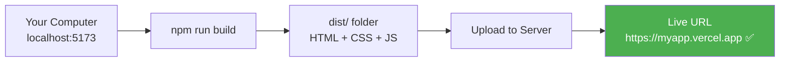
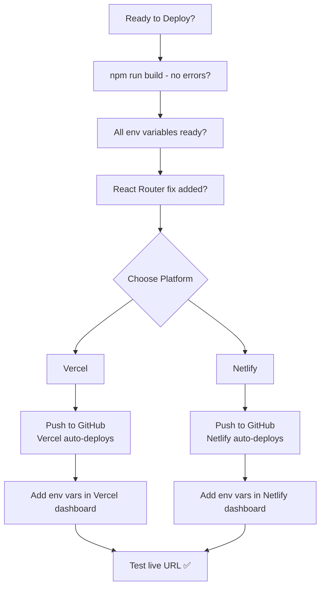

# 🚀 Deploying React Apps

## 📚 Topics Covered
- What is deployment and how the build process works
- `npm run build` — what it creates in `dist/`
- Vercel vs Netlify — comparison
- Vercel CLI deployment
- Vercel via GitHub — automatic deploys on every push
- Netlify drag & drop and CLI
- Netlify via GitHub integration
- Environment variables in deployment dashboards
- React Router fix — `_redirects` (Netlify) and `vercel.json`
- Custom domain setup
- Preview deployments for pull requests
- Continuous deployment workflow
- Common deployment issues and fixes

---

## Vercel & Netlify — From Local to Live in Minutes

---

## 🔹 What is Deployment?

Deployment = your app goes from `localhost:5173` on your computer to a **live URL** that anyone in the world can visit.



---

## 🔹 Build Process — What Happens?

Before deploying, React needs to be **built** (compiled for production):

```bash
npm run build
```

This creates a `dist/` folder (Vite) or `build/` folder (CRA) with:
- Minified JavaScript
- Optimized CSS
- Compressed images
- `index.html`

```
dist/
├── index.html
├── assets/
│   ├── index-abc123.js    ← all your JS, minified
│   ├── index-def456.css   ← all your CSS, minified
│   └── logo-xyz789.png    ← optimized images
```

---

## 🔹 Deployment Options Comparison

| Platform | Free Tier | Custom Domain | CI/CD | Best For |
|----------|-----------|---------------|-------|----------|
| **Vercel** | ✅ Generous | ✅ Free | ✅ Auto from git | React, Next.js |
| **Netlify** | ✅ Generous | ✅ Free | ✅ Auto from git | React, Static sites |
| **GitHub Pages** | ✅ Free | ✅ (custom) | Manual setup | Simple static |
| **Firebase Hosting** | ✅ Free | ✅ Free | Manual/CI | Google ecosystem |

---

## 🔹 1. Vercel Deployment

Vercel was made by the creators of Next.js and has **first-class React support**.

### Method 1: Deploy via Vercel CLI

```bash
# Step 1: Install Vercel CLI
npm install -g vercel

# Step 2: Login
vercel login

# Step 3: In your project folder — deploy!
vercel

# Follow the prompts:
# ? Set up and deploy? Y
# ? Which scope? (your account)
# ? Link to existing project? N
# ? Project name: my-react-app
# ? Directory: ./
# ✓ Deployed! https://my-react-app.vercel.app
```

### Method 2: Deploy via GitHub (Recommended — Auto-deploys!)

1. Push your code to GitHub
2. Go to **vercel.com** → Sign up with GitHub
3. Click **"Add New Project"**
4. Import your GitHub repository
5. Configure:

```
Framework Preset: Vite (or Create React App)
Build Command: npm run build
Output Directory: dist  ← (Vite) or build (CRA)
Install Command: npm install
```

6. Click **"Deploy"**
7. Get your live URL: `https://your-project.vercel.app`

**Auto-deploy:** Every `git push` to main branch → automatic deployment! 🎉

---

### Vercel — Environment Variables

```bash
# In Vercel Dashboard → Your Project → Settings → Environment Variables

# Add each variable:
VITE_API_URL = https://api.myapp.com
VITE_APP_NAME = My App
```

Or via CLI:
```bash
vercel env add VITE_API_URL
# Enter value: https://api.myapp.com
# Select environments: Production, Preview, Development
```

---

### Vercel — Custom Domain

```bash
# Via CLI
vercel domains add myapp.com

# Or in Dashboard → Domains → Add Domain
# 1. Enter: myapp.com
# 2. Add DNS records to your domain registrar
# 3. SSL certificate auto-generated ✅
```

---

## 🔹 2. Netlify Deployment

### Method 1: Drag & Drop (Quickest!)

```bash
# Step 1: Build your project
npm run build

# Step 2: Go to app.netlify.com
# Step 3: Drag your dist/ folder to the deploy zone
# Done! Live in seconds ✅
```

### Method 2: Netlify CLI

```bash
# Install
npm install -g netlify-cli

# Login
netlify login

# Initialize and deploy
netlify init

# Follow prompts:
# ? Create & configure a new site
# ? Team: (your team)
# ? Site name: my-react-app
# ? Build command: npm run build
# ? Directory to deploy: dist
# ✓ Deployed: https://my-react-app.netlify.app

# Deploy again anytime
netlify deploy --prod
```

### Method 3: GitHub Integration (Recommended)

1. Go to **netlify.com** → Log in with GitHub
2. Click **"Add new site"** → **"Import an existing project"**
3. Choose GitHub → Select your repository
4. Configure:

```
Branch to deploy: main
Build command: npm run build
Publish directory: dist
```

5. Click **"Deploy site"**
6. Auto-deploys on every push! ✅

---

### Netlify — Environment Variables

In Netlify Dashboard → Site Settings → Environment Variables:

```
VITE_API_URL = https://api.myapp.com
VITE_APP_NAME = My Production App
```

---

### Netlify — `_redirects` File for React Router

⚠️ **Important!** React Router uses client-side routing. When you deploy, visiting `myapp.netlify.app/about` directly returns a 404 because the server doesn't know about that route.

**Fix:** Create `public/_redirects` file:

```
/*    /index.html   200
```

This tells Netlify to always serve `index.html` and let React Router handle routing.

**For Vite**, create the file at `public/_redirects` (Vite copies `public/` to `dist/` automatically).

---

### Vercel — Router Fix

For Vercel, create `vercel.json` at project root:

```json
{
  "rewrites": [
    {
      "source": "/(.*)",
      "destination": "/index.html"
    }
  ]
}
```

---

## 🔹 Complete Deployment Checklist



---

## 🔹 Step-by-Step: Full Deploy to Vercel

```bash
# 1. Make sure your project is ready
npm run build
# Check: no errors, dist/ folder created

# 2. Initialize git if not already
git init
git add .
git commit -m "Initial commit"

# 3. Push to GitHub
# Create new repo on github.com first, then:
git remote add origin https://github.com/yourusername/my-react-app.git
git branch -M main
git push -u origin main

# 4. Go to vercel.com
# - Sign in with GitHub
# - Click "New Project"
# - Select your repo
# - Framework: Vite
# - Build: npm run build
# - Output: dist
# - Click Deploy!

# 5. Add environment variables in Vercel dashboard
# Settings → Environment Variables → Add each VITE_ variable

# 6. Redeploy after adding env vars
# Deployments → ... → Redeploy

# Your app is live! 🎉
```

---

## 🔹 Continuous Deployment Workflow

After setup, your workflow becomes:

```bash
# Make changes to code
# ...

# Commit and push
git add .
git commit -m "Add new feature"
git push

# Vercel/Netlify automatically:
# 1. Detects the push
# 2. Runs npm run build
# 3. Deploys the new version
# 4. Your live site is updated ✅
```

---

## 🔹 Preview Deployments

Both Vercel and Netlify create **preview URLs** for pull requests:

```bash
# Create a feature branch
git checkout -b feature/new-design

# Make changes, commit, push
git push origin feature/new-design

# Vercel creates a preview URL:
# https://my-app-git-feature-new-design-username.vercel.app

# Show client/teammate before merging to main!
```

---

## 🔹 Custom Domain Setup

```bash
# Example: you bought "myapp.pk" on Namecheap/GoDaddy

# In Vercel:
# 1. Dashboard → Domains → Add
# 2. Enter: myapp.pk
# 3. Vercel shows you DNS records to add

# In your domain registrar (Namecheap):
# DNS Settings → Add records:
# Type: A, Name: @, Value: 76.76.21.21 (Vercel IP)
# Type: CNAME, Name: www, Value: cname.vercel-dns.com

# Wait 24-48 hours for DNS propagation
# SSL certificate auto-generated by Vercel ✅

# Your site: https://myapp.pk ✅
```

---

## 🔹 Common Deployment Issues & Fixes

### Issue 1: Build Fails

```bash
# Check locally first
npm run build

# Common causes:
# - TypeScript/ESLint errors
# - Missing env variables
# - Import case sensitivity (Mac is forgiving, Linux is not!)
```

### Issue 2: Blank Page After Deploy

```jsx
// Check vite.config.js — base path might be wrong
export default defineConfig({
  base: "/",  // ← should be "/" for Vercel/Netlify
  plugins: [react()],
})
```

### Issue 3: API Calls Fail in Production

```bash
# Check env variables are set in deployment platform
# Check CORS — your backend must allow your production domain
# Check VITE_ prefix is present
```

### Issue 4: Routes Return 404

```bash
# For Netlify — create public/_redirects:
/*    /index.html   200

# For Vercel — create vercel.json:
{
  "rewrites": [{ "source": "/(.*)", "destination": "/index.html" }]
}
```

---

## 🔹 `.env` Files for Deployment

```bash
# .env.example (commit to git — shows team what's needed)
VITE_API_URL=https://your-api-url.com
VITE_APP_NAME=My App

# .env.production (add these values in Vercel/Netlify dashboard — DON'T commit)
VITE_API_URL=https://api.myapp.com
VITE_APP_NAME=My Production App
```

---

## 🎯 Interview Questions

**Q1: What is the difference between `npm run dev` and `npm run build`?**

> `npm run dev` starts a development server with hot reloading, unminified code, and source maps — for development only. `npm run build` creates an optimized production bundle with minified code, tree-shaking, and code splitting — for deployment.

**Q2: Why do React Router routes 404 on direct access after deployment?**

> React Router handles routing client-side in the browser. When you directly visit `/about`, the server looks for a file at that path — which doesn't exist. The fix is to redirect all requests to `index.html` and let React Router take over.

**Q3: What is Continuous Deployment?**

> Automated deployment triggered by code pushes. When you `git push` to main, the platform (Vercel/Netlify) automatically builds and deploys your app without any manual steps.

**Q4: Can you have different API URLs for preview vs production deployments?**

> Yes! Vercel and Netlify let you set environment variables per environment (Production, Preview, Development). Preview deployments can point to a staging API while production points to the live API.

---

## 🏠 Final Project — Deploy Your Portfolio!

Deploy a complete React Portfolio App:
1. Build a portfolio with: Home, About, Projects, Contact pages
2. Use React Router for navigation
3. Fetch GitHub repos using TanStack Query
4. Store any API keys in `.env` with `VITE_` prefix
5. Add `vercel.json` for React Router support
6. Deploy to Vercel via GitHub
7. Set environment variables in Vercel dashboard
8. Test all routes directly (not from homepage nav)
9. Share your live URL! 🎉

**Bonus:**
- Add a custom domain
- Set up preview deployments for a feature branch
- Show the deployment URL in your README
