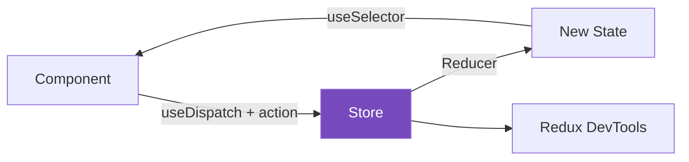

# 🗄️ Redux Toolkit — Modern Redux State Management

## 📚 Topics Covered
- Why Redux Toolkit (RTK) over vanilla Redux
- `configureStore` — setting up the store
- `createSlice` — reducer + actions in one place
- `useSelector` — reading state from any component
- `useDispatch` — sending actions from any component
- `createAsyncThunk` — async actions (API calls)
- `extraReducers` — handling async states (pending/fulfilled/rejected)
- DevTools integration
- Project: Shopping Cart with Redux Toolkit

---

## 🔹 Why Redux Toolkit?

Redux Toolkit is the **official, recommended way** to write Redux. Vanilla Redux required lots of boilerplate — RTK eliminates it.



```
Vanilla Redux:                  Redux Toolkit:
actions/counterActions.js   →   createSlice() handles everything
reducers/counterReducer.js  →   
store.js                    →   configureStore()
constants/actionTypes.js    →   (gone — slice auto-generates)
```

---

## 🔹 Installation

```bash
npm install @reduxjs/toolkit react-redux
```

---

## 🔹 Store Setup with `configureStore`

```js
// src/store/store.js
import { configureStore } from "@reduxjs/toolkit";
import counterReducer from "./counterSlice";
import cartReducer from "./cartSlice";
import authReducer from "./authSlice";

export const store = configureStore({
  reducer: {
    counter: counterReducer,
    cart: cartReducer,
    auth: authReducer,
  },
});

// TypeScript types (optional but useful)
export type RootState = ReturnType<typeof store.getState>;
export type AppDispatch = typeof store.dispatch;
```

```jsx
// src/main.jsx — wrap app with Provider
import { Provider } from "react-redux";
import { store } from "./store/store";

ReactDOM.createRoot(document.getElementById("root")).render(
  <Provider store={store}>
    <App />
  </Provider>
);
```

---

## 🔹 `createSlice` — Reducer + Actions Together

```js
// src/store/counterSlice.js
import { createSlice } from "@reduxjs/toolkit";

const counterSlice = createSlice({
  name: "counter",           // used as prefix in action types
  initialState: {
    value: 0,
    step: 1,
  },
  reducers: {
    // RTK uses Immer — you CAN "mutate" state directly here
    increment: (state) => {
      state.value += state.step;
    },
    decrement: (state) => {
      state.value -= state.step;
    },
    reset: (state) => {
      state.value = 0;
    },
    setStep: (state, action) => {
      state.step = action.payload;
    },
    incrementByAmount: (state, action) => {
      state.value += action.payload;
    },
  },
});

// Export action creators (auto-generated by createSlice)
export const { increment, decrement, reset, setStep, incrementByAmount } =
  counterSlice.actions;

// Export reducer (goes into store)
export default counterSlice.reducer;
```

```jsx
// src/components/Counter.jsx
import { useSelector, useDispatch } from "react-redux";
import { increment, decrement, reset, setStep, incrementByAmount } from "../store/counterSlice";

function Counter() {
  const { value, step } = useSelector((state) => state.counter);
  const dispatch = useDispatch();

  return (
    <div style={{ textAlign: "center", padding: 40 }}>
      <h2 style={{ fontSize: 48 }}>{value}</h2>

      <div style={{ display: "flex", gap: 8, justifyContent: "center" }}>
        <button onClick={() => dispatch(decrement())}>-</button>
        <button onClick={() => dispatch(increment())}>+</button>
        <button onClick={() => dispatch(reset())}>Reset</button>
      </div>

      <div style={{ marginTop: 16 }}>
        <label>Step: </label>
        <input
          type="number"
          value={step}
          min={1}
          onChange={(e) => dispatch(setStep(Number(e.target.value)))}
          style={{ width: 60, padding: 4 }}
        />
        <button onClick={() => dispatch(incrementByAmount(10))}>+10</button>
      </div>
    </div>
  );
}
```

---

## 🔹 Cart Slice — Real World Example

```js
// src/store/cartSlice.js
import { createSlice } from "@reduxjs/toolkit";

const cartSlice = createSlice({
  name: "cart",
  initialState: {
    items: [],
  },
  reducers: {
    addItem: (state, action) => {
      const existing = state.items.find((i) => i.id === action.payload.id);
      if (existing) {
        existing.qty += 1;
      } else {
        state.items.push({ ...action.payload, qty: 1 });
      }
    },
    removeItem: (state, action) => {
      state.items = state.items.filter((i) => i.id !== action.payload);
    },
    updateQty: (state, action) => {
      const item = state.items.find((i) => i.id === action.payload.id);
      if (item) {
        item.qty = action.payload.qty;
        if (item.qty <= 0) {
          state.items = state.items.filter((i) => i.id !== action.payload.id);
        }
      }
    },
    clearCart: (state) => {
      state.items = [];
    },
  },
});

// Selectors — derived data
export const selectCartItems = (state) => state.cart.items;
export const selectCartTotal = (state) =>
  state.cart.items.reduce((sum, i) => sum + i.price * i.qty, 0);
export const selectCartCount = (state) =>
  state.cart.items.reduce((sum, i) => sum + i.qty, 0);

export const { addItem, removeItem, updateQty, clearCart } = cartSlice.actions;
export default cartSlice.reducer;
```

```jsx
// Navbar — reads cart count
import { useSelector } from "react-redux";
import { selectCartCount } from "../store/cartSlice";

function Navbar() {
  const count = useSelector(selectCartCount);
  return (
    <nav style={{ background: "#1a1a2e", padding: "12px 24px", color: "#fff", display: "flex", justifyContent: "space-between" }}>
      <span>🛍️ Shop</span>
      <span>🛒 {count}</span>
    </nav>
  );
}

// Product Card — dispatches addItem
import { useDispatch } from "react-redux";
import { addItem } from "../store/cartSlice";

function ProductCard({ product }) {
  const dispatch = useDispatch();
  return (
    <div style={{ border: "1px solid #ddd", borderRadius: 8, padding: 16 }}>
      <h3>{product.name}</h3>
      <p>${product.price}</p>
      <button onClick={() => dispatch(addItem(product))}>Add to Cart</button>
    </div>
  );
}
```

---

## 🔹 `createAsyncThunk` — Async API Calls

```js
// src/store/postsSlice.js
import { createSlice, createAsyncThunk } from "@reduxjs/toolkit";

// 1. Define the async thunk
export const fetchPosts = createAsyncThunk(
  "posts/fetchAll",           // action type prefix
  async (_, { rejectWithValue }) => {
    try {
      const response = await fetch("https://jsonplaceholder.typicode.com/posts?_limit=10");
      if (!response.ok) throw new Error("Failed to fetch");
      return await response.json();
    } catch (err) {
      return rejectWithValue(err.message);
    }
  }
);

export const createPost = createAsyncThunk(
  "posts/create",
  async (newPost, { rejectWithValue }) => {
    try {
      const response = await fetch("https://jsonplaceholder.typicode.com/posts", {
        method: "POST",
        headers: { "Content-Type": "application/json" },
        body: JSON.stringify(newPost),
      });
      return await response.json();
    } catch (err) {
      return rejectWithValue(err.message);
    }
  }
);

// 2. Slice with extraReducers for async states
const postsSlice = createSlice({
  name: "posts",
  initialState: {
    items: [],
    status: "idle",    // 'idle' | 'loading' | 'succeeded' | 'failed'
    error: null,
  },
  reducers: {},
  extraReducers: (builder) => {
    builder
      // fetchPosts
      .addCase(fetchPosts.pending, (state) => {
        state.status = "loading";
        state.error = null;
      })
      .addCase(fetchPosts.fulfilled, (state, action) => {
        state.status = "succeeded";
        state.items = action.payload;
      })
      .addCase(fetchPosts.rejected, (state, action) => {
        state.status = "failed";
        state.error = action.payload;
      })
      // createPost
      .addCase(createPost.fulfilled, (state, action) => {
        state.items.unshift(action.payload);
      });
  },
});

export default postsSlice.reducer;
```

```jsx
// src/components/PostsList.jsx
import { useEffect } from "react";
import { useSelector, useDispatch } from "react-redux";
import { fetchPosts } from "../store/postsSlice";

function PostsList() {
  const dispatch = useDispatch();
  const { items, status, error } = useSelector((state) => state.posts);

  useEffect(() => {
    if (status === "idle") {
      dispatch(fetchPosts());
    }
  }, [status, dispatch]);

  if (status === "loading") return <div>⏳ Loading posts...</div>;
  if (status === "failed") return <div>❌ Error: {error}</div>;

  return (
    <div style={{ padding: 20 }}>
      <h2>Posts</h2>
      {items.map((post) => (
        <div key={post.id} style={{ padding: 12, border: "1px solid #eee", marginBottom: 8, borderRadius: 8 }}>
          <h3>{post.title}</h3>
          <p style={{ color: "#666" }}>{post.body}</p>
        </div>
      ))}
    </div>
  );
}
```

---

## 🔹 Redux DevTools

Redux Toolkit automatically integrates with **Redux DevTools** browser extension.

- Install the extension for Chrome/Firefox
- Open DevTools → Redux tab
- See every dispatched action, state diffs, and time-travel debugging

---

## 🔹 useReducer + Context vs Redux Toolkit

| | useReducer + Context | Redux Toolkit |
|--|---------------------|---------------|
| Dependencies | None (built-in React) | `@reduxjs/toolkit react-redux` |
| DevTools | ❌ | ✅ Excellent |
| Re-render optimization | ❌ All consumers re-render | ✅ Only selected state consumers |
| Middleware | Manual | ✅ Built-in Thunk |
| Async support | Manual | ✅ createAsyncThunk |
| Best for | Small/medium apps | Medium/large apps |
| Boilerplate | Low | Very low (RTK reduced it) |

---

## 🎯 Interview Questions

**Q1: What is Redux Toolkit and why was it created?**

> RTK is the official recommended way to write Redux. Vanilla Redux had too much boilerplate — separate action types, action creators, and reducers. RTK combines them with `createSlice`, uses Immer for immutable updates, includes Thunk middleware by default, and integrates DevTools automatically.

**Q2: What does `createSlice` do?**

> It generates a reducer function and action creators from a single configuration object. You define `name`, `initialState`, and `reducers` (functions that define state transitions). RTK uses Immer internally so you can write "mutating" code that actually produces immutable updates.

**Q3: How does `createAsyncThunk` work?**

> It creates a thunk action creator that dispatches three lifecycle actions automatically: `pending` (when started), `fulfilled` (on success with return value as payload), and `rejected` (on error). You handle these in `extraReducers` to update loading/error/data state.

**Q4: What is a selector in Redux?**

> A function that takes the Redux state and returns a derived value: `const count = useSelector(state => state.cart.items.length)`. Selectors prevent components from knowing the exact state shape and can be memoized with `createSelector` for performance.

**Q5: What is Immer and how does RTK use it?**

> Immer is a library that lets you write code that appears to mutate state but actually produces a new immutable copy. RTK uses Immer inside `createSlice` reducers — so `state.count += 1` is safe there, but you must never mutate state outside of RTK-managed reducers.

---

## 🏠 Home Task

Build a **User Management App** with Redux Toolkit:
1. Two slices: `usersSlice` and `uiSlice`
2. `usersSlice`: fetch users from `https://jsonplaceholder.typicode.com/users` using `createAsyncThunk`
3. State: `{ users, status, error, selectedUser }`
4. Actions: `fetchUsers`, `selectUser`, `deleteUser`, `addUser`
5. `uiSlice`: `{ searchQuery, filterRole, sortBy }`
6. Derived data: filter users by `searchQuery`, sort by name/email
7. Click a user to show a sidebar with their details (`selectedUser`)
8. Delete button with confirmation — removes from state immediately
