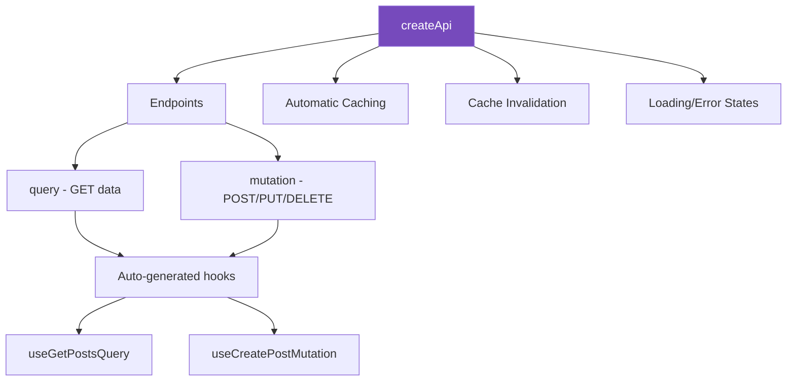
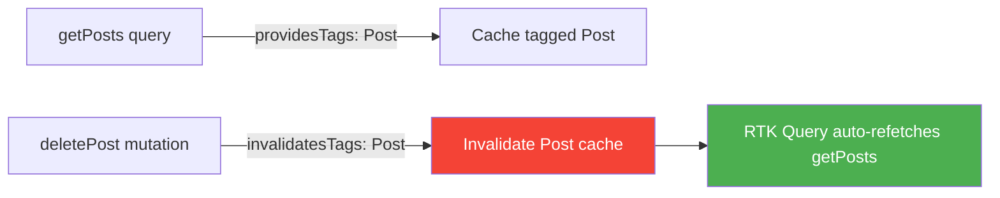

# 🔌 RTK Query — Automated API State Management

## 📚 Topics Covered
- What is RTK Query and why use it
- `createApi` — defining an API service
- `fetchBaseQuery` — base URL and headers
- Endpoints — `query` (GET) and `mutation` (POST/PUT/DELETE)
- Auto-generated hooks — `useGetPostsQuery`, `useCreatePostMutation`
- Cache invalidation with `providesTags` and `invalidatesTags`
- Loading, error, and data states
- Optimistic updates
- Pagination with `keepPreviousData`
- Comparing RTK Query vs TanStack Query

---

## 🔹 What is RTK Query?

RTK Query is a **data fetching and caching layer** built into Redux Toolkit. It eliminates the need to manually write `createAsyncThunk`, loading state, error state, and cache management.



---

## 🔹 Setup — Create API Service

```bash
npm install @reduxjs/toolkit react-redux
# (same packages as Redux Toolkit — RTK Query is included)
```

```js
// src/store/api/postsApi.js
import { createApi, fetchBaseQuery } from "@reduxjs/toolkit/query/react";

export const postsApi = createApi({
  reducerPath: "postsApi",          // key in Redux store
  baseQuery: fetchBaseQuery({
    baseUrl: "https://jsonplaceholder.typicode.com",
    // Add auth headers if needed:
    // prepareHeaders: (headers) => {
    //   headers.set("Authorization", `Bearer ${token}`);
    //   return headers;
    // },
  }),
  tagTypes: ["Post"],               // for cache invalidation
  endpoints: (builder) => ({
    // GET /posts
    getPosts: builder.query({
      query: () => "/posts?_limit=10",
      providesTags: ["Post"],         // this data has tag "Post"
    }),

    // GET /posts/:id
    getPost: builder.query({
      query: (id) => `/posts/${id}`,
      providesTags: (result, error, id) => [{ type: "Post", id }],
    }),

    // POST /posts
    createPost: builder.mutation({
      query: (newPost) => ({
        url: "/posts",
        method: "POST",
        body: newPost,
      }),
      invalidatesTags: ["Post"],      // after creating, refetch "Post" data
    }),

    // PUT /posts/:id
    updatePost: builder.mutation({
      query: ({ id, ...patch }) => ({
        url: `/posts/${id}`,
        method: "PUT",
        body: patch,
      }),
      invalidatesTags: (result, error, { id }) => [{ type: "Post", id }],
    }),

    // DELETE /posts/:id
    deletePost: builder.mutation({
      query: (id) => ({
        url: `/posts/${id}`,
        method: "DELETE",
      }),
      invalidatesTags: ["Post"],
    }),
  }),
});

// Auto-generated hooks
export const {
  useGetPostsQuery,
  useGetPostQuery,
  useCreatePostMutation,
  useUpdatePostMutation,
  useDeletePostMutation,
} = postsApi;
```

---

## 🔹 Store Integration

```js
// src/store/store.js
import { configureStore } from "@reduxjs/toolkit";
import { postsApi } from "./api/postsApi";

export const store = configureStore({
  reducer: {
    [postsApi.reducerPath]: postsApi.reducer,  // RTK Query slice
    // your other slices...
  },
  middleware: (getDefaultMiddleware) =>
    getDefaultMiddleware().concat(postsApi.middleware),  // required
});
```

```jsx
// src/main.jsx
import { Provider } from "react-redux";
import { store } from "./store/store";

ReactDOM.createRoot(document.getElementById("root")).render(
  <Provider store={store}>
    <App />
  </Provider>
);
```

---

## 🔹 Using Query Hooks

```jsx
import { useGetPostsQuery } from "../store/api/postsApi";

function PostsList() {
  const {
    data: posts,      // the fetched data
    isLoading,        // true on first load
    isFetching,       // true when re-fetching (background refresh)
    isError,
    error,
    refetch,          // manually trigger a refetch
  } = useGetPostsQuery();

  if (isLoading) return <div>⏳ Loading...</div>;
  if (isError) return <div>❌ Error: {error.status}</div>;

  return (
    <div style={{ padding: 20 }}>
      <div style={{ display: "flex", justifyContent: "space-between", marginBottom: 16 }}>
        <h2>Posts</h2>
        <button onClick={refetch} disabled={isFetching}>
          {isFetching ? "Refreshing..." : "Refresh"}
        </button>
      </div>
      {posts.map((post) => (
        <div key={post.id} style={{ padding: 12, border: "1px solid #eee", marginBottom: 8, borderRadius: 8 }}>
          <h3>{post.title}</h3>
          <p style={{ color: "#666" }}>{post.body}</p>
        </div>
      ))}
    </div>
  );
}
```

---

## 🔹 Using Mutation Hooks

```jsx
import { useState } from "react";
import { useCreatePostMutation, useDeletePostMutation } from "../store/api/postsApi";

function PostActions({ post }) {
  const [deletePost, { isLoading: isDeleting }] = useDeletePostMutation();

  return (
    <button
      onClick={() => deletePost(post.id)}
      disabled={isDeleting}
      style={{ color: "red" }}
    >
      {isDeleting ? "Deleting..." : "Delete"}
    </button>
  );
}

function CreatePostForm() {
  const [title, setTitle] = useState("");
  const [body, setBody] = useState("");
  const [createPost, { isLoading, isSuccess, error }] = useCreatePostMutation();

  const handleSubmit = async (e) => {
    e.preventDefault();
    await createPost({ title, body, userId: 1 });
    setTitle("");
    setBody("");
  };

  return (
    <form onSubmit={handleSubmit} style={{ padding: 20, border: "1px solid #ddd", borderRadius: 8, maxWidth: 480 }}>
      <h3>Create Post</h3>
      <input
        value={title}
        onChange={(e) => setTitle(e.target.value)}
        placeholder="Title"
        style={{ display: "block", width: "100%", padding: 8, marginBottom: 8 }}
      />
      <textarea
        value={body}
        onChange={(e) => setBody(e.target.value)}
        placeholder="Body"
        rows={3}
        style={{ display: "block", width: "100%", padding: 8, marginBottom: 8 }}
      />
      {isSuccess && <p style={{ color: "green" }}>✅ Post created!</p>}
      {error && <p style={{ color: "red" }}>❌ Error creating post</p>}
      <button type="submit" disabled={isLoading}>
        {isLoading ? "Creating..." : "Create Post"}
      </button>
    </form>
  );
}
```

---

## 🔹 Cache Invalidation — How It Works



```js
// Specific item invalidation — only refetch the changed post
endpoints: (builder) => ({
  getPost: builder.query({
    query: (id) => `/posts/${id}`,
    providesTags: (result, error, id) => [{ type: "Post", id }],
  }),
  updatePost: builder.mutation({
    query: ({ id, ...body }) => ({ url: `/posts/${id}`, method: "PUT", body }),
    // Only invalidate the specific post, not the whole list
    invalidatesTags: (result, error, { id }) => [{ type: "Post", id }],
  }),
})
```

---

## 🔹 Pagination

```js
// With page parameter
getPostsPaginated: builder.query({
  query: ({ page = 1, limit = 10 }) => `/posts?_page=${page}&_limit=${limit}`,
  providesTags: ["Post"],
}),
```

```jsx
import { useState } from "react";
import { useGetPostsPaginatedQuery } from "../store/api/postsApi";

function PaginatedPosts() {
  const [page, setPage] = useState(1);
  const {
    data: posts,
    isLoading,
    isFetching,
  } = useGetPostsPaginatedQuery({ page, limit: 5 });

  return (
    <div style={{ padding: 20 }}>
      {isLoading ? (
        <div>⏳ Loading...</div>
      ) : (
        <>
          {posts?.map((post) => (
            <div key={post.id} style={{ padding: 12, borderBottom: "1px solid #eee" }}>
              <strong>{post.title}</strong>
            </div>
          ))}
          <div style={{ display: "flex", gap: 8, marginTop: 16 }}>
            <button onClick={() => setPage((p) => Math.max(1, p - 1))} disabled={page === 1}>
              Prev
            </button>
            <span>Page {page}</span>
            <button onClick={() => setPage((p) => p + 1)} disabled={isFetching}>
              {isFetching ? "Loading..." : "Next"}
            </button>
          </div>
        </>
      )}
    </div>
  );
}
```

---

## 🔹 Multiple API Services

```js
// src/store/api/usersApi.js
export const usersApi = createApi({
  reducerPath: "usersApi",
  baseQuery: fetchBaseQuery({ baseUrl: "https://jsonplaceholder.typicode.com" }),
  tagTypes: ["User"],
  endpoints: (builder) => ({
    getUsers: builder.query({ query: () => "/users", providesTags: ["User"] }),
    getUser: builder.query({ query: (id) => `/users/${id}` }),
  }),
});

export const { useGetUsersQuery, useGetUserQuery } = usersApi;

// Add to store:
// reducer: { [postsApi.reducerPath]: postsApi.reducer, [usersApi.reducerPath]: usersApi.reducer }
// middleware: getDefaultMiddleware().concat(postsApi.middleware, usersApi.middleware)
```

---

## 🔹 RTK Query vs TanStack Query

| Feature | RTK Query | TanStack Query |
|---------|-----------|----------------|
| Part of Redux | ✅ Yes | ❌ Standalone |
| Setup | Needs Redux Provider | Needs QueryClientProvider |
| Code gen | ✅ `createApi` generates hooks | Manual `useQuery` calls |
| Cache invalidation | Tag-based | Manual `queryClient.invalidate` |
| DevTools | Redux DevTools | Dedicated TanStack DevTools |
| Best with | Redux-heavy apps | Any React app (no Redux needed) |
| Learning curve | Medium (Redux concepts) | Low |

---

## 🎯 Interview Questions

**Q1: What does `createApi` do in RTK Query?**

> It creates a "service" definition with a base URL, endpoint definitions (queries and mutations), and tag types for cache invalidation. It auto-generates React hooks for each endpoint and integrates the caching layer into the Redux store.

**Q2: What is the difference between `providesTags` and `invalidatesTags`?**

> `providesTags` marks what data a query provides (tags it). `invalidatesTags` marks what data a mutation invalidates — when a mutation with `invalidatesTags: ["Post"]` completes, all queries that `providesTags: ["Post"]` are automatically refetched.

**Q3: What is the difference between `isLoading` and `isFetching`?**

> `isLoading` is true only on the first request when there's no cached data. `isFetching` is true any time a request is in-flight, including background refreshes. For showing skeletons use `isLoading`; for showing a subtle spinner use `isFetching`.

**Q4: When would you choose RTK Query over TanStack Query?**

> If you're already using Redux Toolkit for state management, RTK Query is a natural fit — less setup, DevTools integration, and code lives in the same Redux ecosystem. If you don't need Redux at all and just want server state management, TanStack Query is simpler with no Redux dependency.

---

## 🏠 Home Task

Build a **Blog Platform** using RTK Query:
1. `postsApi` with endpoints: `getPosts`, `getPost`, `createPost`, `updatePost`, `deletePost`
2. `usersApi` with endpoints: `getUsers`, `getUser`
3. Posts list page — paginated (5 per page), show author name by looking up `userId` in users data
4. Post detail page — fetch single post + comments (`/posts/:id/comments`)
5. Create post form — title, body, userId select — success/error toast
6. Edit post inline — click edit, show input fields, save calls `updatePost`
7. Delete post — with confirm dialog, calls `deletePost` which auto-refreshes the list
