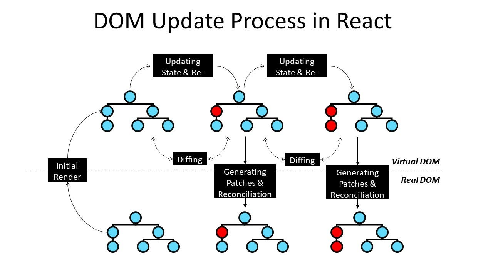

# ⚙️ React Hooks & `useState` — The Power of State in Functional Components

## 📚 Topics Covered
- What are React Hooks
- `useState` hook — syntax and usage
- State vs Regular Variable
- State immutability — why state is replaced, not mutated
- Asynchronous state updates
- Multiple `useState` in one component
- Virtual DOM, Diffing, Reconciliation, React Fiber
- Counter App project

---

## 🔹 What Are Hooks?

Before diving into `useState`, let’s understand **what Hooks** are.

**Hooks** are special **functions introduced in React 16.8** that let you **use state, lifecycle, and other React features** inside **functional components** — without needing class components.

Before Hooks:

* Only **class components** could have state and lifecycle methods.
* Functional components were **stateless**.

After Hooks:

* Functional components can manage state and side effects easily.
* React apps became **simpler, faster, and cleaner**.

### 🧠 Meaning of "Hooks"

Hooks literally mean:

> “You can *hook into* React’s features (like state or lifecycle) from your functions.”

---

## 🪝 Most Common Hooks in React

| Hook Name                 | Purpose                                                   |
| ------------------------- | --------------------------------------------------------- |
| `useState`                | To manage state (data that changes)                       |
| `useEffect`               | To handle side effects (API calls, timeouts, DOM updates) |
| `useContext`              | To access global data without props                       |
| `useRef`                  | To directly access DOM elements                           |
| `useReducer`              | To handle complex state logic                             |
| `useMemo` / `useCallback` | To optimize performance                                   |

In this step, we’ll focus on the **most important and commonly used hook** — `useState`.

---

# 🔹 What is `useState`?

**`useState`** is a **React Hook** that allows you to create **state variables** in **functional components**.

👉 It’s the **most basic hook** used to store and update data that affects what’s displayed on the screen.

---

## 🎯 Real-Life Example (Without useState)

Let’s start with a simple example 👇

```jsx
function Counter() {
  let count = 0;

  function updateCount() {
    count++;
    console.log(count);
  }

  return (
    <div>
      <p>You clicked {count} times</p>
      <button onClick={updateCount}>Click me</button>
    </div>
  );
}
```

🧩 **What happens here:**

* Each time you click the button, `count` increases in memory.
* But the **UI doesn’t update** — because React doesn’t know it changed.

💡 React only re-renders when **its internal state changes**, not regular JS variables.

So even though `console.log(count)` prints the new number,
the text on screen stays the same!

---

## ✅ With useState (Correct Way)

```jsx
import { useState } from "react";

function Counter() {
  const [count, setCount] = useState(0);

  return (
    <div>
      <p>You clicked {count} times</p>
      <button onClick={() => setCount(count + 1)}>Click me</button>
    </div>
  );
}
```

🧠 **What’s happening now:**

* `useState(0)` creates a **state variable** `count` with initial value `0`.
* `setCount` is a **function** that updates that state.
* When `setCount` runs → React **detects the change**, re-renders the component, and updates the UI.

---

## 🔍 Deep Explanation of `useState`

`useState` returns an **array** with **two elements:**

```js
const [state, setState] = useState(initialValue);
```

| Part           | Description                                                             |
| -------------- | ----------------------------------------------------------------------- |
| `state`        | The current value (read-only)                                           |
| `setState`     | Function to update that value                                           |
| `initialValue` | The default starting value (can be number, string, object, array, etc.) |

Example:

```jsx
const [name, setName] = useState("Rana");
const [age, setAge] = useState(22);
```

You can have **multiple states** in the same component — each one independent.

---

## 🧠 Variable vs State in React

| Feature           | Normal Variable (`let` / `const`) | React State (`useState`)  |
| ----------------- | --------------------------------- | ------------------------- |
| Stored In         | Memory (cleared on re-render)     | React’s internal memory   |
| Updates UI?       | ❌ No                              | ✅ Yes                     |
| Update Method     | Direct assignment (`=`)           | `setState()` function     |
| Causes Re-render? | ❌ No                              | ✅ Yes                     |
| Mutable?          | ✅ Yes                             | ❌ No (Immutable)          |
| Lifetime          | Lost on every render              | Preserved between renders |

---

## ⚠️ Wrong vs ✅ Correct Way

### ❌ Wrong:

```js
count = count + 1;
```

This changes the variable, but React **doesn’t re-render**.

### ✅ Correct:

```js
setCount(count + 1);
```

This **notifies React** → re-renders the UI → shows updated value.

---

## 🔁 When Does React Re-render?

React re-renders a component when:

1. The **state** of that component changes (`setState` used)
2. The **props** of that component change
3. The **parent** re-renders and passes new props down

🔄 But React is smart — it **only re-renders the part** that needs updating.

---

## 🔐 Mutable vs Immutable State

In JavaScript, we can directly modify variables:

```js
let num = 5;
num = num + 1; // ✅ allowed
```

But React **state is immutable**.
You **cannot** modify it directly — you must **use the setter function**.

### Example:

```jsx
const [user, setUser] = useState({ name: "Rana", age: 22 });

// ❌ Wrong:
user.age = 23; // UI won't update

// ✅ Correct:
setUser({ ...user, age: 23 }); // React re-renders
```

---

## 💬 Why Is State Immutable?

Because React uses **Virtual DOM** and **diffing algorithm** to decide what to update.

If React can **compare old vs new state**, it knows what to change efficiently.

If you mutate state directly:

* React cannot detect the change properly.
* UI may not update.
* Bugs and unpredictable behavior occur.

Immutability = **Predictable + Fast + Easy to debug**

---

## 🧠 About Naming Convention in useState

```jsx
const [name, setName] = useState("Rana");
```

🧩 Convention:

* First part = state name (example: `name`)
* Second part = setter function name (usually prefixed with `set`)

✅ Standard naming pattern:

```
state → setter
name → setName
count → setCount
theme → setTheme
```

But React doesn’t *force* it — it’s just a **best practice** for clarity.
You *can* technically do this:

```jsx
const [name, changeName] = useState("Ali");
```

…but this breaks convention and confuses readers.
So always use `set` + `StateName` format.

---

## 🔍 Example: Multiple useState in One Component

```jsx
function Profile() {
  const [name, setName] = useState("Rana");
  const [age, setAge] = useState(22);
  const [theme, setTheme] = useState("light");

  return (
    <div>
      <h1>{name}</h1>
      <p>Age: {age}</p>
      <p>Theme: {theme}</p>
      <button onClick={() => setTheme("dark")}>Change Theme</button>
    </div>
  );
}
```

Each state works **independently** and **triggers re-render** when updated.

---

## ⚙️ Asynchronous Nature of State Updates

React updates the state **asynchronously** (not immediately).
That means if you do:

```jsx
setCount(count + 1);
console.log(count);
```

You’ll see the **old value** in console because React updates `count` *after* the function finishes executing.

✅ Correct approach:
If you want to use the latest state value immediately after update:

```jsx
setCount(prev => prev + 1);
```

This ensures React uses the **most recent** value, even if multiple updates are batched together.

---

# 🧪 Example Project — Counter App

### 🎯 Features:

* Increase by 1
* Decrease by 1
* Reset to 0

---

### Code:

```jsx
import { useState } from 'react'

export default function App() {
  const [count, setCount] = useState(0);

  const increase = () => {
    setCount(count + 1);
    console.log("Before re-render (stale value):", count);
  }

  const decrease = () => {
    if (count > 0) setCount(count - 1);
  }

  const reset = () => {
    setCount(0);
  }

  return (
    <div style={{ textAlign: "center", marginTop: "50px" }}>
      <h2>Count: {count}</h2>
      <button onClick={increase}>Increase</button>
      <button onClick={decrease}>Decrease</button>
      <button onClick={reset}>Reset</button>
    </div>
  )
}
```

---

### 🧩 Important Notes:

* `useState` is **component-specific** (local state).
* Updating state triggers **only that component** to re-render.
* `console.log(count)` shows **old value** because React batches updates.

---

## 🏠 Home Task Ideas

1. Add two new buttons:

   * ➕ Increase by 5
   * ➖ Decrease by 5
2. Add a message:
   `"Count is even"` or `"Count is odd"`.
3. Add simple CSS styling for buttons and counter display.

---

## 🧾 Summary Table

| Concept           | Normal Variable      | React State             |
| ----------------- | -------------------- | ----------------------- |
| Storage           | Function memory      | React’s internal memory |
| UI Update         | ❌ No                 | ✅ Yes                   |
| Re-render Trigger | ❌ No                 | ✅ Yes                   |
| Mutable           | ✅ Yes                | ❌ No (Immutable)        |
| Update Method     | Direct assignment    | Setter function         |
| Lifetime          | Lost after re-render | Preserved               |

---

# ⚙️ React DOM Update Process

## 🧩 Step 1: State or Props Change

Whenever you change a component’s **state** or receive new **props**, React **re-renders that component**.

Example:

```jsx
function Counter() {
  const [count, setCount] = React.useState(0);

  return (
    <button onClick={() => setCount(count + 1)}>
      Count: {count}
    </button>
  );
}
```

### What happens when you click the button?

1. `setCount(count + 1)` updates the **state**.
2. React detects that **state has changed**.
3. React **re-renders** the component — but only *virtually*, not in the real DOM (yet).

---

## 🧠 Step 2: Create a New Virtual DOM

React maintains a **Virtual DOM**, which is like a **lightweight copy** of the real DOM stored in memory.

* Each time a component’s state changes:

  * React **creates a new virtual DOM tree** that represents what the UI should look like **after** the change.

### Think of it like this:

🪞 Virtual DOM is a mirror image of your UI inside React’s memory.

Example before clicking the button:

```jsx
<h1>Count: 0</h1>
```

After clicking once:

```jsx
<h1>Count: 1</h1>
```

So React now has:

* **Old Virtual DOM:** `<h1>Count: 0</h1>`
* **New Virtual DOM:** `<h1>Count: 1</h1>`

---

## 🔍 Step 3: Diffing Algorithm (Compare Old vs New Virtual DOM)

Now React needs to figure out:

> “What changed?”

It compares the **old virtual DOM** with the **new one** — this process is called **diffing**.

React’s diffing algorithm works efficiently:

* It checks each node (element, text, attribute, etc.)
* It **finds the minimal set of changes** needed to make the real DOM match the new Virtual DOM.

### Example:

Old Virtual DOM:

```jsx
<ul>
  <li>A</li>
  <li>B</li>
</ul>
```

New Virtual DOM:

```jsx
<ul>
  <li>A</li>
  <li>B</li>
  <li>C</li>
</ul>
```

🧠 React sees that only one `<li>` was added → it updates **just that part** of the real DOM, not the whole `<ul>`.

---

## ⚡ Step 4: Reconciliation (Apply Changes to Real DOM)

After React identifies **what changed**, it performs **reconciliation** — i.e., updates the **real DOM** with those changes.

React applies **only the minimal updates**:

* Adds new nodes
* Removes deleted nodes
* Updates text or attributes that changed

💡 This makes React **very fast** because it avoids unnecessary DOM operations.

### Continuing our Counter Example:

Only this part of the real DOM updates:

```diff
- <button>Count: 0</button>
+ <button>Count: 1</button>
```

Nothing else on the page changes.

---

## 🧩 Step 5: ReactDOM Commit Phase

React follows a **two-phase update process** internally:

| Phase            | Description                                                                                       |
| ---------------- | ------------------------------------------------------------------------------------------------- |
| **Render Phase** | React calculates changes using Virtual DOM and Diffing (pure calculation, no screen updates yet). |
| **Commit Phase** | React applies the calculated changes to the real DOM (visible updates happen here).               |

Let’s see how these two work together 👇

---

### 🔁 React’s Fiber Architecture (behind the scenes)

React uses an internal system called **Fiber** to manage rendering.

* Fiber breaks the rendering work into **small units**.
* This helps React:

  * Pause, resume, or prioritize updates.
  * Make the UI smooth (no freezing when lots of changes happen).

So React updates efficiently, even with complex UIs.

---

## 🧠 Visual Representation

Here’s a simple diagram of React’s DOM update process:

```
STATE/PROP CHANGE
       ↓
NEW VIRTUAL DOM CREATED
       ↓
DIFFING ALGORITHM
(Compare new vs old virtual DOM)
       ↓
RECONCILIATION
(Find minimal changes)
       ↓
COMMIT PHASE
(Update real DOM)
```



---

## 🎯 Interview Questions

**Q1: What is `useState` and why do we need it?**

> `useState` is a hook that lets functional components store and update values. Without it, changing a regular variable won't trigger a re-render — the UI stays outdated. `useState` tells React "this value changed, re-render this component."

**Q2: What does "state is immutable" mean?**

> You never directly modify the existing state value (e.g., `state.count++`). Instead, you always pass a new value to the setter. This lets React detect the change by comparing references and decide whether to re-render.

**Q3: Why are state updates asynchronous?**

> React batches multiple state updates together and processes them in one render cycle for performance. This means the new state value is not available immediately after calling the setter — it's available in the next render.

**Q4: What is the difference between `setCount(count + 1)` and `setCount(prev => prev + 1)`?**

> The second form (functional update) is safer when the new state depends on the old state. In async scenarios or when multiple updates happen, `prev` always refers to the most recent state, while `count` might be stale.

**Q5: What triggers a re-render in React?**

> 1. A `useState` setter is called with a new value. 2. A `useReducer` dispatch changes state. 3. The parent re-renders and passes new props. 4. A `useContext` value changes.

---

## 🏠 Home Task

Build a **Multi-Feature Counter App**:
1. Counter with Increment (+1), Decrement (-1), Reset (0) buttons
2. Prevent count from going below 0
3. A "Step" input — user can set step size (default 1), counter increments/decrements by that step
4. Color changer: 3 buttons that change the background color of the counter display
5. Show how many times the counter has been incremented total (separate from count)
6. Bonus: Save the count in `localStorage` so it persists on page refresh