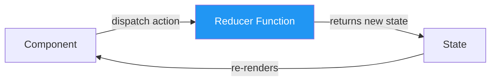

# 🔄 `useReducer` — Managing Complex State

## 📚 Topics Covered
- What is `useReducer` and why use it over `useState`
- Reducer function — `(state, action) => newState`
- `dispatch` — triggering state changes
- Action objects — `{ type, payload }`
- `useState` vs `useReducer` — when to use each
- Handling multiple state transitions cleanly
- Initializer function (lazy initialization)
- Project: Shopping Cart with `useReducer`

---

## 🔹 What is `useReducer`?

`useReducer` is a hook for managing **complex state logic** — when the next state depends on the previous state, or when you have multiple related state values that change together.



---

## 🔹 `useState` vs `useReducer`

| Situation | Use |
|-----------|-----|
| Simple value (boolean, string, number) | `useState` |
| Multiple related values that change together | `useReducer` |
| Next state depends on previous state logic | `useReducer` |
| Same state change triggered from many places | `useReducer` |
| State transition logic is complex | `useReducer` |

---

## 🔹 Syntax

```jsx
const [state, dispatch] = useReducer(reducer, initialState);
```

- `reducer` — pure function: `(state, action) => newState`
- `initialState` — starting value
- `state` — current state
- `dispatch` — function to send actions to the reducer

---

## 🔹 Basic Example — Counter

```jsx
import { useReducer } from "react";

// Step 1: Define the reducer
function counterReducer(state, action) {
  switch (action.type) {
    case "INCREMENT":
      return { count: state.count + 1 };
    case "DECREMENT":
      return { count: state.count - 1 };
    case "RESET":
      return { count: 0 };
    case "SET":
      return { count: action.payload };
    default:
      return state; // always return state for unknown actions
  }
}

// Step 2: Use in component
function Counter() {
  const [state, dispatch] = useReducer(counterReducer, { count: 0 });

  return (
    <div style={{ textAlign: "center", padding: 20 }}>
      <h2>Count: {state.count}</h2>
      <button onClick={() => dispatch({ type: "INCREMENT" })}>+</button>
      <button onClick={() => dispatch({ type: "DECREMENT" })}>-</button>
      <button onClick={() => dispatch({ type: "RESET" })}>Reset</button>
      <button onClick={() => dispatch({ type: "SET", payload: 10 })}>
        Set to 10
      </button>
    </div>
  );
}
```

---

## 🔹 Action Object Structure

Actions are plain objects with a `type` (what happened) and optional `payload` (data):

```jsx
// No payload needed
dispatch({ type: "INCREMENT" });
dispatch({ type: "RESET" });

// With payload
dispatch({ type: "SET_NAME", payload: "Ali" });
dispatch({ type: "ADD_ITEM", payload: { id: 1, name: "Phone", price: 500 } });
dispatch({ type: "REMOVE_ITEM", payload: 3 }); // payload = id to remove
```

---

## 🔹 Managing Multiple State Fields

```jsx
const initialState = {
  name: "",
  email: "",
  loading: false,
  error: null,
  success: false,
};

function formReducer(state, action) {
  switch (action.type) {
    case "SET_FIELD":
      return { ...state, [action.field]: action.value };
    case "SUBMIT_START":
      return { ...state, loading: true, error: null };
    case "SUBMIT_SUCCESS":
      return { ...state, loading: false, success: true };
    case "SUBMIT_ERROR":
      return { ...state, loading: false, error: action.payload };
    case "RESET":
      return initialState;
    default:
      return state;
  }
}

function SignupForm() {
  const [state, dispatch] = useReducer(formReducer, initialState);

  const handleChange = (e) => {
    dispatch({
      type: "SET_FIELD",
      field: e.target.name,
      value: e.target.value,
    });
  };

  const handleSubmit = async (e) => {
    e.preventDefault();
    dispatch({ type: "SUBMIT_START" });
    try {
      await fakeApiCall(state);
      dispatch({ type: "SUBMIT_SUCCESS" });
    } catch (err) {
      dispatch({ type: "SUBMIT_ERROR", payload: err.message });
    }
  };

  return (
    <form onSubmit={handleSubmit} style={{ maxWidth: 400, margin: "0 auto", padding: 20 }}>
      <h2>Sign Up</h2>

      <input
        name="name"
        value={state.name}
        onChange={handleChange}
        placeholder="Name"
        style={{ display: "block", width: "100%", padding: 8, marginBottom: 8 }}
      />
      <input
        name="email"
        value={state.email}
        onChange={handleChange}
        placeholder="Email"
        style={{ display: "block", width: "100%", padding: 8, marginBottom: 8 }}
      />

      {state.error && <p style={{ color: "red" }}>❌ {state.error}</p>}
      {state.success && <p style={{ color: "green" }}>✅ Registered!</p>}

      <button
        type="submit"
        disabled={state.loading}
        style={{ width: "100%", padding: 10, marginTop: 8 }}
      >
        {state.loading ? "Signing up..." : "Sign Up"}
      </button>
    </form>
  );
}
```

---

## 🔹 Project: Shopping Cart with `useReducer`

```jsx
import { useReducer } from "react";

const initialState = {
  items: [],
  total: 0,
};

function cartReducer(state, action) {
  switch (action.type) {
    case "ADD_ITEM": {
      const existing = state.items.find((i) => i.id === action.payload.id);
      const items = existing
        ? state.items.map((i) =>
            i.id === action.payload.id
              ? { ...i, qty: i.qty + 1 }
              : i
          )
        : [...state.items, { ...action.payload, qty: 1 }];
      return {
        items,
        total: items.reduce((sum, i) => sum + i.price * i.qty, 0),
      };
    }
    case "REMOVE_ITEM": {
      const items = state.items.filter((i) => i.id !== action.payload);
      return {
        items,
        total: items.reduce((sum, i) => sum + i.price * i.qty, 0),
      };
    }
    case "UPDATE_QTY": {
      const items = state.items
        .map((i) =>
          i.id === action.payload.id ? { ...i, qty: action.payload.qty } : i
        )
        .filter((i) => i.qty > 0);
      return {
        items,
        total: items.reduce((sum, i) => sum + i.price * i.qty, 0),
      };
    }
    case "CLEAR_CART":
      return initialState;
    default:
      return state;
  }
}

const products = [
  { id: 1, name: "Laptop", price: 1200 },
  { id: 2, name: "Mouse", price: 25 },
  { id: 3, name: "Keyboard", price: 75 },
  { id: 4, name: "Monitor", price: 400 },
];

function ShoppingCart() {
  const [cart, dispatch] = useReducer(cartReducer, initialState);

  return (
    <div style={{ display: "grid", gridTemplateColumns: "1fr 1fr", gap: 24, padding: 20 }}>
      {/* Product List */}
      <div>
        <h2>🛍️ Products</h2>
        {products.map((product) => (
          <div
            key={product.id}
            style={{
              display: "flex",
              justifyContent: "space-between",
              padding: 12,
              border: "1px solid #ddd",
              borderRadius: 8,
              marginBottom: 8,
            }}
          >
            <div>
              <strong>{product.name}</strong>
              <p style={{ color: "#666", margin: 0 }}>${product.price}</p>
            </div>
            <button
              onClick={() => dispatch({ type: "ADD_ITEM", payload: product })}
              style={{ padding: "6px 12px", background: "#2196f3", color: "#fff", border: "none", borderRadius: 4, cursor: "pointer" }}
            >
              Add to Cart
            </button>
          </div>
        ))}
      </div>

      {/* Cart */}
      <div>
        <h2>🛒 Cart ({cart.items.length} items)</h2>
        {cart.items.length === 0 ? (
          <p style={{ color: "#999" }}>Cart is empty</p>
        ) : (
          <>
            {cart.items.map((item) => (
              <div
                key={item.id}
                style={{
                  display: "flex",
                  justifyContent: "space-between",
                  alignItems: "center",
                  padding: 8,
                  borderBottom: "1px solid #eee",
                }}
              >
                <span>{item.name}</span>
                <div style={{ display: "flex", gap: 8, alignItems: "center" }}>
                  <button onClick={() => dispatch({ type: "UPDATE_QTY", payload: { id: item.id, qty: item.qty - 1 } })}>-</button>
                  <span>{item.qty}</span>
                  <button onClick={() => dispatch({ type: "UPDATE_QTY", payload: { id: item.id, qty: item.qty + 1 } })}>+</button>
                  <span>${item.price * item.qty}</span>
                  <button
                    onClick={() => dispatch({ type: "REMOVE_ITEM", payload: item.id })}
                    style={{ color: "red", background: "none", border: "none", cursor: "pointer" }}
                  >✕</button>
                </div>
              </div>
            ))}
            <div style={{ marginTop: 16, borderTop: "2px solid #333", paddingTop: 12 }}>
              <strong>Total: ${cart.total}</strong>
              <br />
              <button
                onClick={() => dispatch({ type: "CLEAR_CART" })}
                style={{ marginTop: 8, padding: "8px 16px", background: "#f44336", color: "#fff", border: "none", borderRadius: 4, cursor: "pointer" }}
              >
                Clear Cart
              </button>
            </div>
          </>
        )}
      </div>
    </div>
  );
}

export default ShoppingCart;
```

---

## 🎯 Interview Questions

**Q1: What is the difference between `useState` and `useReducer`?**

> `useState` is simpler and best for independent, primitive values. `useReducer` is better when you have complex state transitions, multiple related fields, or when the next state depends on the previous one in non-trivial ways. `useReducer` also makes state logic easier to test since the reducer is a pure function.

**Q2: What is a reducer function?**

> A pure function that takes the current state and an action, and returns the new state: `(state, action) => newState`. It must never mutate the state directly — always return a new object.

**Q3: What is an "action" in `useReducer`?**

> A plain JavaScript object that describes what happened. It has a `type` string (what event occurred) and an optional `payload` (data needed to update the state). Convention: `{ type: "ADD_ITEM", payload: item }`.

**Q4: Why must a reducer be a pure function?**

> Pure functions are predictable — same inputs always produce same outputs. This makes state logic testable, debuggable, and compatible with React's rendering model. Never use `Date.now()`, `Math.random()`, or mutate external variables in a reducer.

**Q5: Can you use multiple `useReducer` in one component?**

> Yes. Each `useReducer` manages its own state slice. This is often better than one giant reducer with all state.

---

## 🏠 Home Task

Build a **Bank Account App** using `useReducer`:
1. Actions: `DEPOSIT`, `WITHDRAW`, `TRANSFER`, `TOGGLE_ACCOUNT`
2. State: `{ balance, savings, isActive, transactions: [] }`
3. Each action adds to `transactions` array with amount, type, and timestamp
4. Prevent withdrawal if balance goes below 0
5. Transfer between balance and savings
6. Show transaction history list
7. `TOGGLE_ACCOUNT` disables all actions when account is frozen
