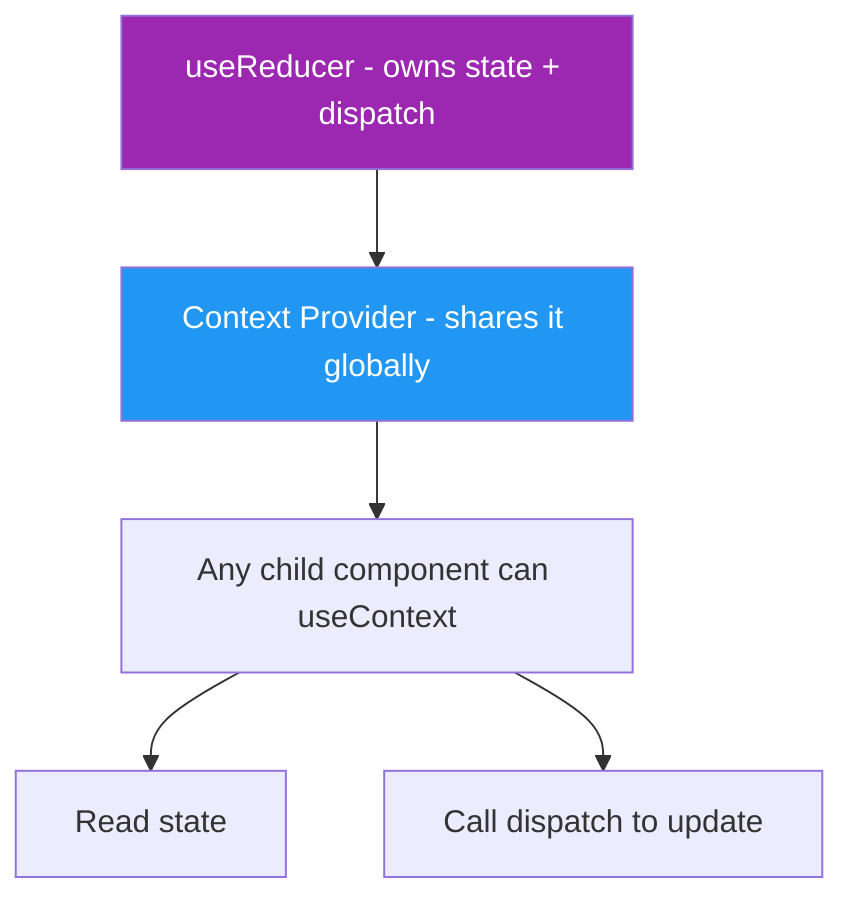
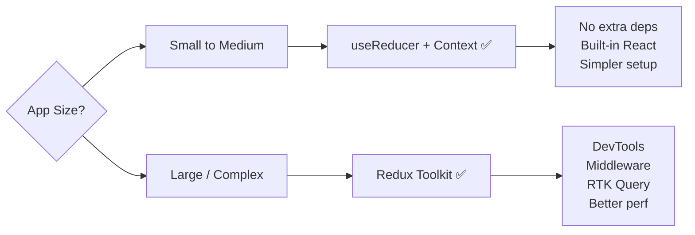

# 🔄 `useReducer` + Context — Global State Without Redux

## 📚 Topics Covered
- Why combine `useReducer` with Context API
- The "React Redux" pattern using only built-in hooks
- Creating a global store with Context + useReducer
- Custom `useStore` hook for clean access
- Auth state management example
- Shopping Cart global state example
- When this pattern is enough vs when to use Redux

---

## 🔹 Why Combine useReducer + Context?

`useReducer` alone manages state in one component. When you need that state **globally** (accessible from any component), combine it with Context API.



This pattern is often called **"Poor Man's Redux"** — it gives you centralized state management without installing any library.

---

## 🔹 The Pattern

```jsx
// 1. Create context
const StoreContext = createContext(null);

// 2. Define reducer
function reducer(state, action) { ... }

// 3. Create Provider
function StoreProvider({ children }) {
  const [state, dispatch] = useReducer(reducer, initialState);
  return (
    <StoreContext.Provider value={{ state, dispatch }}>
      {children}
    </StoreContext.Provider>
  );
}

// 4. Custom hook for clean access
function useStore() {
  return useContext(StoreContext);
}

// 5. Wrap App
<StoreProvider><App /></StoreProvider>

// 6. Use anywhere
function AnyComponent() {
  const { state, dispatch } = useStore();
}
```

---

## 🔹 Example 1: Global Auth State

```jsx
import { createContext, useContext, useReducer } from "react";

// --- Auth Reducer ---
const initialAuthState = {
  user: null,
  isAuthenticated: false,
  loading: false,
  error: null,
};

function authReducer(state, action) {
  switch (action.type) {
    case "LOGIN_START":
      return { ...state, loading: true, error: null };
    case "LOGIN_SUCCESS":
      return { ...state, loading: false, isAuthenticated: true, user: action.payload };
    case "LOGIN_ERROR":
      return { ...state, loading: false, error: action.payload };
    case "LOGOUT":
      return initialAuthState;
    case "UPDATE_PROFILE":
      return { ...state, user: { ...state.user, ...action.payload } };
    default:
      return state;
  }
}

// --- Context & Provider ---
const AuthContext = createContext(null);

export function AuthProvider({ children }) {
  const [state, dispatch] = useReducer(authReducer, initialAuthState);

  // Action creators — cleaner than raw dispatch calls
  const login = async (email, password) => {
    dispatch({ type: "LOGIN_START" });
    try {
      // Simulate API call
      await new Promise((r) => setTimeout(r, 1000));
      if (email === "admin@test.com" && password === "1234") {
        dispatch({
          type: "LOGIN_SUCCESS",
          payload: { id: 1, name: "Ali Hassan", email, role: "admin" },
        });
      } else {
        throw new Error("Invalid credentials");
      }
    } catch (err) {
      dispatch({ type: "LOGIN_ERROR", payload: err.message });
    }
  };

  const logout = () => dispatch({ type: "LOGOUT" });

  return (
    <AuthContext.Provider value={{ ...state, login, logout }}>
      {children}
    </AuthContext.Provider>
  );
}

// --- Custom Hook ---
export function useAuth() {
  const context = useContext(AuthContext);
  if (!context) throw new Error("useAuth must be used inside AuthProvider");
  return context;
}
```

```jsx
// --- Login Form ---
function LoginForm() {
  const { login, loading, error } = useAuth();
  const [email, setEmail] = useState("");
  const [password, setPassword] = useState("");

  const handleSubmit = (e) => {
    e.preventDefault();
    login(email, password);
  };

  return (
    <form onSubmit={handleSubmit} style={{ maxWidth: 360, margin: "40px auto", padding: 24, border: "1px solid #ddd", borderRadius: 8 }}>
      <h2>Login</h2>
      <input value={email} onChange={(e) => setEmail(e.target.value)} placeholder="Email" style={{ display: "block", width: "100%", padding: 8, marginBottom: 8 }} />
      <input type="password" value={password} onChange={(e) => setPassword(e.target.value)} placeholder="Password" style={{ display: "block", width: "100%", padding: 8, marginBottom: 8 }} />
      {error && <p style={{ color: "red" }}>❌ {error}</p>}
      <button type="submit" disabled={loading} style={{ width: "100%", padding: 10 }}>
        {loading ? "Logging in..." : "Login"}
      </button>
      <p style={{ fontSize: 12, color: "#999" }}>Use: admin@test.com / 1234</p>
    </form>
  );
}

// --- Dashboard ---
function Dashboard() {
  const { user, logout } = useAuth();
  return (
    <div style={{ padding: 24 }}>
      <h2>Welcome, {user.name}!</h2>
      <p>Email: {user.email} | Role: {user.role}</p>
      <button onClick={logout}>Logout</button>
    </div>
  );
}

// --- App ---
function App() {
  const { isAuthenticated } = useAuth();
  return isAuthenticated ? <Dashboard /> : <LoginForm />;
}

// --- Root ---
export default function Root() {
  return (
    <AuthProvider>
      <App />
    </AuthProvider>
  );
}
```

---

## 🔹 Example 2: Global Cart State

```jsx
import { createContext, useContext, useReducer, useMemo } from "react";

function cartReducer(state, action) {
  switch (action.type) {
    case "ADD": {
      const exists = state.find((i) => i.id === action.payload.id);
      return exists
        ? state.map((i) => i.id === action.payload.id ? { ...i, qty: i.qty + 1 } : i)
        : [...state, { ...action.payload, qty: 1 }];
    }
    case "REMOVE":
      return state.filter((i) => i.id !== action.payload);
    case "UPDATE_QTY":
      return state
        .map((i) => i.id === action.payload.id ? { ...i, qty: action.payload.qty } : i)
        .filter((i) => i.qty > 0);
    case "CLEAR":
      return [];
    default:
      return state;
  }
}

const CartContext = createContext(null);

export function CartProvider({ children }) {
  const [items, dispatch] = useReducer(cartReducer, []);

  const total = useMemo(
    () => items.reduce((sum, i) => sum + i.price * i.qty, 0),
    [items]
  );

  const itemCount = items.reduce((sum, i) => sum + i.qty, 0);

  return (
    <CartContext.Provider value={{ items, total, itemCount, dispatch }}>
      {children}
    </CartContext.Provider>
  );
}

export function useCart() {
  return useContext(CartContext);
}
```

```jsx
// Navbar — shows cart count from anywhere
function Navbar() {
  const { itemCount } = useCart();
  return (
    <nav style={{ background: "#1a1a2e", padding: "12px 24px", color: "#fff", display: "flex", justifyContent: "space-between" }}>
      <span>🛍️ My Shop</span>
      <span>🛒 {itemCount}</span>
    </nav>
  );
}

// Product Card — adds to cart
function ProductCard({ product }) {
  const { dispatch } = useCart();
  return (
    <div style={{ border: "1px solid #ddd", borderRadius: 8, padding: 16 }}>
      <h3>{product.name}</h3>
      <p>${product.price}</p>
      <button onClick={() => dispatch({ type: "ADD", payload: product })}>
        Add to Cart
      </button>
    </div>
  );
}

// Cart Page — reads and manages cart
function CartPage() {
  const { items, total, dispatch } = useCart();
  return (
    <div>
      {items.map((item) => (
        <div key={item.id} style={{ display: "flex", justifyContent: "space-between", padding: 8 }}>
          <span>{item.name} x{item.qty}</span>
          <button onClick={() => dispatch({ type: "REMOVE", payload: item.id })}>Remove</button>
        </div>
      ))}
      <strong>Total: ${total}</strong>
    </div>
  );
}
```

---

## 🔹 useReducer + Context vs Redux



| | useReducer + Context | Redux Toolkit |
|--|---------------------|---------------|
| Setup | Zero config | `npm install @reduxjs/redux-toolkit react-redux` |
| DevTools | ❌ No | ✅ Excellent |
| Middleware | ❌ Manual | ✅ Built-in (Thunk) |
| Performance | ⚠️ All consumers re-render | ✅ Selector-based optimization |
| Learning curve | Low | Medium |
| Best for | Small/medium apps | Large apps |

---

## 🎯 Interview Questions

**Q1: Why combine `useReducer` with Context instead of just Context with `useState`?**

> For complex state with many transitions, `useReducer` keeps the logic organized in one place (the reducer). With `useState` you'd have multiple setters spread across the provider. `useReducer` + Context gives you a predictable, centralized state machine.

**Q2: What is the difference between this pattern and Redux?**

> Functionally similar — both have a store, reducer, and dispatch. Key differences: Redux has DevTools, middleware support, and selector-based re-render optimization. The `useReducer` + Context pattern is simpler with no dependencies but doesn't scale as well for very large apps.

**Q3: What is an "action creator" and why use it?**

> A function that creates and dispatches actions: `const login = (email) => dispatch({ type: "LOGIN", payload: email })`. It hides the action structure from components and makes it easier to refactor.

**Q4: Does every component re-render when dispatch is called?**

> Every component that consumes the context via `useContext` will re-render when the context value changes. To optimize, split contexts (auth context separate from cart context) so updates to one don't affect consumers of the other.

---

## 🏠 Home Task

Build a **Global Theme + User Settings App**:
1. `SettingsContext` using `useReducer`
2. State: `{ theme: "light", language: "en", fontSize: "md", notifications: true }`
3. Actions: `SET_THEME`, `SET_LANGUAGE`, `SET_FONT_SIZE`, `TOGGLE_NOTIFICATIONS`, `RESET_SETTINGS`
4. Settings panel component — reads and updates all settings
5. Navbar that changes background based on theme
6. Content area font changes based on `fontSize`
7. Persist settings to `localStorage` — restore on page reload
