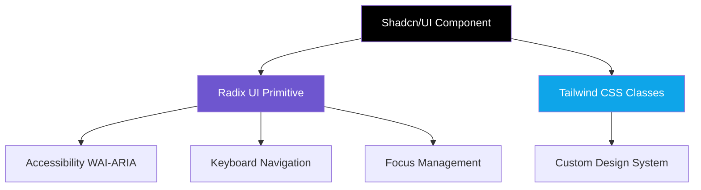

# 🧱 Shadcn/UI — Accessible Component Library

## 📚 Topics Covered
- What is Shadcn/UI and how it differs from other component libraries
- Radix UI Primitives — accessibility-first headless components
- Setting up Shadcn/UI in a Vite + React project
- Using the CLI to add components
- `Button`, `Input`, `Card`, `Dialog`, `Select`, `Dropdown`, `Toast`
- Customizing components — `variants` with `cva()`
- Combining Shadcn/UI with Tailwind
- Building a real form with Shadcn components + React Hook Form

---

## 🔹 What is Shadcn/UI?

Shadcn/UI is **not a traditional component library** — you don't install it as a dependency. Instead, the CLI **copies component source code directly into your project**. You own the code and can customize it freely.

```
Traditional Library:         Shadcn/UI:
npm install @mui/material     npx shadcn add button
       ↓                            ↓
node_modules/                src/components/ui/button.tsx
(black box, hard to customize) (your file, fully editable)
```

It's built on top of **Radix UI Primitives** — unstyled, accessible components — and styled with **Tailwind CSS**.



---

## 🔹 Setup in Vite + React

```bash
# 1. Create a Vite project (if not already done)
npm create vite@latest my-app -- --template react
cd my-app

# 2. Install Tailwind (required by Shadcn)
npm install -D tailwindcss @tailwindcss/vite

# 3. Initialize Shadcn
npx shadcn@latest init
```

Follow the prompts — choose your base color (Zinc/Slate/Gray etc), and it sets up:
- `components/ui/` — where components will be copied
- `lib/utils.ts` — the `cn()` helper
- Updates `tailwind.config.js` with theme variables

```bash
# 4. Add components one by one
npx shadcn@latest add button
npx shadcn@latest add input
npx shadcn@latest add card
npx shadcn@latest add dialog
npx shadcn@latest add select
npx shadcn@latest add toast
npx shadcn@latest add form
```

Each command copies the component file into `src/components/ui/`.

---

## 🔹 Button Component

```jsx
import { Button } from "@/components/ui/button";

function Demo() {
  return (
    <div className="flex gap-4 p-8">
      <Button>Default</Button>
      <Button variant="destructive">Delete</Button>
      <Button variant="outline">Outline</Button>
      <Button variant="secondary">Secondary</Button>
      <Button variant="ghost">Ghost</Button>
      <Button variant="link">Link</Button>
      <Button size="sm">Small</Button>
      <Button size="lg">Large</Button>
      <Button disabled>Disabled</Button>
    </div>
  );
}
```

The Button source uses `cva()` (class variance authority) for variants:

```jsx
// src/components/ui/button.tsx (what Shadcn generates — you can edit this)
import { cva } from "class-variance-authority";

const buttonVariants = cva(
  "inline-flex items-center justify-center rounded-md text-sm font-medium transition-colors focus-visible:outline-none disabled:opacity-50 disabled:pointer-events-none",
  {
    variants: {
      variant: {
        default: "bg-primary text-primary-foreground hover:bg-primary/90",
        destructive: "bg-destructive text-destructive-foreground hover:bg-destructive/90",
        outline: "border border-input hover:bg-accent",
        secondary: "bg-secondary text-secondary-foreground hover:bg-secondary/80",
        ghost: "hover:bg-accent hover:text-accent-foreground",
        link: "underline-offset-4 hover:underline text-primary",
      },
      size: {
        default: "h-10 py-2 px-4",
        sm: "h-9 px-3",
        lg: "h-11 px-8",
      },
    },
    defaultVariants: {
      variant: "default",
      size: "default",
    },
  }
);
```

---

## 🔹 Card Component

```jsx
import {
  Card,
  CardContent,
  CardDescription,
  CardFooter,
  CardHeader,
  CardTitle,
} from "@/components/ui/card";
import { Button } from "@/components/ui/button";
import { Badge } from "@/components/ui/badge";

function ProductCard({ product }) {
  return (
    <Card className="w-80">
      <CardHeader>
        <div className="flex items-start justify-between">
          <CardTitle>{product.name}</CardTitle>
          <Badge variant={product.inStock ? "default" : "secondary"}>
            {product.inStock ? "In Stock" : "Out of Stock"}
          </Badge>
        </div>
        <CardDescription>{product.description}</CardDescription>
      </CardHeader>
      <CardContent>
        
        <p className="text-2xl font-bold mt-4">${product.price}</p>
      </CardContent>
      <CardFooter className="flex gap-2">
        <Button className="flex-1">Add to Cart</Button>
        <Button variant="outline">Wishlist</Button>
      </CardFooter>
    </Card>
  );
}
```

---

## 🔹 Dialog (Modal)

```jsx
import {
  Dialog,
  DialogContent,
  DialogDescription,
  DialogFooter,
  DialogHeader,
  DialogTitle,
  DialogTrigger,
} from "@/components/ui/dialog";
import { Button } from "@/components/ui/button";
import { Input } from "@/components/ui/input";
import { Label } from "@/components/ui/label";

function EditProfileDialog() {
  return (
    <Dialog>
      <DialogTrigger asChild>
        <Button variant="outline">Edit Profile</Button>
      </DialogTrigger>
      <DialogContent className="sm:max-w-[425px]">
        <DialogHeader>
          <DialogTitle>Edit Profile</DialogTitle>
          <DialogDescription>
            Make changes to your profile here. Click save when done.
          </DialogDescription>
        </DialogHeader>
        <div className="grid gap-4 py-4">
          <div className="grid grid-cols-4 items-center gap-4">
            <Label htmlFor="name" className="text-right">Name</Label>
            <Input id="name" defaultValue="Ali Hassan" className="col-span-3" />
          </div>
          <div className="grid grid-cols-4 items-center gap-4">
            <Label htmlFor="email" className="text-right">Email</Label>
            <Input id="email" defaultValue="ali@example.com" className="col-span-3" />
          </div>
        </div>
        <DialogFooter>
          <Button type="submit">Save changes</Button>
        </DialogFooter>
      </DialogContent>
    </Dialog>
  );
}
```

---

## 🔹 Select Component

```jsx
import {
  Select,
  SelectContent,
  SelectItem,
  SelectTrigger,
  SelectValue,
} from "@/components/ui/select";

function LanguageSelector() {
  return (
    <Select>
      <SelectTrigger className="w-[180px]">
        <SelectValue placeholder="Select language" />
      </SelectTrigger>
      <SelectContent>
        <SelectItem value="en">English</SelectItem>
        <SelectItem value="ur">Urdu</SelectItem>
        <SelectItem value="ar">Arabic</SelectItem>
        <SelectItem value="fr">French</SelectItem>
      </SelectContent>
    </Select>
  );
}
```

---

## 🔹 Toast Notifications

```jsx
import { useToast } from "@/components/ui/use-toast";
import { Toaster } from "@/components/ui/toaster";
import { Button } from "@/components/ui/button";

// Add <Toaster /> once in your App root
function App() {
  return (
    <>
      <Main />
      <Toaster />
    </>
  );
}

function Main() {
  const { toast } = useToast();

  return (
    <div className="p-8 flex flex-col gap-4">
      <Button
        onClick={() =>
          toast({
            title: "Success!",
            description: "Your profile has been updated.",
          })
        }
      >
        Show Success Toast
      </Button>
      <Button
        variant="destructive"
        onClick={() =>
          toast({
            variant: "destructive",
            title: "Error",
            description: "Something went wrong. Please try again.",
          })
        }
      >
        Show Error Toast
      </Button>
    </div>
  );
}
```

---

## 🔹 Complete Form with Shadcn + React Hook Form

```bash
npm install react-hook-form @hookform/resolvers zod
npx shadcn@latest add form
```

```jsx
import { useForm } from "react-hook-form";
import { zodResolver } from "@hookform/resolvers/zod";
import { z } from "zod";
import {
  Form,
  FormControl,
  FormDescription,
  FormField,
  FormItem,
  FormLabel,
  FormMessage,
} from "@/components/ui/form";
import { Input } from "@/components/ui/input";
import { Button } from "@/components/ui/button";
import { useToast } from "@/components/ui/use-toast";

const formSchema = z.object({
  username: z.string().min(3, "Username must be at least 3 characters"),
  email: z.string().email("Enter a valid email"),
  password: z.string().min(8, "Password must be at least 8 characters"),
});

function SignupForm() {
  const { toast } = useToast();
  const form = useForm({
    resolver: zodResolver(formSchema),
    defaultValues: { username: "", email: "", password: "" },
  });

  function onSubmit(values) {
    toast({
      title: "Account created!",
      description: `Welcome, ${values.username}`,
    });
    form.reset();
  }

  return (
    <div className="max-w-md mx-auto p-6">
      <h2 className="text-2xl font-bold mb-6">Create Account</h2>
      <Form {...form}>
        <form onSubmit={form.handleSubmit(onSubmit)} className="space-y-4">
          <FormField
            control={form.control}
            name="username"
            render={({ field }) => (
              <FormItem>
                <FormLabel>Username</FormLabel>
                <FormControl>
                  <Input placeholder="alihassan123" {...field} />
                </FormControl>
                <FormDescription>This is your public display name.</FormDescription>
                <FormMessage />
              </FormItem>
            )}
          />

          <FormField
            control={form.control}
            name="email"
            render={({ field }) => (
              <FormItem>
                <FormLabel>Email</FormLabel>
                <FormControl>
                  <Input type="email" placeholder="ali@example.com" {...field} />
                </FormControl>
                <FormMessage />
              </FormItem>
            )}
          />

          <FormField
            control={form.control}
            name="password"
            render={({ field }) => (
              <FormItem>
                <FormLabel>Password</FormLabel>
                <FormControl>
                  <Input type="password" placeholder="••••••••" {...field} />
                </FormControl>
                <FormMessage />
              </FormItem>
            )}
          />

          <Button type="submit" className="w-full">
            Create Account
          </Button>
        </form>
      </Form>
    </div>
  );
}
```

---

## 🔹 Customizing Components

Since you own the source, you can add new variants directly:

```jsx
// src/components/ui/button.tsx — add a new "success" variant
const buttonVariants = cva("...", {
  variants: {
    variant: {
      // existing...
      default: "bg-primary ...",
      // add your own:
      success: "bg-green-500 text-white hover:bg-green-600",
      warning: "bg-yellow-500 text-white hover:bg-yellow-600",
    },
  },
});

// Now use it:
<Button variant="success">Saved!</Button>
<Button variant="warning">Review</Button>
```

---

## 🎯 Interview Questions

**Q1: How is Shadcn/UI different from Material UI or Ant Design?**

> Traditional libraries ship pre-built components you import from `node_modules` — you can't change the internals. Shadcn/UI copies the component source into your project so you fully own and control the code. It's also built on accessible Radix primitives, not custom implementations.

**Q2: What is Radix UI and why does Shadcn use it?**

> Radix UI is a collection of unstyled, accessible headless components (Dialog, Select, Tooltip, etc.) that handle all keyboard navigation, ARIA attributes, and focus management correctly. Shadcn adds Tailwind styling on top of these reliable primitives.

**Q3: What is `cva()` (class variance authority)?**

> A utility for building component variants cleanly. You define a base class string and then declare variant options (e.g., `variant: { primary, secondary }`, `size: { sm, md, lg }`). `cva()` returns a function that accepts variant options and returns the correct class string.

**Q4: Can you use Shadcn/UI without Tailwind?**

> No — Shadcn components are styled entirely with Tailwind utility classes. Tailwind is a required dependency. If you want unstyled components only, use Radix UI directly.

---

## 🏠 Home Task

Build a **Dashboard Page** using only Shadcn/UI components:
1. Navbar with a `DropdownMenu` for user profile (Edit Profile, Settings, Logout)
2. Stat cards using `Card` — Total Sales, New Users, Revenue, Conversion
3. A data table (use Shadcn `Table` component) showing 5 users with name, email, role, and status `Badge`
4. An "Invite User" `Dialog` with a form (email + role `Select`) validated with Zod
5. Toast notification on form submit — success or error
6. Light/Dark mode toggle using Shadcn `Switch`
